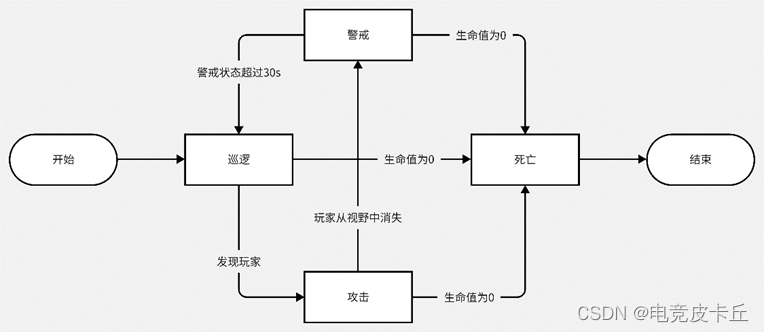
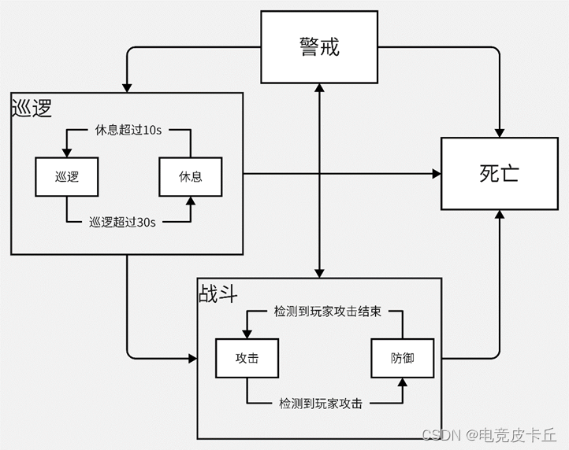
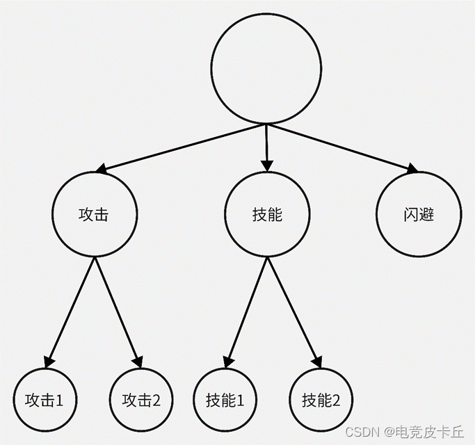
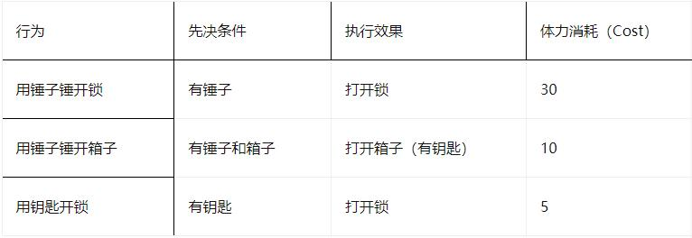
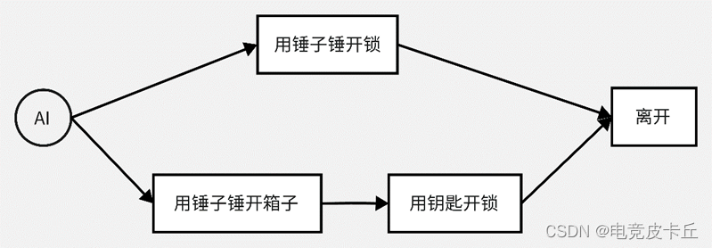
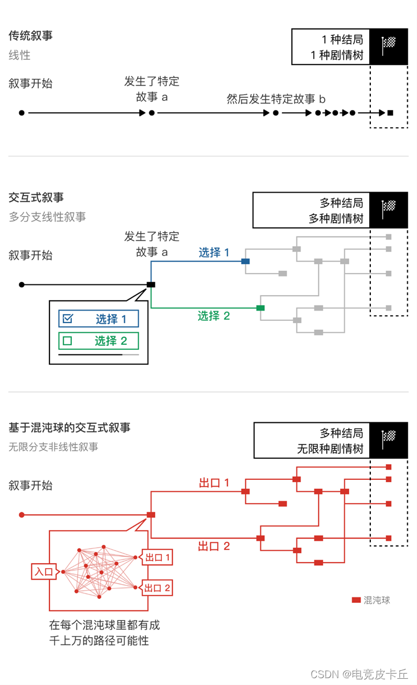

# 游戏AI

自 AI 的想法诞生以来，游戏一直为 AI 的研究过程提供助力。游戏不仅提出有趣且复杂的问题来供AI解决————例如去精通一个游戏；它们也为（人类，甚至机器）用户能够体验到的创意以及表达提供了一个画布。因此可以说，游戏是罕见的，是科学（解决问题）与艺术相碰撞并相互作用的领域，而这些因素也让游戏对于AI的研究来说成为一个独特并且优秀的环境。然而不仅是AI在游戏中提升，游戏也在AI研究中得到了发展。

——《Artificial Intelligence and Games》

## 什么是游戏AI?

弱AI。大多数游戏里的AI实际上只是一些能够给玩家带来一定智能程度的“错觉”的智能体。所以，简单来说，游戏AI就是游戏中那些非玩家控制的游戏角色，也就是NPC的行为逻辑。

## 为什么需要？

在游戏中，虚拟的游戏角色的行为深刻影响着玩家在游玩这个游戏时候的感受，而游戏AI决定了这些虚拟游戏角色背后的行为逻辑。这种行为逻辑真实与否，直接影响了玩家的游戏体验。

打个比方，艾尔登法环中的许多敌人都有一个“药检”系统，敌人一旦检测到玩家使用元素瓶，敌人就会发了疯似的来打断玩家。单从这一点来看，这不是一个优秀合理的游戏AI。甚至因此有玩家调侃到，哪怕你在元素瓶的物品描述上加上这样一句话——使用元素瓶这件事在交界地被视为是最恶劣的嘲讽方式，都能使这一事件合理。由此可见，游戏AI对于玩家的游戏体验起到重要作用。

## 分类

### 从游戏环节看

1. 游戏画面

***姿态识别***，***表情识别***，***环境生成***，***GAN***

2. 玩家型AI

该类型应该是最被大众所熟知的游戏AI类型，2017年AlphaGo击败世界围棋冠军李世石，2019年OpenAI Five击败DOTA2世界冠军OG证明了AI在游戏上的表现可以超越人类。而此类AI问题本质上可以看成是路径规划问题，即根据当前的游戏状态生成相应的动作序列。典型的以强化学习、深度强化学习为代表的游戏AI目前在国内的游戏工业界已被大量研究，在某些游戏类型例如棋牌类、回合制策略游戏中，***蒙特卡洛搜索树（行为树）***、***演化算法***、***A***等在线学习算法也具有一定优势。

3. 游戏内容

Procedural Content Generation(PCG)。在游戏内容（地图）的产出上，以魔兽争霸3为例，一方面依赖于游戏本体制作时开发者制作的地图；另一方面依赖于社区玩家的自定义地图，而社区玩家内容又更是由玩家数量所决定，丰富且可行的游戏内容是吸引玩家入坑的重要保障。利用AI去生成可行的游戏内容是非常值得研究的方向。目前该方向的主流算法包括***演化算法***、***GAN***等。

4. 游戏初始化平衡

目前在卡牌类游戏中，为了初始化得到的卡牌或是环境相对平衡，在PVE游戏中体现为玩家可以战胜Bot，PVP游戏例如炉石传说、自走棋，防止出现双方卡牌差距过大导致输掉，可以利用AI来设计发牌的策略。该方向的主要算法为***演化算法***。

5. 游戏测试

在游戏制作完成后，开发者们需要测试游戏内存在的bug，这毫无疑问是重要的，如果一款游戏存在大量的bug，对该游戏的评价和收益都会造成巨大的影响。而测试游戏需要大量的时间，在这一方面，测试专用的agent可以被设计来面对这一挑战，目前这一块的算法主要为***蒙特卡洛搜索树***、***强化学习***、***深度强化学习***等。

6. 用户画像

***机器学习***

7. 言论监控

***NLP***

### 具体应用

1. 利用AI玩游戏

在游戏中建立bot。

（1）应用为导向

a.与玩家对抗/协作
依据数据和预算产生不同水平的agent，可以与玩家共同匹配或作为PVE的NPC等提高玩家体验水平，由此引申的功能可以有动态难度调节，游戏自动平衡。

b.游戏bug测试
在投入运行前，可以通过投入大量的有测试行为的agent进入游戏，根据其行动期间的log异常来得到一些bug，或是通过bot间的对战，依据一定的判定方法来得到版本数值平衡性分析。

c.合成数据收集
在游戏投入运行得到一定的玩家数据前，可以使用agent的行动来得到仿真的玩家数据，例如阵型识别，胜率预测等数据。

d.产生更强力的agent
根据共同演化的方法，一系列基础的agent可以通过参数演化或者agent间对抗性的方法来催生性能更好的agent。

e.寻路(Pathfinding)
寻路规划可以被视为AI动作序列输出的一种特例。在某些游戏例如马里奥中，寻路算法本身就构成了AI player。

（2）方法为导向

根据是否使用了游戏提供的仿真模型（即可根据目前的游戏状态以及可执行动作得到后续的帧的游戏状态可以将其分为Model-based与Model-free的agent。

a.Model Based（基于模型的agent）
Planning-based：最佳优先搜索（例如 ）,蒙特卡洛树搜索,演化规划
基于模型的强化学习

b.Model Free(无模型方法)
静态类方法:状态机,行为树,基于效用（启发式）函数的AI方法
planning-based:STRIPS（符号化表示规划）

c.学习类方法
强化学习：需要高度表格化表示。
深度强化学习：基于游戏图像，不需要标记数据，但需要有游戏实时的奖励设置。
演化算法：通过演化算法来更新神经网络结构和权重来达到最优化。
模仿学习：根据玩家的数据来学习游戏的策略，基于游戏图像，需要玩家数据。
逆强化学习：根据策略来学习游戏中的奖励分布。

---
---


（3） 实现

#### a. 朴素AI

游戏AI最简单的实现方式，就是用if else这类的简单分支语句对NPC的行为进行分类和判别。
```
打个比方，有一个敌人在巡逻，我们可以用朴素AI为他添加一些规则：
如果视线内没有人就巡逻
如果视线内有玩家就攻击
如果生命值降为0就死亡
```
看上去好像没有什么问题，但是如果玩家接近这个NPC，之后又离开了这个NPC的视线呢？这个敌人就会在攻击结束后和没事人继续回去巡逻，这显然不符合常理。而且实际上游戏中的情况远比这种情况要复杂，虽然单纯使用这种简单的分支语句，在理论上也可以通过各种嵌套实现很复杂的行为逻辑，但且不说这段代码有多让人头疼，最主要的是其代码的复用性太差，每个不同类型的敌人都要从头构建一个新的行为逻辑，所以这里我们要引入有限状态机。

####  b. 有限状态机(Finite-state machine,FSM)

有限状态机是将游戏内NPC的各类行为抽象为几个状态，再通过事件将不同的状态相互连接，组成一个状态机。在某个特定事件发生时，状态才将进行转换。

还是以刚才巡逻的敌人举例，我们可以将这个敌人分为巡逻、警戒、攻击、死亡四个状态，再通过一些事件进行连接。



在有限状态机下，通过很简洁的代码就可以实现复杂的行为逻辑。并且最重要的是，代码可以封装复用了，不同类型的单位可能只需要修改几个切换状态的条件，大大降低了工作量。

#### c. 分层有限状态机(Hierarchy-FSM,HFSM)

分层有限状态机是有限状态机的进阶版。随着NPC的行为逻辑越来越复杂，有限状态机也有点不够用了，于是就需要分层有限状态机。

在分层有限状态机中，每个状态都可以包含多个子状态，而子状态仅可以与同状态下的子状态之间切换，不同状态下的子状态之间是不可以切换的。

还是以刚才巡逻的士兵为例，我们给他的巡逻状态分为巡逻和休息两个状态，攻击状态分为攻击和防御两个状态，这样这个警卫的状态图如下



####  d. 行为树(Behavior Tree, BT)

行为树是树状的数据结构，每个节点都代表了一个行为，每个行为都可以有子行为。所有行为都有个先决条件，也就是产生这些行为的条件。每次从根部节点开始遍历，检查每一个先决条件，满足先决条件的节点会继续判断执行它的子节点，而如果一个节点的先决条件并不满足，则会跳过它的子节点，判断它的兄弟节点，直到整个树遍历结束，再从根部节点开始遍历。

与状态机不同，行为树的节点与节点之间的联系较少，增加与删除节点对其他节点都没有什么影响，增加了它的灵活性与可扩展性。而且，可以通过在先决条件中添加随机因素来很好的实现随机性，更适用于一些动作游戏中boss的攻击逻辑等。



但是行为树的设计思路更加接近机器的思维，而且因为其每次运行都要从根部节点开始，其决策判断时间也要比状态机更长。


'''在过去，游戏 AI 一般倾向于采用行为树作为决策结构，通过引入逻辑节点减少转换条件，迅速地组织较复杂的行为决策，此外它的重用性很高，可以通过重组不同的节点来实现不同的行为树。但与此同时，行为树的缺点也显而易见，比如它会让游戏内置的机器人看起来非常死板，灵活性不强。

而强化学习技术恰巧能弥补这个缺点，让机器人更加拟人、智能，提高游戏的可玩性，同时也能提高游戏的制作效率。'''

'''很多领域都要求百分百精准，比如医疗领域、精密仪器制造领域等等。如果达不到完全精准，那我们就不能相信 AI，最后可能还需要人工进行复审。这意味着，AI 只是起到了一个辅助性的作用，并不能起到决定性作用，因此确实没法用。但在另外一些领域，比如游戏，即便 AI 出现了一点小的失误也没有关系。所以说，强化学习能不能落地，怎么落地，具体还是要看领域。目前来看，游戏无疑是强化学习技术最成功的一个落地场景。'''

'''很多人认为我们用强化学习技术就是要把游戏变成非常强，其实并不是。通过强化学习技术去打败人类玩家其实是一件非常简单的事情，并且早已得到实现。但这是在研究阶段做的事情，真正落地的时候，AI 的目的并不是要打败玩家，而是要陪玩家玩游戏。这也是我们游戏制作的一个核心思想。'''

####  e. 目标导向的行为规划(Goal-Oriented Action Planning，GOAP)

目标导向的行为规划，要先给AI一个（或多个）目标，再给AI提供多条可执行的行为路径、对世界因素的描述、每个路径行为执行的先决条件、以及执行行为对世界产生的影响效果等等。然后AI要根据这些因素，找到一个最佳行为队列，并按顺序执行。

```
举个例子，一个AI被关在一个带锁的笼子里，笼子里有一个小锤子和一个玻璃箱，玻璃箱里有钥匙。给AI的目标是离开这个笼子，AI可以执行的行为和先决条件如下
```

```
AI在遍历所有行为后，可以得到两条路径
```

经过计算两种路径的体力消耗，先用锤子锤开箱子再用钥匙开锁的消耗小于直接用锤子锤开锁的行为消耗，AI确定前者为最优解并执行。这种决策方式更加接近人类的思考方式。

#### f.协同多智能体(Group AI&Meta AI)

以上所列举的这几种方式，已经基本可以满足单一NPC的绝大部分需求了。但是，实际的游戏环境中大多并不是单一智能体，而是同时有多个智能智能单位，这些智能体之间的行为联动也是游戏AI的一部分。比如在某些潜行类游戏中，一个NPC发现什么响动，通常会带动他周围的好几个敌人同时警觉，并一起前往发出声响的地方搜查，这就是Group AI在起作用。

而对于NPC更多、场景更复杂的情况，我们就需要Meta AI，它的作用是对场上的所有AI进行指挥调度，就好像是坐在幕后的“导演”，用蓝牙耳机告诉场上的NPC在什么时候该去哪干什么事，从而实现更加可控的玩家体验。

#### g.机器学习

说了这么多方法，其实都与真正意义上的人工智能关系不大，那么有没有游戏AI真正用到了人工智能方法呢？答案是肯定的，这里我们以rct.ai开发的“混沌球”算法为例。

首先让我们从整体架构的角度来看看基于混沌球的叙事方式与传统叙事方式的不同。

混沌球与传统的叙事方式的区别在于，他们将 “事件” 替换为一个又一个明确定义了入口和出口的黑盒，这可以简单理解为，在每一个切片的混沌球里，开始和结局（一个或者多个）是确定的，但是玩家每一次如何从开始到达结局，则是混沌的，是路径不明确的。这个路径只有当玩家不断的和虚拟世界里的虚拟人物 NPC 作出交互，这些 NPC 根据深度强化学习训练后的模型作出动态且实时的反应来推动剧情发展之后，才会被确定下来。这似乎有点像之前提到的目标导向的行为规划，但是NPC的路径选择是根据强化学习训练后得到的。



2. 利用AI为玩家建模

利用游戏产生的数据来为玩家建立体验或行为模型（包括其消费预测，游戏性行为预测，体验感预测）或是进一步利用该数据来更新与描述游戏（例如平衡性分析，游戏流派，提供给Agent更多的训练数据）

以潜行恐怖游戏《Hello Neighbor》中的玩家建模例子。在这款游戏中，AI打造的领居会一直跟踪玩家，并从过去的错误中吸取教训，致力于打败玩家。

（1）应用为导向

a.理解玩家在游戏中的体验。AI可以根据玩家的体验感来评测游戏各个组件与系统; 辅助更新新的游戏活动; 辅助更新前两个AI系统。
b.理解玩家在游戏中的行为。AI辅助分析游戏行为，例如发掘一些新的游戏玩法；可以根据异常数据来判定外挂等作弊系统；形成可观的游戏数据来支持新的游戏AI迭代；辅助设计更具有公平性的匹配系统;预测玩家的行为；对玩家社交群体分类；分析玩家的性格。

（2）方法为导向

a.经验VS行为（Experience vs Behavior）

Experience: 玩家在游戏过程中的感受，包括：一系列(合成的)感受、认知、行为状态，或是其他的用户状态，情绪和认知等

Behavior:玩家在游戏过程中的行为。

b.高级概念分类

model-based（理论驱动）：从一些列玩家心理学、认知学的研究中得到一些玩家对应游戏的模型，来自上而下的设计游戏

model-free（数据驱动）：不利用之前的学科研究来对玩家进行自下而上的建模，其中包括可视化，例如热力图来衡量玩家的活动频率。

c.监督学习
玩家建模包括寻找一个函数，将玩家的一组可测量的属性映射到特定的玩家状态。按照监督学习的方法，这是通过机器学习或自动调整模型的参数来实现的，以适应包含一组输入样本的数据集，每个样本与目标输出配对。输入样本对应于可测量的属性（或特征）列表，而目标输出对应于我们有兴趣学习预测的每个输入样本的玩家状态的注释。如前所述，注释可以从行为特征，如关卡或玩家原型的完成时间，到玩家经验的估计，如玩家的挫折感等。

d.无监督学习
很多时候，我们面临的数据集是没有关于玩家行为或经验状态的目标输出。在这种情况下，玩家的建模必须依靠无监督学习。无监督学习的重点是通过发现输入的关联，在没有获得目标输出的情况下，将模型与观察结果相匹配。输入通常被视为一组随机变量，通过观察输入向量之间的关联来建立模型。应用于玩家建模的无监督学习包括聚类和关联挖掘等任务。


3. 利用AI生成游戏内容

就是PCG(Procedural content generation)，利用AI的方法去协助设计游戏系统，前置要求是需要比较好的数据（包括数据的质量，数据的代表方式，数据的数量）和有代表性的评估方法（包括美学，可玩性，新奇性）。具体的应用方法需要进一步查阅资料。

（1）应用为导向

a.(辅助)生成游戏中的内容（影响规则）：关卡、地图、物品、武器、任务、人物、规则等。

b.(辅助)生成游戏中的外观（不影响规则）：人物外观，表情，武器外观，音效等。

c.辅助设计

d.修复地图bug：对无法抵达的死角做检测与替换等。

e.数据压缩：将游戏数据压缩到更小的尺寸。

（2）方法为导向

a.元胞自动机
使用领域规则根据随机初始状态生成大量不规则图形，可用于热量、雨水、液体流动、压力爆炸等环境系统建模，也可以生成洞窟等小型地图，但无法保证可控性。

b.基于文法方法
定义一系列文法规则来生成内容。

c.基于搜索方法（通常为Evolutionary Algorithms,EA）：
相较于机器学习的方法，搜索方法可以大大减少所需求的数据量，关键问题有例如需要确定较好的内容表示形式，需要有一种较好的评估手段。有以下几种分类：
```
EA类算法：遗传算法，演化策略，演化编程
EA like 算法：粒子群演算法，差分进化算法
content representation

评估方法
    直接评估是通过某种函数去约束评估生成的内容，包括Theory-driven和Data-driven，区别在于评估函数是基于理论还是经验模型的。

    基于仿真是利用bot AI去进行游戏来评估游戏的内容。包括静态评估和动态评估，区别是评估函数是否会随着时间改变。

    互动评估属于实时评估，通过人类玩家的体验进行评价。包括隐式评估-通过玩家玩游戏产生的数据来分析内容好坏，以及显式评估- 玩家直接评分
```

d.机器学习方法
PCG研究的一个新方向是在现有内容上训练生成器，以便能够产生更多相同类型和风格的内容。这是受最近的深度神经网络研究结果的启发，其中生成式对抗网络和变异自动编码器等网络架构在学习生成卧室、猫或人脸等图像方面取得了很好的效果，同时也受到了早期研究结果的启发，其中较简单的学习机制如马尔科夫链和较复杂的架构如递归神经网络都在一些语料库的训练后学习生成文本和音乐。

```
神经网络，包括GAN，AutoEncoder, transformer和NeuroEvolution等等。
概率模型，包括决策树等
```
e.将游戏生成内容与玩家体验结合(EDPCG，Expierience-driven PCG)，它包括了三个核心方面: 情绪激发、情绪检测和情绪表达。

- 情绪激发: 游戏为激发情感提供了出色的背景构件，因为刺激是变化的，来自不同的来源，如图像、声音、故事等等。
- 情绪检测: 游戏用户（玩家）通常更愿意提供更多的多模态性质的输入（通过传感器），只要这将导致体验的增强。从某种意义上说，玩家是情感计算和多模态交互研究的最佳用户。
- 情绪表达: 用户在游戏中自愿经历一系列的体验：这些体验从非常积极的到非常消极的都有。同时，游戏中的情感体验是受玩家影响的! 因此，玩家习惯于并在很大程度上对基于情感的表达持开放态度!

## 与其他AI区别

游戏AI与其他行业AI最主要的区别，就是游戏AI的设计目的是用于服务人类玩家,是为了给予玩家一个尽可能好的游戏体验，这也是为什么前面一直都没有提到大名鼎鼎的AlphaGo。从设计目的的角度来看，AlphaGo不能算得上是游戏AI，它的存在从来不是为了服务玩家，而是要打败玩家。DeepMind公司的目的不是为了让围棋这个游戏更好玩（他们甚至让围棋变得更无聊），而是测试自家的AI有多么强大的计算能力和学习能力，围棋只是一个工具而已。

所以，游戏AI在与玩家对抗时，一定要满足合理性与公平性。比如敌人不能发现自己视野以外的单位，不能让玩家觉得AI作弊了（但是AI的确会作弊来获取信息，而获取这些信息不是为了击败玩家，而是为玩家提供更好的服务）。文章开头提到的艾尔登法环中一些读指令的行为，就会让玩家有一种出戏的感觉，降低游戏的沉浸感与真实性。

而且，有些时候为了增加游戏的沉浸感和多样性，抑或者仅仅是为了降低游戏的难度，游戏AI不仅不能太聪明，甚至还要装傻。比如许多射击游戏中敌人的第一枪永远打不中玩家，或者在AI的决策中添加随机性，让AI也可能会犯错，露出破绽等等。

## 附录：JPS

https://zerowidth.com/2013/a-visual-explanation-of-jump-point-search.html

https://blog.csdn.net/qq_37005831/article/details/115091377

A\*问题：进行节点搜索的时候，会把周围8个方向所有的可用邻居节点全部存储于，这样openlist中点的数量会很多，搜索效率较慢，并且占用内存也会很高。A\*算法有一个坑点，就是如果两个格子不可到达，A\*算法通常会遍历整个地图，这样会造成严重的卡顿。解决这种问题有两个方法有两个：
1. 提前计算了地图格子的不可到达区域
2. 设置A*算法遍历格子的数量，当算法中查询的点到达一定数量时，直接返回当前到达目标点最小的点，这个点不一定是准确的。

JPS优点：使用JPS算法比A\*更快（绝大部分地图），内存占用更小，因为OpenList少了很多节点（最差的情况和A\*一样，最差的是每个障碍都不连续，中间都有缝隙，这样所有地方都是跳点了）

JPS 问题：JPS算法最终搜索的路径是直来直去的，不是像A*那样尽量靠近目标点的，所以这也是RTS游戏不使用跳点寻路的一个原因。还有一点JPS算法也不支持格子权重，比如在有的游戏中，草地格子和森林格子对骑兵的移动消耗是不同的，骑兵应该尽量走草地，如果用JPS寻路的话，搜索的路径是错误的。

共同问题：不是正常人走的路