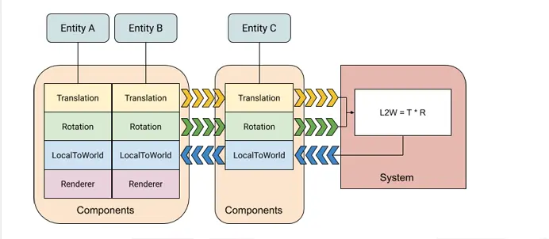
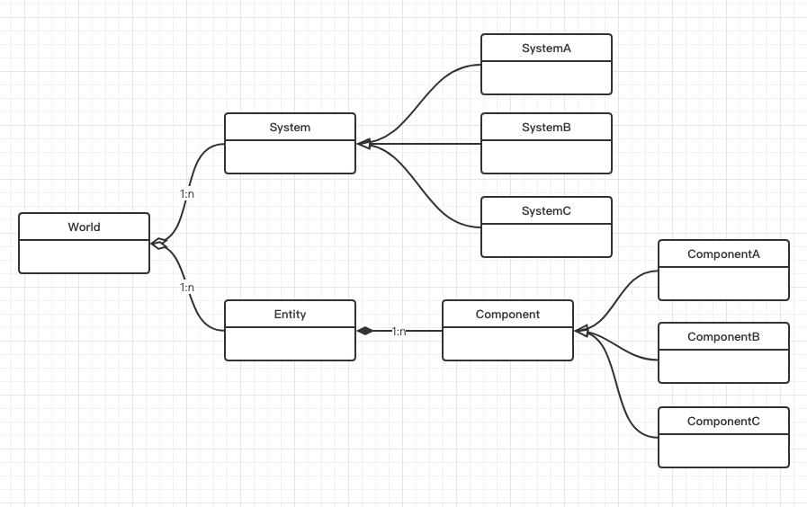
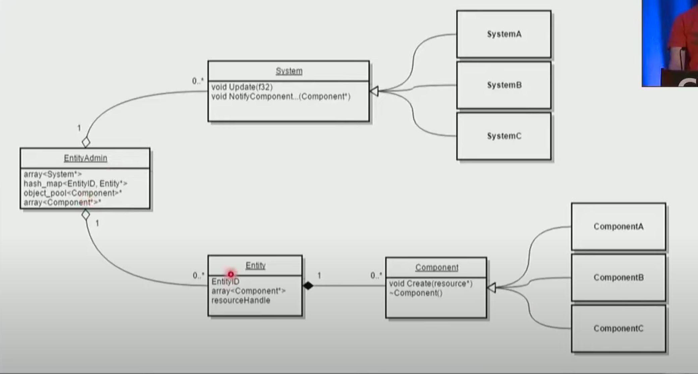

# How ECS Works




# 与Procedural Programming、OOP对比
Eg: 「我吃午饭」
```
// Procedural Programming 
eat(me, lunch) 
// OOP 
me.eat(lunch) 
```

对于更复杂的情况，OOP 发展出了继承、多态这一套规则，用于抽象共有的属性与方法，以实现代码与逻辑的复用

```
class People { 
  void eat() 
} 
class He extends People {} 
class She extends People {} 
 
const he = new He() 
const she = new She() 
he.eat() 
she.eat() 
```

可以看出，我们关注的点是：He 和 She 都是「人」，都具有「吃」这个共通的动作

# ECS - 三相之力
我们首先需要有一个 Entity(它可以理解为一个组件 Component 的集合，仅此而已) ---仅仅标识实体，没有方法、没有数据

```typescript
class Entity {
  components: {} 
  addComponent(c: Component) { 
    this.components[c.name] = component 
  } 
}
```

然后，在 ECS 中，一个 Entity 能干嘛，取决于所拥有的 Component：我们需要标识它可以「吃」---代表数据，没有方法
component一定存值类型而不是引用类型

```typescript
class Mouth { 
  name: 'mouth' 
}
```
最后，需要引入一个 System 来统一执行 「吃」这个动作 ---与某类或几类Component相关的行为，主动处理，集合处理

```typescript
class EatSystem { 
  update(list: Entity[]) { 
    list.forEach(e => e.eat) 
  } 
} 
```


组合运行
```typescript
function run() { 
  const he = (new Entity()).addComponent(Mouth) 
  const she = (new Entity()).addComponent(Mouth) 
 
  const eatSystem = new EatSystem() 
  eatSystem.update([he, she]) 
} 
```
依赖某种查询机制，来获取一个Entity集合上各Entity的符合条件的Component集合。

ECS 的设计就是为了管理复杂度，它提供的指导方案就是 Component 是纯数据组合，没有任何操作这个数据的方法；而 System 是纯方法组合，它自己没有内部状态。它要么做成无副作用的纯函数，根据它所能见到的对象 Component 组合计算出某种结果；要么用来更新特定 Component 的状态。System 之间也不需要相互调用（减少耦合），是由游戏世界（外部框架）来驱动若干 System 的。如果满足了这些前提条件，每个 System 都可以独立开发，它只需要遍历给框架提供给它的组件集合，做出正确的处理，更新组件状态就够了。


# Pros and Cons

## 传统OOP的问题：

- 数据组织耦合性极强：
一旦父类中增加或删除某个字段可能要影响到所有子类，影响到所有子类相关的逻辑 - e.g. ABC是D的子类，某天发现需要增加一个AB都有但是C没有的子类，那么这个数据不好放在D中，只能将AB抽象一个父类E，E继承于D，AB共有的字段加入E。一旦继承结构发生变化，接口可能也要改变；比如之前有个接口传入参数是E，当AB不再需要公用的那个字段，那么需要调整继承关系，让AB重新继承D，那么需要将接口的传入参数类型改成D，其中的逻辑代码可能也要发生调整。更可怕的是，如果游戏逻辑变化复杂频繁，需要不断调整继承结构，很无力。
还有个问题，是继承在运行时无法增添删除字段，比如平常走路，有时使用坐骑，使用坐骑的相关信息就要挂到player上，这样就很不灵活。

- 逻辑接口难以复用，难以热插拔
OOP处理相同行为所使用的方法是继承相同的父类或者接口。问题是接口并没有实现代码，而是需要子类取写相关实现，相似的功能每个子类可能写一份相似的代码，导致接口实现无法复用。同样的问题还能用之前的坐骑举例，骑行的接口无法动态删掉

- 不同程序员可能导致灾难后果
比如为了省事将AB中的字段加到D中，导致C莫名其妙多了个无用字段。越来越大之后，干脆用起面向过程了。

组件模式具有：高度模块化，组件可热插拔，类型间依赖少的特点。ECS也是种组件模式。

## 长处

- 「组合优于继承」
Entity 所具有的表现，仅取决于它所拥有的 Component，这意味着完全解耦对象的属性与方法;另外，不存在继承关系，也就意味着不需要再为基类子类的各种问题所头疼(eg：菱形继承、基类修改影响所有子类...etc)

- 「数据与逻辑的完全抽离」
Entity 由 Component 组成，Component 之中只有数据，没有方法;而 System 只有方法，没有数据。这也就意味着，我们可以简单地把当前整个游戏的状态生成快照，也可以简单地将快照还原到整个游戏当中 (这点对于多人实时网游而言，非常重要) （更高的性能，并行）

- 「表现与逻辑的抽离」
组件分离的方式天生适合逻辑和表现分离。同一套逻辑处理系统，加了表现组件就有了表现，可以放在客户端，不加的话就是纯逻辑，放在服务端确认客户端回传的数据。一套代码又能做服务器又能做客户端。（更高效的AI）
降低复杂性。
复杂性是软件工程的核心问题，
三种复杂性来源：
状态引起的复杂性（State）、
控制引起的复杂性（Control）、
代码量引起的复杂性（代码量的增长需要脑力的平方增长来理解）。

- 「组织方式更加友好」
真实的 ECS 中，Entity 本身仅具有 id 属性，剩下完全由 Component 所组成，这意味着可以轻松做到游戏内对象与数据、文档之间的序列化、表格化转换；扩展性更好，便于添加新功能。（可装配（配表）实现的编辑器）

- 「递归栈浅」
便于调试，更高效的程序开发维护

- 「减轻二级缓存miss问题」(memory bound效率问题)
数据布局对CPU cache友好，缓存命中率高（从缓存上拿数据），更利于多线程处理（jobsystem）。省电

- 「容易预测和回滚」
ECS的初衷就是为解决预测和回滚的，因为数据和状态都存储在Component（组件）里面，因此记录关键帧的数据和状态非常方便，这就使得实现预测和回滚容易许多；


### 对于特定Mactch 3
- 高效的程序开发维护。解耦。调用栈比较浅。
- 更高的性能。并行。
- Logic 和 View分离。
- 更高效的AI。关卡机器人。难度评估。趣味性评估。
- 可装配（配表）实现的编辑器。策划与程序解耦。
- 规范化的生产流程。


## 不足

- 「System 之间存在执行顺序上的耦合」
容易因为 System 的某些副作用行为(删除 Entity、移除 Component)而影响到后续 System 的执行。这需要一些特殊的机制来尽量避免

- 「C 与 S 之间分离」
导致S难以追踪C的属性变化，因为S中没有任何状态

- 「逻辑内聚，也更分散」
比如 A 对 B 攻击，传统 OOP 中很容易纠结伤害计算这件事情需要在 A 的方法还是 B 的方法中处理;而 ECS 中可以有专门的 System 处理这件事。但同样的，System 也容易造成逻辑的分散，导致单独看某些 System 代码难以把握到完整的逻辑

- 「学习成本高，开发速度慢」
ECS的低耦合特性来源于规范，规范导致了开发者需要花更多的时间在代码结构的设计上。ECS的思考方式和面向对象的思考方式存在着较大的不同。 

# 例子
1. 在演讲中，作者谈到了一个根据输入状态来决定是不是要把长期不产生输入的对象踢下线的例子，就是要对象同时具备连接组件、输入组件等，然后这个 AFK 处理系统遍历所有符合要求的对象，根据最近输入事件产生的时间，把长期没有输入事件的对象通知下线；他特别说到，AI 控制的机器人，由于没有连接组件，虽然具备状态组件，但不满足 AFK 系统要求的完整组件组的要求，就根本不会遍历到，也就不用在其上面浪费计算资源了。我认为这是 ECS 相对传统对象 Update 模型的一点优势；用传统方法的话，很可能需要写一个空的 Update 函数。

2. 玩家实体因为某些原因（可能陷入昏迷）而丧失了移动能力，只需简单地将移动组件从该实体身上移除，便可以达到无法移动的效果了。

3. 我们还可以用空组件（不含任何数据的组件）对实体进行标记，从而在运行时动态地识别它。如，EnemyComponent这个组件可以不含有任何数据，拥有该组件的实体被标记为“敌人”。(EnemeyComponent可以作为单例组件存在)

```csharp

  public class IComponent { }

  public class Entity { // 真正意义上的空对象，只包含一些常用组件处理
    public void AddComponent<T>() where T: IComponent {
      // 实现Entity的组件绑定
    }

    public bool HaveComponent<T>() where T: IComponent {
      // 返回一个Entity是否包含某个组件
    }

    public T GetComponent<T>() where T: IComponent {
      // 返回一个Entity包含的某个组件
    }
 }

  public class Dog: IComponent { }

  public class Pig: IComponent { }

  public class tail: IComponent { }

  public class WagTailSystem(){
    public void WagTails(List<tail> tails){
      Debug.Log("wag tails!");
    }
  }

  public void CreateEntitas(){
    Entity temp = null;

    for(int i = 0; i < 100; i++ ){
      temp = new Entity();
      temp.AddComponent<tail>();
      
      if(i<50){
        temp.AddComponent<dog>();
      } 
      else {
        temp.AddComponent<pig>();
      }

      entities.Add(temp);
      
    }
  }


  public void main()[
    List<tail> tails = new List<tail>();

    foreach(var t in entities){ // 筛选所有符合条件的
      if(t.HaveComponent<tail>()){
        tails.Add(t.GetComponent<tail>());
      }
    }

    new WagTailSystem().WagTails(tails);
  ]
```


# 总结
ECS 只是“面向数据的设计”思想下的一种设计模式，可以预见接下来在各个特定的领域会产生更多的以数据为中心的设计模式，特别是在并行计算领域，面向数据的设计将占主导地位。
ECS相比与其他的架构的优越性在于并行处理大量数据，这可以提高服务器响应的时间，也可以提高客户端的计算效率，将更多的资源放在计算其他无法并行计算的数据上，但是相应的，如果数据量较小的话，使用ECS架构并不能很好的体现他的优越性，甚至不如其他的架构。ECS不适合UI开发。
ECS提出了一种新的编程范式 —— 函数关系式（FRP）。涉及到的设计模式：工厂模式，单例模式，组合模式，责任链模式，观察者模式。 

【注释：常见编程范式】
- Imperative in which the programmer instructs the machine how to change its state,
  - procedural which groups instructions into procedures,
  - object-oriented which groups instructions with the part of the state they operate on,
- Declarative in which the programmer merely declares properties of the desired result, but not how to compute it
  - functional in which the desired result is declared as the value of a series of function applications,
  - logic in which the desired result is declared as the answer to a question about a system of facts and rules,
  - mathematical in which the desired result is declared as the solution of an optimization problem
  - reactive in which the desired result is declared with data streams and the propagation of change

由于代码逻辑分布于各个系统中，各个系统之间为了解耦又不能互相访问，那么如果有多个系统希望运行同样的逻辑，该如何解决，总不能把代码复制 N 份，放到各个系统之中。UtilityFunction（实用函数） 便是用来解决这一问题的，它将被多个系统调用的方法单独提取出来，放到统一的地方，各个系统通过 UtilityFunction 调用想执行的方法，同系统一样， UtilityFunction 中不能存放状态，它应该是拥有各个方法的纯净集合。

# References

[OverWatch ECS](https://www.youtube.com/watch?v=zrIY0eIyqmI&ab_channel=GDCArchive%28Unofficial%29)

[浅谈OverWatch ECS](https://blog.codingnow.com/2017/06/overwatch_ecs.html)

[Unity轻量级插件Entitas](https://github.com/sschmid/Entitas-CSharp/wiki)

[Unity手游实战：从0开始SLG——ECS战斗（一）ECS设计思想](https://cloud.tencent.com/developer/article/1659089)


[Entity system architecture with Unity - Unite Europe 2015](https://www.youtube.com/watch?v=1wvMXur19M4&ab_channel=Unity)

[Entitas - ECS Architecture with Unity by Example - Unite Europe 2016](https://www.youtube.com/watch?v=Phx7IJ3XUzg&ab_channel=DesperateDevs)
