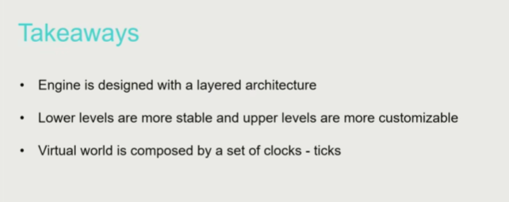

# 游戏引擎分层

## Layers of Game Engine

用户-工具层（工具交互编辑界面）-功能层（渲染、动画、物理等功能模块）-资源层（资源加载）-核心层（功能处理的内核）-平台层（对接不同游戏发布平台和系统）+ 对第三方软件工具调用、连接。

5+1层。下层是上层的基础。

## Resource Layer

资源（resource）到资产（asset）：各种资源文件格式转换成统一的资源格式，例如png、jpeg等图片格式压缩方式不同，且不适合GPU直接处理，需要统一转换成dts格式（可以直接在GPU中使用），这种转换提取有用数据（例如psd格式中有许多无用信息），并压缩，节省存储空间和运算效率。

定义一个描述资产关系的文件（脚本，XML），例如说明模型、贴图、动画对应的文件分别是哪些，以使引擎在运行时加载对应的资产。

游戏引擎最核心的功能就是数据之间的关联。游戏工程文件中会给每一个asset配置一个全局的独一的文件识别号（global unique identity，可以不依据文件的位置查找它），与通过路径查找文件不同。

资源管理器（Runtime Asset Manager）,其中handle system 在资产查找中起重要作用。

资源层的核心功能之一是管理资产（asset）的生命周期，资产会随着玩家游戏进度不断的加载和卸载，处理不好会对游戏运行造成问题。

延迟加载与生命周期不同，是在游戏运行到某个环节后逐渐加载。

资源层管理游戏资源池的分配，资产的实时生命周期，因此是引擎的核心部分。

## Function Layer 功能层

Tick：帧、时间、运动、变化

包括tick logic（模拟/逻辑世界）、tick rendering（渲染世界），类似unity的update（）

tick logic实现的某些功能根据不同的游戏需求边界感模糊。

游戏随着硬件多核走向多线程。

SIMD

## Core Layer 核心层（数学运算、数据结构与容器、内存管理）

矩阵变换、线性代数等数学知识，参照作者GAMES101笔记，或者看闫老师的课程。

游戏引擎的基础要求是runtime，对效率要求高。

SSE指令CPU专门用啦做向量运算，比普通运算指令快。

C++标准数据结构、容器不适合直接使用，需要为引擎专门写一套数据结构，因为使用标准数据结构容易造成内存浪费（内存碎片），且不受控制。

内存管理（Memory Management）很重要，游戏引擎的开发与操作系统开发有些类似。

提升CPU、内存效率的三个要点：1.把数据集中存放；2.按照顺序结构排列；3.输入输出以批处理的形式进行。

core层是引擎的核心，对代码质量要求高（安全、效率）。

## Platform Layer 平台层

目的是使游戏开发不受平台差异的影响。例如不同的平台会使用不同的图形API，平台层通过Render Hardware Interface（RHI）来解决这些差异问题，利用虚函数对这些图形API进行封装。

## Tool Layer 工具层（主要为创作者提供生产力工具）

工具层不需要实时（runtime）。

工具层是以地图编辑器为中心一系列的编辑器，包括蓝图逻辑编辑器、材质编辑器、动画编辑器等等。

引擎的主要开发语言是C++，因为对运行效率有很高要求，但是工具层也可以选择C#等语言，不同的引擎有不同的选择。

工具层的代码量要大于其他层，维护难度较高，也算是最核心的。

Digital Content Creation（DCC）：别人开发的资产生产工具。例如Blender、Maya。

Asset Conditioning Pipeline（本质是资源导入管线）把引擎的编辑器与第三方外部DCC结合起来共同构成引擎完整的工具层。

## Why Layered Architecture?

- Decoupling and Reducing Complexity
    - Lower Layers are independent from upper layers
    - Upper layers dont know how lower layers are implemented

- Response for Evolving Demands
    - Upper layers evolve fast, lower layers are stable

## Mini Engine Pilot