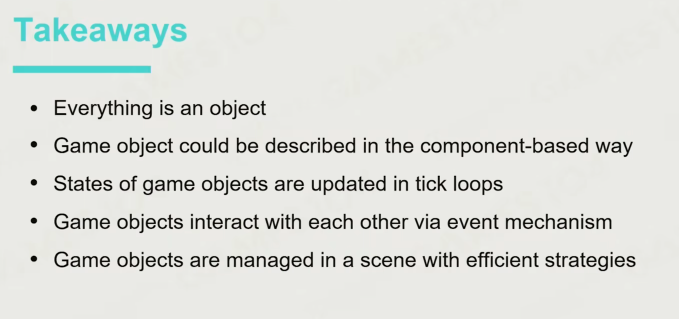
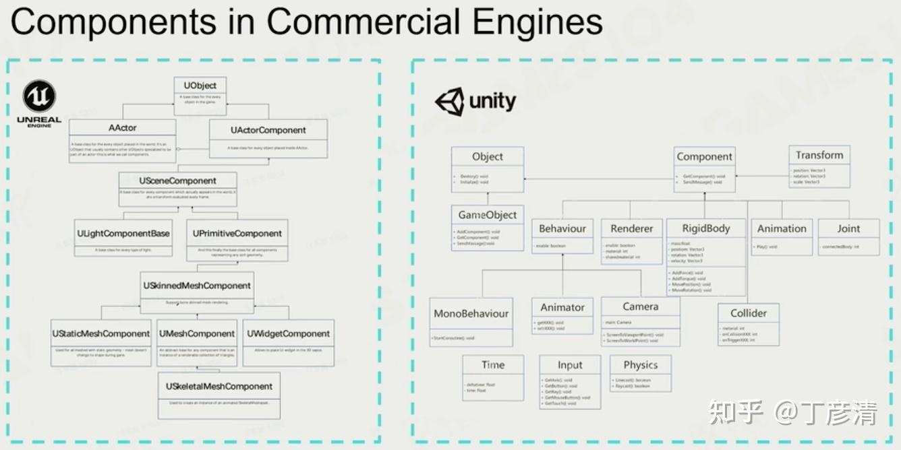
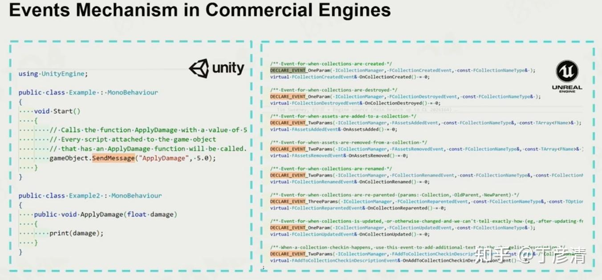

# 构建游戏世界

## 如何让游戏世界活起来

###  Game Objects（游戏对象）：

Dynamic Game Objects（动态游戏物体）

Static Game Objects（静态游戏物体）

Environments（环境系统）

Other Game Objects（其他游戏物体，一般都不是实物）

属性和行为基本可以描述以上所有物体。

用C++面向对象与派生、继承的特点，描述一个Game Objects。

在游戏物体日益复杂的情况下，通过继承的方法很难描述一个属性和行为复杂的游戏对象，因此现在发展成通过定义组件（Components），然后用组件组成一个需要的游戏对象的方式。这样方便自定义，以及组件复用，并且方便用户理解和使用。

从组件到游戏对象构建出游戏中的万事万物。

## Tick

Object-based Tick，Component-based Tick（现代引擎常用的，类似工业流水线。把同类Component放在一起读写、处理效率更高）。

## Event

Event在系统架构中被叫做解耦合，改变了对象、组件之间的通信方式（时间驱动，观察者模式，事件回调）。

## Scene Management

Scene Management：用于通知管理GO（Game Object）,通过GO的唯一ID与场景位置实现。

如何管理：

最直接简单的是所有GO依次查找位置，但当GO较多时开销大；

二是把场景划分成均匀的格子，但是当GO分布不均匀时不适合；

三是树形结构，例如Quadtree；(Hierarchical segmentation)

其他，BVH包围盒。

## 其他需要处理的复杂情况

GO Bindings.

组件循环依赖。(Pre tick()、Post tick()函数。)

tick+event产生的时序问题，如果处理不好会产生逻辑冲突，尤其容易在多线程中产生。Immediate Event sending or not (解决：Event dispatcher，类似邮局决定谁先发了谁消息)

游戏的精彩回顾不是游戏储存了录屏文件，二是把游戏时的玩家数据输入存储起来，通过这些数据进行场景复现。
