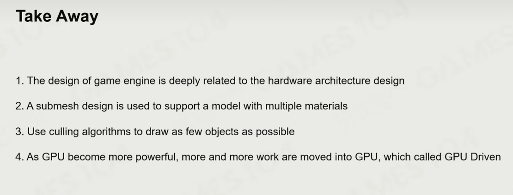

# 游戏引擎中的渲染实践 Rendering on Game Engine: Basics of Rendering

## 渲染概述

游戏渲染中的挑战：

1.游戏渲染系统非常复杂，包含大量的game object和不同的效果；

2.要深度适配现代硬件架构，GPU、CPU；

3.对高帧率与高分辨率越来越高的要求；

4.对CPU性能的有限使用，因为CPU除了渲染之外还要为游戏逻辑、网络、物理、ai系统提供算力。

## 渲染系统的对象

Rendering pipeline and data

Projection and Rasterization

Shading: constants/parameters, ALU, Texture Sampling, Branches

Texture Sampling: 昂贵。

## 了解GPU

SIMD（Single Instruction Multiple Data）单指令多数据流，并发编程。例如向量运算（x,y,z），一个指令可以完成三个运算。

SIMT（Single Instruction Multiple Threads）单指令多线程，可以理解为把多个SIMD同时运行，SIMT+SIMD使显卡运算量运算速度大量提升。

要尽可能降低CPU与GPU之间的数据传输，因为数据的传输较为耗时。Unity URP在这部分有明显的优化。

尽量保持CPU向GPU的单向数据传输，不要CPU从GPU中读数据，CPU的逻辑运算和GPU的渲染有差异，数据自由流动会产生混乱。

提高运行效率要利用好Cache以提高传输速度，使同批数据同时缓存在Cache中。

与PC不同，游戏主机的内存是共享的，被称作UMA（Unified Memory Architecture）。

引擎的架构是和硬件架构（PC、主机、手机等都不相同）息息相关的

## 可渲染物体

mesh + material + shader = renderable

需要给每个顶点单独存储法线，因为如果在三角面弯折处两个重合的顶点法线（从三角面获得）会不一样。使用顶点编号，避免顶点重复储存浪费空间。

视觉material：

1.与物理材质是完全不同的概念

2.主要模型（models）：Phong模型、PBR模型、Subsurface次表面模型

3.材质贴图：albedo、法线、金属、roughness、AO

Shader是源码又是数据。

*SubMesh*：为了给mesh不同位置设置不同材质，用顶点编号范围把整个mesh划分为不同的SubMesh。

Instance：引擎中的实例化，例如场景中多个相同物体其实是一个Game Object的实例。也就是说，场景中的mesh、shader、texture都是存储在各自的资源池内，场景渲染时通过索引值去调用资源，这样可以实现场景中相同资源的复用，降低存储空间。是现代游戏引擎中的重要概念。

游戏引擎在运行时会把场景中的GO按照材质进行分类排序，即把材质相同的SubMesh放在一起，这样可以避免材质参数的频繁改动，提高GPU的利用效率。

GPU Batch Rendering：提高场景中相同mesh、material的GO运算效率，提升drawcall 的速度，把更多的计算从CPU中转移到GPU中实现。

## 可见性裁剪

BVH（Bounding Volume Hierarchy）https://blog.csdn.net/zjc_game_coder/article/details/76562542

PVS (Potential Visibility Set)可以理解为透过房间的门和窗最多能看到的房间。该方法也可以用于资源的加载。

## 纹理压缩

引擎不能用jpg png等压缩格式，因为这些格式纹理每个像素的值不能直接访问

Block Compression: 核心是储存一个4*4纹素内的最大值和最小值，其他像素根据插值（距离参数）计算而来

## 建模工具

建模方式：

点线面：Maya

雕刻型：Zbrush，更自由灵活

3D扫描：精度更高更准确

自动化生成模型：houdini，目前地形为主

## 新的模型管线

背景：游戏的数据量越来越大，例如，模型细节增多，游戏场景增大。这种进步对游戏引擎架构提出更高要求。

Cluster-Based Mesh Pipeline：引擎新的发展方向，两个重要的idea：一是把mesh面片按照一个数量进行分组，根据距离的远近呈现不同面片细分度的mesh模型，这个功能大多数可以通过代码自动化生成；二是根据摄像机的方向和距离动态剔除模型不需要被渲染的面片。UE5的Nanite可以理解为在Cluster-Based Mesh Pipeline基础上的优化。

