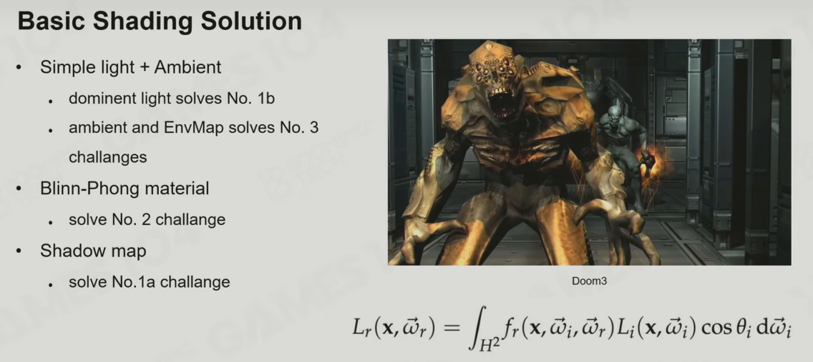

# 游戏引擎中的渲染实践 Rendering on Game Engine:

3A渲染核心技术总结

- Lightmap + Lightprobe
- PBR + IBL
- Cascade shadow + VSSM

## 渲染方程及挑战

Rendering = Lighting + Material + Shader

第一个挑战：

1.阴影（光源的可见性）

2.光是复杂的（点光源、平行光、spot light、面光源，面光源是最难的）

第二个挑战：如何快速准确的算出光线与材质的积分结果。

第三个挑战：直接光照+n个间接光照。

## 基础光照解决方案

解决方法：1.simple light + ambient；2.Blinn-Phong Material；3.shadow map。

虽然有很多Shadow 的算法，但是在游戏引擎中最常用的还是shadow map。

Kajiya: 早期渲染模型，未完全遵循渲染公式

- Dominent light solves challenge 1.2
- Ambient and Env map solves 3

Blinn-Phong Materials: 基于经验，不基于物理；不能量守恒（保守）；很难实现复杂真实

- Solves 2

Shadow Map

- Solves 1.1

## 基于预计算的全局光照

预计算即是用空间换时间。

把三维空间展开在一个2D纹理上。

全局光照对于真实感的刻画非常重要。

这部分可以看GAMES202更为详细

LightMap:

优点：Efficient in RT; Bake a lot of fine detail of GI on Environment

缺点：耗时；只能静态物体；会占更多存储。能得到很好的光照效果，但有被淘汰的趋势。

Light Probes + Reflection Probes

优点：Efficient in RT; Can be applied to both static and dynamic objects; Handle both diffuse and specular shading

缺点：A bunch of SH light probes need precomputation; Cannot handle fine detail of GI, i.e, soft shadow on overlapped structures

## 基于物理的材质

光照射物体时除了一部分光被反射掉，还有些光会进入物体内部，对于金属物体来说，金属的电子可以捕获光子，把这部分光吸收掉，但对于非金属物质来说，这些进入物体内部的光还会被散射出来（完成几次折射后随机弹射出来），称为次表面散射。

BRDF: https://zhuanlan.zhihu.com/p/490024846

PBR Specular 模型非常灵活，尤其是Specular 贴图有RGB三个参数，灵活自由的另一面是难以控制，这也是为什么只有一个参数的PBR Metallic 模型更常用。

## 基于图像的光照

这部分对于IBL（image-based light）只是粗略的讲了些

## 经典阴影方法

Pros:
- Best way to prevalent errors with shadowing: perspective alias
- Fast to generate depth map, 3x up when depth writing only
- provide fairly good results

Cons:
- Nearly impossible to generate high quality area shadows
- No colored shadows, Transucent surfaces cast opaque shadows