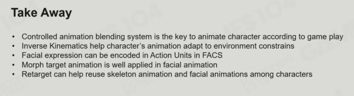

# 高级动画技术：动画树、IK和表情动画

## 动画混合

Lerp - Calculate Blend Weight - Align Blend Timeline

要求动画需要是循环播放的。

## 混合空间

Lerp, Mask, Additive
 
## 动作状态机

Cross Fades Curve

## 动画混合树

## IK

Basic Concept:

- End-effector: The bone which is expected to be moved to a desired position

- IK (Inverse Kinematics): The use of kinematic equations to determine thejoint params of a manipulator so that the end-effector moves to a desired position

- FK (Forward Kinematics): The use of kinematics equations of a robot to compute the position of the end-effectors from specified values for the joint params

Two Bones IK，通过一个三角形解决问题计算旋转角度

Complexity of Multi-Joint IK Solving:

- Check Reachability of the Target: 如果骨骼触碰不到物体的情况下求解，会一直进行无效运算。
- Constraints of Joints: 不同骨骼有不同活动范围

骨骼是纯抽象的，没有空间的体积，容易自我交叉、重叠，因此IK很难。 

Multi-Joint IK的几种算法：

CCD ，最经典、简单、主流的算法；

FABRIK ，较为主流的算法；

Jacobin Matrix ,可以用于多控制点（target）的IK，运算比较复杂；

## 面部动画

微表情对于面部动画的精度要求高。

Facial Action Coding System

人脸表情动画的本质是对几个关键Pose做插值运算，然后用顶点动画实现动画效果。

FACS in Morph Target Animation: 关键帧Poses记录的是顶点相对于中性表情的偏移量（offset）

骨骼蒙皮动画实现人的人脸动画，主要用于眼球、嘴巴以及捏脸功能

UV Texture Facial Animation：适用于二次元

Muscle Model Animation：脸部肌肉模型动画，新的趋势，更真实，用于电影动画

## 动画重定向

Share Animation Among Characters

- Ignore Offset Between Source and Target Joints
- Keep Orientation in Different Binding Pose
- Handle animation tracks respectively, 旋转位移缩放的重定向
- Align Movement by Pelvis Height

Lock feet 通过骨骼映射的方法实现。