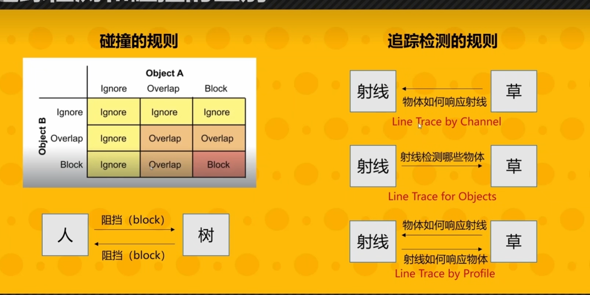

# 10 游戏引擎中物理系统的基础理论和算法

## 物理系统

物理的解算要比渲染和动画更复杂。

## 物理对象与形状

### 物理对象

静态物体：有碰撞，但不会动；

动态物体：受到力后会有物理运动；

Trigger

Kinematic Actor: 
- Ignoring Physics Rules
- Controlled by gameplay logic directly

### 物理形状

复杂几何体之间的求交非常复杂，因此物理系统中会用形态简单、可以快速求解的几何体

物理形状的属性：

1.质量或密度（一个object内均匀分布）；

2.重心/质心；

3.摩擦力和弹性；

## 力与运动

游戏中的各种力（force）：

重力、拖力（Drag）、摩擦力、冲力（Impulse，例如爆炸时的冲击力）。

介绍牛顿第一、第二定理。

同现实世界一样，游戏世界的运动也基本是变速的，因此需要通过积分算出运动物体在每帧的位置。

但是因为计算精度问题，积分的计算的运动结果很难准确。

例如显式欧拉积分计算的结果随着时间的增大，最终大于真实结果，产生能量不守恒的现象。隐式欧拉积分则随着时间增大，计算结果小于真实结果，但考虑到各种原因造成的能量损失，隐式欧拉积分相比显式欧拉积分在游戏引擎中更能被接受。

计算结果更为准确的是半隐式欧拉积分

## 刚体动力学

游戏引擎中的物理引擎大多数使用第三方产品，不需要自己开发。

上面介绍的物体受力运动情况都是假设物体是理想状态下的，但是在游戏中物体的形状并非都为球形，而是大多数形状不规则，所以物体的受力和运动也不是理想状态，例如不规则物体在抛物运动时的旋转加速度与球形物体不同。因此引出刚体运动

## 碰撞检测

2 Phases:
- Broad Phase
    - Find intersected rigid body AABBs
    - Potential Overlapped reigid body pairs

- Narrow Phase
    - Detect overlapping precisely
    - Generate contact information

Broad Phased 方法一：BVH Tree

Broad Phased 方法二：Sort and Sweep（效率更高）

Narrow Phased 方法一：Basic Shape Intersection Test

Narrow Phased 方法二：Minkowski Difference-based Methods
建立在Minkowski Sum 基础上。

把两个碰撞体看作是无数点的集合，对两个集合进行加减运算（和集合的并、交不是一个概念），具象理解两个集合的加法运算是吧第一个几何按照第二个几何的边缘做平移运动（视频课件有动画可以帮助理解，文字难以表达）。而两个集合相减形成的新集合是否包含原点可以判断是否相交和交距。

Narrow Phased 方法三：Separating Axis Theorem（SAT）
以两个凸多边形的边做轴，是否存在一个轴可以把两个多边形完全划分在轴的两侧，如果存在则不相交。

## 碰撞解决

如何把两个相交的碰撞体分开：Applying Penalty Force

Constraints在引擎中更常用。

## 场景请求

Raycast，在游戏中用于弹道，碰撞检测，思想类似光线追踪。

## 效率，准确性与确定性

1. Simulation Optimization - Sleeping 

- Simulating and solving all rigid bodies uses lots of resources
- Introducing sleeping
    - A rigid body does not move for a period of time
    - Until some external force acts on it

2. 把碰撞物体进行分组，没有交互整体休眠

Continuous Collision Detection 连续碰撞检测

- Make floor thicker - boundary air wall

3. Deterministic Simulation

Same old states + same inputs = same new states

- Fixed step of physics simulation
- Deterministic simulation solving sequence
- Float point consistency

