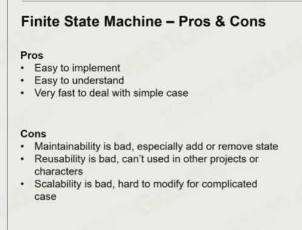
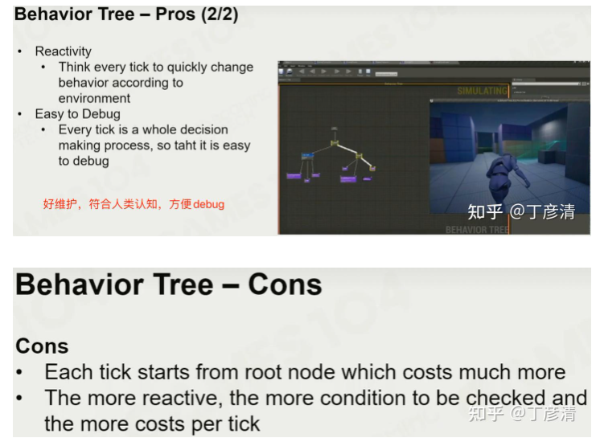

# 16 基础AI(下)

## Steering

From path to motion:
- Cars cannot follow planned path exactly
- Motion of cars are limited by their motion abilities:
    - Linear acceleration (throttle/brake)
    - Angular acceleration (steering force)
- Motion needs to be adjusted to the limits

Seek/Flee

VlocityMatch

Align: Matches target orientation

## 群体模拟

Microscopic / Macroscopic / Mesoscopic

斥力/zone graph

Collision Avoidance - Force-based

Collision Avoidance - Velocity-based

RVO, ORVO, ORCA

## Sensing & Perception

Influence map

Gmae Object

## 经典决策算法

Finite State Machine

HFSM

BT

确定性很高 接下来讲AI自己思想在决策