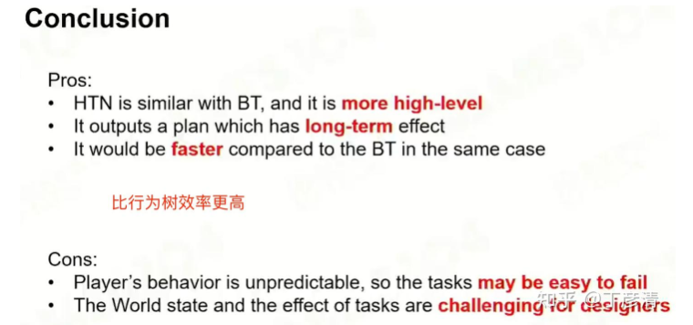

# 17 高级AI(上)

## 层次任务网路（HTN）

Make plan like human

把行为树理解为完成某一任务有哪些子任务，实现子任务有哪些选项

HTMN Framework:
- World state (subjective world view in AI Brain)
- Sensors (Perception)
- HTN Domain (Describe the relationship of hierarchical tasks)
- Planner (Make a plan)
- Plan Runner (Update the world state after the task)

Replanning

## GOAP

More automated. Backward Planning

Select -> Make Plan -> Execute

HTN的目标是隐藏在过程中，而此处的goal被清晰定量表达(通过 a collection of states)

从目标倒推。有cost，其他都与HTN类似

## 蒙特卡洛树搜索（MCTS）
Monte Carlo method 用随机数的方法解决了巨大、复杂的问题。