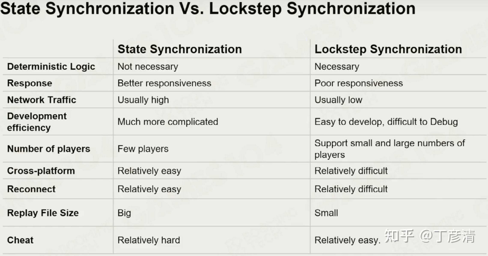

# 18 网络架构基础

## Synchronization

### Snapshot 

- Client sends inputs to server
- Server simulated the game world

- Generates whole game state snapshots
- Sends them down to client

- Client updates the dispaly according to snapshot

结果高度一致，但是会限制带宽帧率

在两个客户端之间做插值

Features:
- Client performance is wasted
- High server pressure
- High data volume and high bandwidth requiremeents
- As games get more complex, snapshots get bigger

### Lockstep Sync (帧同步)

Same input + Same execution Process = Same state

服务器负责信息同步转发

#### Deterministic Lockstep

game progress depends on slowest

wait for offline

#### Bucket Sync

Bucket: A fixed time period

Each bucket
- collect all instructions
- broadcast to all players

Interactivity +, Consistency -

在断线回联、观战、精彩重放中的应用

作弊问题：投票机制

Advantages:
- low bandwidth, only sends commands
- High development efficiency, similar to single player game dev
- Precise action/hit detection
- Easy to record games

Problems:
- Maintain the consistency is difficult to achieve
- Hard to solve the cheat plugin to unveil all game states
- Longer disconnection and reconnection time

#### Deterministic Difficulties

### State Sync

状态同步内容：
- State data
- Events
- Control data

“服务器更具有发言权"

Dumb Client Problem: Cannot do anything until receive sever state update

- Client-side prediction
- Server reconciliation

