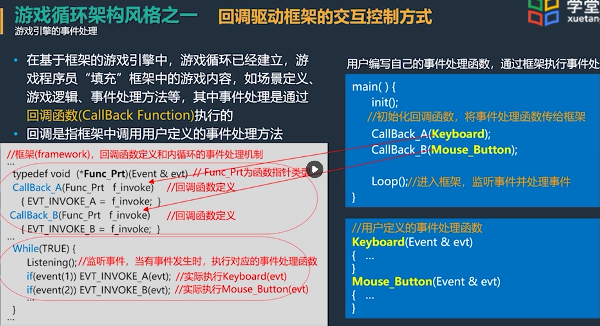

# 第1章 导论

## 1.1 典型游戏团队结构

Engineer, Artist, Designer, Producer，其他支持和管理人员（市场，法律，it，行政）

Content is King

市场、制造和分销一般由发行商负责

## 1.2 游戏是什么

在设计的虚拟环境中，用确定的约束规则，由游戏参与者决策和控制的一种体验流程

## 1.3 游戏引擎是什么

把游戏开发中的基本核心功能抽象出来，供游戏开发者调用，这样的组件系统被称为游戏引擎

## 1.4 不同游戏类型的引擎差异

## 1.5 游戏引擎概览

## 1.6 运行时引擎架构

游戏引擎通常由工具套件和运行时组件两部分组成

### 1.6.1 目标硬件，设备驱动程序和操作系统

### 1.6.2 第三方软件开发包和中间件

数据结构，图形，碰撞物理，角色动画，人工智能，生物力学角色模型

### 1.6.3 平台独立层

### 1.6.4 核心系统

assertion，内存分配，数学库等

### 1.6.5 资源管理器

### 1.6.6 渲染引擎

### 1.6.7 剖析和调试工具

### 1.6.8 碰撞和物理

### 1.6.9 动画

### 1.6.10 人体学接口设备

### 1.6.11 音频

### 1.6.12 网络

### 1.6.13 游戏性基础系统

### 1.6.16 游戏专用子系统

如摄像机，人工智能，专用渲染，武器等

## 1.7 工具及资产管道

### 1.7.1 数字内容创作工具（DCC）

### 1.7.2 资产调节管道

### 1.7.3 世界编辑器，资源数据库

# 第2章 专业工具

# 第3章 游戏软件工程师基础

# 第4章 游戏所需的三维数学

# 第5章 游戏支持系统

## 5.1 子系统的启动和终止

### 5.1.1 C++ 静态初始化次序（是不可用的）

在函数内声明的静态变量不会在main()之前构建。把全局单例改为静态变量就可控制全局单例的构建次序

```cpp
class RenderManager{
public:
    // 取得唯一实例
    static RenderMannager& get()
    {
        // 此函数中的静态变量将于函数被首次调用时构建
        static RenderManager sSingleton;
        return sSingleton;
    }

    RenderManager()
    {
        VideoManager::get();
        TextureManager::get();
        // ...
    }

    ~RenderManager()
    {
        // 终止管理器
    }

};
```

变种：

```cpp
static RenderManager& get()
{
    static RenderManager* gpSingleton = NULL;
    if(gpSingleton == NULL)
        gpSingleton = new RenderManager;
    ASSERT(gpSingleton);
    returnm *gpSingleton;
}
```

但此方法不可控制析构次序，且难以预计单例确切构建时间

最简单的“蛮力”方法就是，明确定义启动和终止函数，而构造和析构函数完全不做任何事，这样我们可以在main()中按需明确次序调用

## 5.2 内存管理

以malloc或者new进行内存分配是非常慢的操作，要尽量避免动态内存分配，不然也可利用自制的内存分配器降低分配成本

把数据置于细小的连续内存块更高效

### 5.2.1 优化内存分配

用malloc或者new很慢的原因：

1. 大量管理开销
2. 从user mode切换到kernel mode的context-switch浪费时间

### 5.2.2 内存碎片

以堆栈和池分配器避免内存碎片

## 5.3 容器

p++后置递增不造成数据依赖，而++p会，且可能造成流水线停顿（stall）

## 5.4 字符串

提前对字符串扣留一次并把结果储存备用更好

```cpp
static StringId sid_foo = internString("foo");

// stringid.h

typedef U32 StringId;
extern StringId internString(const char* str);

// stringid.cpp
static HashTable<StringId, const char*> gStringIdTable;

StringId internString(const char* str)
{
    StringId sid = hasCrc32(str);
    HashTable<StringId, const char*>::iterator it = gStringIdTable.find(sid);

    if (it == gStringTable.end())
    {
        // 加入表
        // 记得要复制，以防原来的字符串是动态分配的并将被释放
        gStringTable[sid] = strdup(str);
    }

    return sid;
}
```

## 5.5 引擎配置

# 第6章 资源及文件系统

处理资源间的交叉引用：

1. 使用全局统一标识符做交叉引用
2. 指针修正表
3. 存储C++对象为二进制映像：构造函数

# 第7章 游戏循环及实时模拟

## 7.1 渲染循环

Rectangle Invalidation, 仅重绘屏幕中有改动的内容

```
while(!quit){
    updateCamera();
    updateSceneElements();

    // 把静止的场景渲染到屏幕外的帧缓冲
    renderScene();

    // 交换背景缓冲和前景缓冲
    swapBuffers();
}
```

## 7.2 游戏循环

## 7.3 游戏循环的架构风格

消息泵，回调驱动，基于事件的

## 7.4 抽象时间线

## 7.5 测量及处理时间

30 FPS: delta time = 33.3ms

60 FPS: delta time = 16.6ms

毫秒是游戏中常用的时间单位

游戏有时候会用上一帧的delta t估计下一帧，会造成不好的效果。帧率调控可以减少误差

在Unity中，Update和FixedUpdate是两个常用的游戏循环函数，它们之间有以下区别：

调用频率：Update函数在每一帧渲染之前被调用，因此其调用频率是不确定的，取决于每秒帧数（FPS）。而FixedUpdate函数是在固定时间间隔内调用，通常是每秒固定调用几次。默认情况下，FixedUpdate每秒调用次数为50次，但可以通过修改Time.fixedDeltaTime来改变。

时间间隔：Update函数的时间间隔是可变的，根据帧率的变化而变化。而FixedUpdate函数的时间间隔是固定的，不受帧率的影响，因此在物理模拟等需要固定时间间隔的情况下更加可靠。

适用场景：Update函数适用于处理与用户输入、游戏逻辑和动画相关的操作。因为其调用频率不固定，所以适合处理相对较轻量级的操作。而FixedUpdate函数适用于处理物理模拟、刚体运动和碰撞检测等需要固定时间间隔的操作。由于其时间间隔固定，所以适合处理较重量级的操作。

需要注意的是，由于物理引擎在FixedUpdate中运行，所以涉及刚体和碰撞的代码最好放在FixedUpdate中，以确保物理模拟的准确性。而其他游戏逻辑和动画相关的代码可以放在Update中。

综上所述，Update和FixedUpdate函数在调用频率、时间间隔和适用场景上有所区别，开发者应根据具体的需求和功能选择合适的函数来编写代码。

总结来说，按照一定时间间隔更新游戏适用于较简单的、不需要实时响应的游戏类型，而帧间隔更新适用于对实时性要求更高的游戏类型。

## 7.6 多处理器的游戏循环

比如

```cpp

RayCastResult result;
requestRayCast(playerPos, enemyPos, &result);

// 当等待其他核做光线投射时，做其他无关的工作

// 不能做更多了，等待光线投射作业的结果

waitForRayCastResuilts(&result);

//处理结果
if(result.hitSth() && isEnemy(r.getHitObject()))
{
    // ...
}

```

有时也加入bool rayJobPending以等待上一帧光线投射结果

## 7.7 网络多人游戏循环

# 第8章 人体学接口设备

## 8.1 各种人体学接口设备

## 8.2 人体学接口设备的接口技术

轮询，中断

## 8.3 输入类型

## 8.4 输出类型

## 8.5 游戏引擎的人体学接口设备系统

迅速连续按按钮

```cpp
class ButtonTapDetector{
    U32 m_buttonMask; // 需要检测的按钮（位掩码）
    F32 m_dtMax; // 按下事件之间的最长允许时间
    F32 m_tLast; // 最后按下按钮的事件，以s为单位

public:
    ButtonTapDetector(U32 buttonMask, F32 dtMax)
        : m_buttonMask(1U<<buttonMask)
        , m_dtMax(dtMax)
        , m_tLast(CurrentTime()-dtMax) // 开始时是无效的
    {}

    bool isGestureValid(U32 buttonMask, F32 dtMax)
    {
        F32 t = CurrentTime();
        F32 dt = t-m_tLast;
        return (dt < m_dtMax);
    }

    void Update(){
        if(ButtonJustWentDown(m_buttonMask)){
            m_tLast = CurrentTime();
        }
    }
};

```

多按钮序列

```cpp
class ButtonSequenceDetector{
    U32* m_aButtonIds; // 检测的序列
    U32 m_ButtonCount;  // 序列中的按钮数
    F32 m_dtMax; // 按下事件之间的最长允许时间
    EventId m_eventId; // 检测到序列时发送的事件
    U32 m_iButton; // 要检测的下一个按钮
    F32 m_tStart; // 序列开始时间，以s为单位
public:
    // 构建一个对象，用于检测指定的按钮序列
    // 当成功检测到序列时，就会广播指定事件，令整个游戏能适当回应事件

    ButtonSequenceDetectir(U32* aButtonIds, U32 buttonCount, F32 dtMax, EventId eventIdToSend)
        : m_aButtonIds(aButtonIds)
        , m_nButtonCount(buttonCount)
        , m_dtMax(dtMax)
        , m_eventId(eventIdToSend)
        , m_iButton(0)
        , m_tStart(0) // 开始时是无效的
    {}

    void Update(){
        ASSERT(m_iButton < m_nButtonCount);

        // 计算下一个预期的按钮，以位掩码表示
        U32 buttonMask = (1U << m_aButtonIds[m_iButton]);

        if (ButtonJustWentDown(~buttonMask)){
            m_iButton = 0; // 重置序列
        }
        else if (ButtonJustWentDown(buttonMask)){
            if(m_iButton == 0){
                m_tStart = CurrentTime();
                m_iButton++;
            }
        
            else{
                F32 dt = CurrentTime() - m_tStart;

                if(dt<m_dtMax){
                    // 序列仍然有效
                    m_iButton++;

                    if(m_iButton == m_nButtonCount){
                        // 序列已完成
                        BroadcastEvent(m_eventId);
                        m_iButton = 0;
                    }
                }
                else{
                    // 对不起，按的不够快
                    m_iButton = 0;
                }
            }
        }
    }
};
```

# 第9章 调试及开发工具

## 9.1 日志及跟踪

## 9.2 调试用的绘图功能

## 9.3 游戏内置菜单

## 9.4 游戏内置主控台

## 9.5 调试用摄像机和游戏暂停

## 9.6 作弊

## 9.7 屏幕截图及录像

## 9.8 性能分析

## 9.9 内存统计和泄露检测

# 第10章 渲染引擎

## 10.1 采用深度缓冲的三角形光栅化基础

## 10.2 渲染管道

1. 工具阶段
2. 资产调节阶段
3. 应用程序阶段
4. 几何处理阶段
5. 光栅化阶段

## 10.3 高级光照及全局光照

## 10.4 视觉效果和覆盖层

# 第11章 动画系统

## 11.1 动画系统类型

sprite: 图形硬件绘制

## 11.2 骨骼

## 11.3 姿势

## 11.4 动画片段

## 11.5 蒙皮及生成矩阵调色板

## 11.6 动画混合

## 11.7 后期处理

## 11.8 压缩技术

## 11.9 动画系统架构

- 动画通道
- 动作状态机
- 动画控制器

## 11.10 动画管道

## 11.11 动作状态机

## 11.12 控制器

# 第12章 碰撞及刚体动力学

## 12.1 你想在游戏中加入物理吗

- 可预测性
- 调教及控制
- 意外行为

游戏设计应驱动游戏引擎物理方面的需求，而不是反过来

## 12.2 碰撞/物理中间件

## 12.3 碰撞检测系统

避免隧穿(Tunneling):
- 扫掠形状
- 连续碰撞检测

性能优化：
- 时间一致性
- 空间划分(BSP)
- 粗略阶段，中间阶段，精确阶段
- 扫掠裁剪算法


碰撞查询：
- 光线投射
- 形状投射
- Phantom

## 12.4 刚体动力学

## 12.5 将物理引擎整合至游戏

刚体通过逻辑对象作为枢纽与渲染引擎相连

# 第13章 音频

## 13.1 声音的物理

## 13.2 声音的数学知识

## 13.3 声音技术

## 13.4 三维音频渲染

衰减，偏移，混响

## 13.5 音频引擎架构

## 13.6 游戏专用的音频功能

### 13.6.1 支持切割屏

### 13.6.2 角色对话

优先级及打断，独占性，对话分支

### 13.6.3 音乐

# 第14章 游戏性系统介绍
游戏机制通常被定义为一些规则，主宰了各个实体之间的互动。机制定义了目标(Objective)、成败准则(criteria)、玩家能力(ability)、非玩家实体的数量及类型、以及游戏体验的整体流程(overall flow)

## 14.1 剖析游戏世界

动态元素、静态元素，主要为了优化

game state指的是所有动态游戏世界中元素的当前整体状态

目标和组块的耦合被刻意减弱

# 14.2 实现动态元素：游戏对象

## 14.3 数据驱动

当游戏的行为可以全部或部分由设计师（美术，策划）所提供的数据所控制，而不是由程序员编写的软件完全控制，该引擎为数据驱动

## 14.4 游戏世界编辑器

# 第15章 
---
---
---

# 3D游戏引擎架构设计基础

## 1. 游戏引擎的场景管理

### 场景管理概述

游戏场景

- 摄像机
- 地面
- 天空
- 光照
- 人物
- 道具
- 建筑
- 特效


管理

1. 分类
2. 树形组织
3. 包围体层次结构 BVH方法
4. 几种包围体比较
    - 包围球
    - AABB轴平行包围体
    - OBB有向包围体 (也是长方体作为包围体，但可以按照任意方向建立)
    - k-离散有向多面体（最紧密，但开销最大）

BVH

- 快速判断场景对象之间的几何位置关系
- BVH方法为每个对象建立包围体
- 包围体层次结构就是节点有包围体信息的树状结构


### 场景图

场景对象的分类
- 按大小
- 可移动性
- 可渲染性
- 刚体变形

BVH数仅仅表示几何对象。场景图包含非几何对象

### OGRE场景管理

场景类型分为
- 静态型
    - 非常庞大
    - skyplane, World geometry, Static geometry
- 动态型
    - Entity
    - 用SceneNode类和MovableObject类来表示
- 扩展型
    - SceneNode的派生类

### OSG场景管理

不同点：

- OGRE最多只有一个父节点（场景树），OSG有0个或多个（有向无环图）
- OGRE树节点类型单一，扩展性好，OSG有多种节点类型，场景树节点的管理比较复杂

共同点：

- 都是通过场景图管理场景中的内容
- 场景内容都不作为树节点，不会出现重复加载
- 都用包围体简化可移动对象的表示

### Panda3D 场景管理

- 有0个或多个（有向无环图）
- 有多种场景类型节点，扩展性差
- 场景图节点只有一个基类，没有提取可渲染节点的渲染操作，设计逻辑简单，但模块划分不够细

### 八叉树场景管理

镜头位置和方向确定后遍历顺序就确定了

### BSP场景管理

超平面将空间分割成两个半空间，正空间放右子树，负空间放左子树

凸包面就不用分割，非凸多面体继续分割

判断凸多面体：所有面都在任何一面前面

### BSP树场景管理遍历和应用

选择超平面：
剔除所有凸包面，对所有非凸包面计算正负空间平面个数和需要切割的个数，选择差的最小且切割面最少的

最早运用于FPS游戏，因为玩家视点变化时，通过遍历BSP树，场景可以快速渲染

模拟实时漫游


## 2. 游戏资源管理

### 资源管理概述

设计资源数据的内存组织，和资源加载卸载调度

UE4 资源管理编辑器：场景关卡，网络模型，材质，粒子效果等

### OGRE资源组织

Entity

Mesh SubEntity

SubMesh

### OGRE资源管理

资源加载，维护，统一管理标准方便日后扩展

### panda3D资源管理

## 3. 游戏引擎的场景渲染

### 场景渲染概述和场景剔除

Culling: 视见体剔除，被遮挡物体剔除，背面剔除


### 真实感场景渲染

局部光照/全局光照

### 细节分层方法

Level of Detail， 分为模型网格和纹理贴图（e.g., MipMap）的，是渲染时使用较少的细节表示较小的，较远的或不太重要的场景物体


视点依赖LoD，连续LoD，离散LoD

### OGRE渲染过程

### OGRE渲染类

## 4.角色动画

### 骨骼蒙皮

1 DOF: Knee, 
2 DOF: wrist（普通关节）, 
3 DOF: arm（球关节）
6 DOF: 自由关节

顶点绑定2-4个关节

### 角色动画的运动合成

- 线性混合（LERP）
角色姿势就是骨骼上各关节位置；两个源骨骼姿势的每个关节位置做线性插值

- 骨骼分部混合（Partial-Skeleton Blending）
线性混合一种特殊情况，不同部位的关节，b取值不同
e.g., 走路、跑步、站立+挥左手

- 加法混合（Additive Blending）

源片段S，参考片段为R，差别片段D = S - R

S1 = R1 + D

- 运动捕捉


### 角色动画的运动控制

- 本身的姿势控制，由角色骨骼关节点的位置变化和时间变化共同决定

- 整体角色的运动控制，由动画片段在全局时间线的播放方式和运动轨迹决定

两个参数：时间线和放置位置


### OGRE角色动画

### Panda3D角色动画

## 5. 引擎事件处理和脚本语言

### 事件处理概述

两大主线：场景管理和渲染，事件触发和事件处理

- 回调：框架中调用用户定义的事件的处理方法

- 事件处理机制：是系统提供的一种事件处理框架，为用户提供事件处理函数的接口

- 要素：事件源，事件，事件监听，事件队列，队列监听，事件处理器，事件处理回调函数 

- 基于事件更新的交互控制方式

- 消息泵



### OGRE, panda3D 事件处理

### 脚本语言

缩短传统的编写-编译-链接-运行过程而创建的

- 简单易掌握
- 与应用程序密切相关，可以直接调用应用程序函数
- 不具备通用性，能处理的问题范围有限
- 多为解释执行

## 6.内存管理

### 内存管理

### 可扩展性实现    