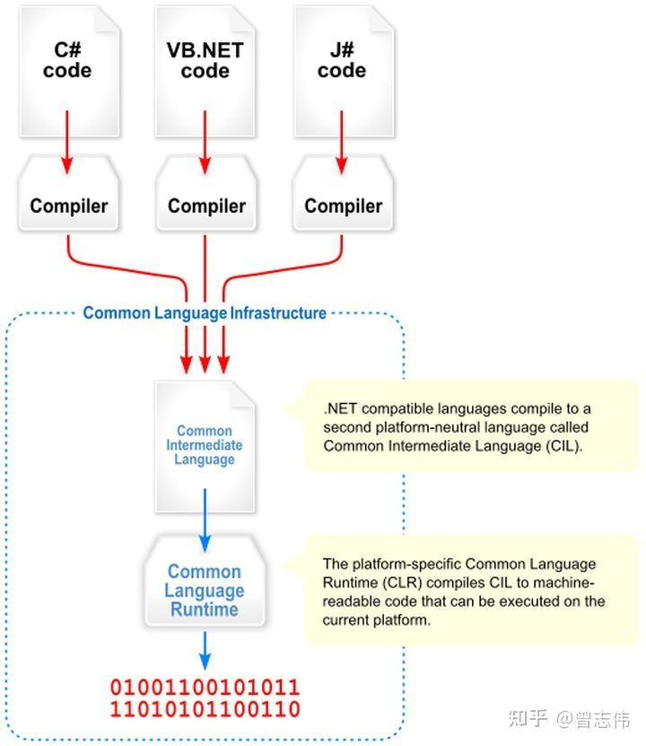
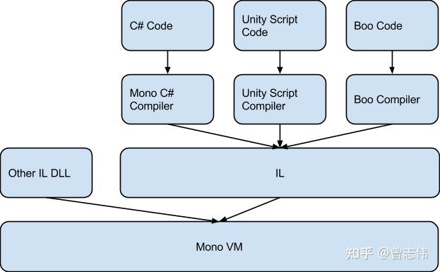
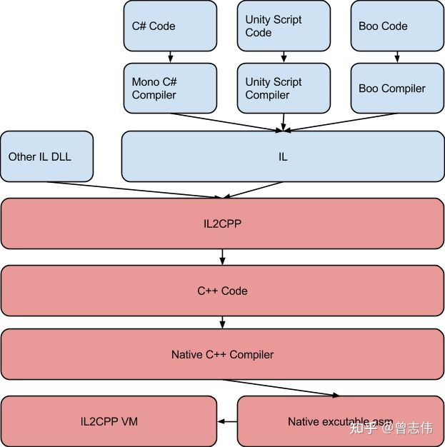
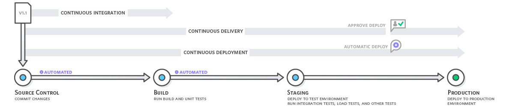

# Shell 综述

## 定义
一个接受用户指令的程序

shell 语法允许将已有工具组合成管线来自动化处理大量数据，将命令串行编写到脚本，来改进重复的工作流

Terminal运行了某种shell的终端模拟器

## 简史

Bourne Shell -> C Shell -> Korn Shell -> BASH

find -type f | wc -l

---
---
# Shell Script

## 正则
一种表达方式，可以查找匹配特定准则的文本
- 用来改变输入流的sed流编辑器
- 用于grep

## 文本处理工具

## shell语法变量，判断，循环
赋值前后不能有空格
export PATH 将变量放到环境中
export -p显示当前环境
unset 删除变量

## 模式匹配运算符
\# 匹配前面 %匹配结尾

## 算术展开
$((...)) 算数运算

## 标准输入输出

## 文件处理
touch 新建文件，更新文件修改时间  
mktemp 创建临时文件  
xargs 对每一行执行  
df 查看磁盘状态  
du 查看当前文件夹状态  
md5, cksum 算一个文件的md5，sha256值等等

---
---
# Git

## 图形化软件
TortoiseGit, Fork, SourceTree

## 命令行格式
UNIX风格  
git commit --message="msg"
GNU风格  
git commit -m "msg"

裸双破折号，分离参数

## 版本库
本地/远程
裸/非裸

## 文件管理和索引  

已修改  |　工作目录  
已暂存　|　暂存区域  
已提交　|　git 仓库

## 增删改

git add "*.cs"  
git rm file 从index和worktree删除  
git rm --cached file 已暂存->未暂存   

## 分支
git branch branchName[commitId]
git show-branch
git checkout branchName
删除：git branch -d （不能删除当前分支）

## 合并分支  

git checkout 切到要合并到的分支  
git merge 要合并的分支  
***冲突？***  
查看：git status; git diff  
***解决？***  
git checkout --ours FilePath  
git checkout --theirs FilePath  
git add  
git commit   
git log 两个父提交  

***特点:***
1. 两个父提交  
2. 非压制合并  
3. 非一个接一个合并每个提交  
4. pull = fetch + merge  

## 更改提交

git reset --soft/mixed/hard 回退某条提交，重新编辑提交（修改工作目录）

git cherry-pick commitId  不改变现有历史记录，修复bug同步

git revert 

git commit --ammend 修改当前分支的最后一次提交

git rebase 保持正在开发的提交相对于另一个分支是最新的


***建议：***  
拉取分支时rebase  
同步主干分支到功能分支选择rebase  
合并回主干选择merge  
频繁冲突时选择merge  

---
---
# Unity 

## 游戏引擎简介

和 UE 区别： UE精通难，收费高，开源，视觉效果好，包体大，端游多，动画系统好，庞杂（学不完）

## 反射
反射就是通过字符串的形式，导入模块；通过字符串的形式，去模块寻找指定函数，并执行。利用字符串的形式去对象（模块）中操作（查找/获取/删除/添加）成员，一种基于字符串的事件驱动


## Unity GC
- 直接垃圾收集
    - 引用计数
- 间接垃圾收集
    - 复制算法
    - 标记清除（Boehm垃圾回收）
    - 标记压缩
    - 分代算法（SGen垃圾回收）

## Mono和IL2CPP

***跨平台***：一次编译，不需要任何代码修改，应用程序就可以运行在任意在平台上跑，即代码不依赖于操作系统，也不依赖硬件环境。  
Unity是如何实现跨平台的？Unity脚本后处理(Scripting Backend)的两种方式Mono和IL2CPP。

***三种编译方式***：
- 即时编译（Just in time,JIT）：程序运行过程中，将CIL的byte code转译为目标平台的原生码映射到虚拟内存中执行。
- 提前编译（Ahead of time,AOT）：程序运行之前，将.exe或.dll文件中的CIL的byte code部分转译为目标平台的原生码并且存储，程序运行中仍有部分CIL的byte code需要JIT编译。
- 完全静态编译（Full ahead of time,Full-AOT）：程序运行前，将所有源码编译成目标平台的原生码。  

*IOS不支持jit编译原因:
机器码被禁止映射到内存，即封存了内存的可执行权限，变相的封锁了JIT编译方式。微软的Xbox360， XboxOne，还是Sony的PS3，PS4，PSV，也没有一个是允许JIT的。

### Mono  

Mono是如何诞生的？
C#代码编写好之后被C#编译器编译成IL代码,然后IL代码被CLR运行时（JIT, AOT两种编译模式）编译成本机代码.但.net framework因为特定的依赖是只在windows上运行,于是Mono为了跨平台就诞生了.

Mono的目标是在尽可能多的平台上使.net标准的东西能正常运行的一套工具，核心在于"跨平台的让.net代码能运行起来"。

Mono就作为一个中间层将IL代码的处理分出好多个分支,分别对应不同的平台.Mono其实和.net framework 是同一个东西,只不过Mono支持更多的平台,但.net的运行效率更高
Unity打包时会将mono一同打包进来,同时Unity将脚本编译为IL代码打包,这样只要是Mono支持的平台,都可以在Mono中编译成平台本地代码.

Mono组成组件：C# 编译器，CLI虚拟机，以及核心类别程序库。
Mono的编译器负责生成符合公共语言规范的映射代码，即公共中间语言（Common Intermediate Language，CIL），我的理解就是工厂方法实现不同解析。

****IL***: IL的全称是 Intermediate Language，很多时候还会看到CIL（特指在.Net平台下的IL标准）。翻译过来就是中间语言。
它是一种属于通用语言架构和.NET框架的低阶的人类可读的编程语言。
CIL类似一个面向对象的汇编语言，并且它是完全基于堆栈的，它运行在虚拟机上（.Net Framework, Mono VM）的语言。



工作流程：
1. 通过C#编译器mcs，将C#编译为***IL***（byte code）  
2. 通过Mono运行时中的编译器（Mono Runtime）将IL编译成对应平台的***原生码***  


GC: Boehm & SGen

特点：
1. 构建应用非常快  
2. 由于Mono的JIT(Just In Time compilation) 机制, 所以支持更多托管类库  
3. 支持运行时代码执行  
4. 必须将代码发布成托管程序集 (.dll 文件 , 由mono或者.net 生成 )  
5. Mono VM在各个平台移植异常麻烦，有几个平台就得移植几个VM（WebGL和UWP这两个平台只支持 IL2CPP）  
6. Mono版本授权受限，C#很多新特性无法使用  
7. iOS仍然支持Mono , 但是不再允许Mono(32位)应用提交到Apple Store

### IL2CPP（AOT）

为啥要转成CPP呢？
1. 运行效率快。程序的运行效率有了1.5-2.0倍的提升。除此之外，
可以利用现成的在各个平台的C++编译器对代码执行编译期优化，这样可以进一步减小最终游戏的尺寸并提高游戏运行速度。
2. Mono VM在各个平台移植，维护非常耗时，有时甚至不可能完成。
Mono的跨平台是通过Mono VM实现的，有几个平台，就要实现几个VM，像Unity这样支持多平台的引擎，Mono官方的VM肯定是不能满足需求的。所以针对不同的新平台，Unity的项目组就要把VM给移植一遍，同时解决VM里面发现的bug。这非常耗时耗力。这些能移植的平台还好说，还有比如WebGL这样基于浏览器的平台。要让WebGL支持Mono的VM几乎是不可能的。


工作流程：  
IL2CPP分为两个独立的部分：
1. AOT（静态编译）编译器：把IL中间语言转换成CPP文件
2. 运行时库：例如垃圾回收、线程/文件获取（独立于平台，与平台无关）、内部调用直接修改托管数据结构的原生代码的服务与抽象

GC: Boehm

特点：
1. 相比Mono, 代码生成有很大的提高  
2. 可以调试生成的C++代码  
3. 可以启用引擎代码剥离(Engine code stripping)来减少代码的大小  
4. 程序的运行效率比Mono高，运行速度快  
5. 多平台移植非常方便  
6. 相比Mono构建应用慢  
7. 只支持AOT(Ahead of Time)编译
8. 由于动态语言的特性，他们多半无需程序员太多关心内存管理，所有的内存分配和回收都由一个叫做GC（Garbage Collector）的组件完成。虽然通过IL2CPP以后代码变成了静态的C++，但是内存管理这块还是遵循C#的方式，这也是为什么最后还要有一个 IL2CPP VM的原因：它负责提供诸如GC管理，线程创建这类的服务性工作。但是由于去除了IL加载和动态解析的工作，使得IL2CPP VM可以做的很小，并且使得游戏载入时间缩短。
9. 由于C++是一门静态语言，这就意味着我们不能使用动态语言的那些酷炫特性。运行时生成代码并执行肯定是不可能了。这就是Unity里面提到的所谓AOT编译而非JIT。

### 编译区别



IL2CPP比较适合开发和发布项目 ，但是为了提高版本迭代速度，可以在开发期间切换到Mono模式（构建应用快）

## How to avoid producing GC?

```csharp
void Update() 
{
    List<string> list = new List<string>();  # √

    for (int i = 0; i<1000; i++>) 
    {
        object obj = i;                # √
        list.Add("test");
    }

    string str = "";               # √
    foreach (var item in list)
    {
        str = str + item;              # √
    }
}
```
3.9M GC


```csharp
private List<string> list = new List<string>();
private StringBuilder str  new StringBuilder();

void Update()
{
    if (list.Count != 0)
    {
        list.Clear();
    }

    if (str.Length != 0)
    {
        str.Clear();
    }

    for(int i = 0; i<1000 ; i++)
    {
        list.Add("test");
    }

    foreach(var item in list)
    {
        str.Append(item);
    }
}

```
---
---
# UE5

Nanite + Lumen + Niagara + Chaos ...


## 基础知识

- GameMode
This is the overall game manager and controls different GameStates. It is only on the server, and so should control the actual flow of the game, like spawning in a player or an AI. You could have multiple GameStates here that you cycle through, such as a BeforeGameState, an InGameState and an AfterGameState.


- GameState
This is used to hold variables about the current game mode like the time elapsed so far or which team is winning. On client and server.

- PlayerController
Interface between pawn and player.
This is used to receive inputs and then tell whatever Pawn it is controlling to do something with that input. Like the controller could listen out for the W key and then tell the character it is controlling to do something with that W input. This is because your controller can possess multiple pawns within a single game (not at the same time), and so each character might want to do different things based on that W key input. It can do other stuff as well as listen for inputs, but for example's sake I'm keeping it simple.

- PlayerCharacter
The actual player themselves. This has things like the skeletal mesh and receives input from a controller.

- PlayerState
Used to keep track of variables about the player such as name or ID


- GameInstance
Used to store stuff that should persist between levels.

---
---
# 设计模式

## 状态模式
```
public class BreakfastState : State
{
    public override void DoAction(Work w){
        if (w.hour < 10) {
            Console.WriteLine("当前时间{0}点。头脑清晰，速度起飞敲代码", w.hour);
        }
        else {
            w.SetState(new ForenoonState());
            w.Request();
        }
    }
}
```

```
// 扩展“强制下班”逻辑

public class EveningState : State
{
    w.SetState(new ForceOffDutyState());
}

public class ForceOffDutyState : State{
    public override void DoAction(Work w) {
        Console.WriteLine("当前时间{0}点。强制断电下班！", w.hour);
    }
}
```

---
---
# 游戏框架

## 什么是框架？
框是约定、规则  
架是支撑、工具

### 约定规则（框）
文件夹结构、代码规范、资源规范

代码规范包括：命名规则、注释规则、空格缩进（editor config）

### 支撑业务功能，提高开发效率（架）

***基础模块***：  
- 数据表
    - ProtoBuffer / FlatBuffer
    - Excel

- 静态配置
    - 常量配置
- 资源管理
    - AssetBundle
- 热更新
    - 资源
    - 代码
- UI
    - 空间封装
    - UI管理
- 场景
    - 管理
    - 事件
- 网络
- 动画
    - 缓动动画
    - 管理


***工具模块***：
- 日志
    - 等级
    - 上传
    
- 对象池引用池
    内存管理
- 文件系统
    - 跨平台
    - 读写
- 自动生成文档
- FSM
    - 角色状态
    - 流程控制
- 设置
    - 通用功能
- 各种工具类
    - 字符串操作
    - 范型变量
- 资源监控

---
---  

# 渲染管线

## 为什么矩阵能表示变换

## 游戏渲染管线
在游戏内实时将3D场景显示到2D屏幕上的一系列步骤

### 发展历史
### 简介

## 几何处理
如何处理几何数据

Vertex Data  
Vertex Shader  
(Tessellation 平面细分) 应用在雪被踩下之后的地面三角形  
(Geometry Shader)  
Triangle Setup  
Clipping
*注：（）里不要用

应用：艺术字（UI也是mesh）

### 模型
3D物体的几何表示  
Model = Mesh网格 + Material

### 网格
= triangles

### 顶点
位置，法线，颜色，uv纹理坐标，切线，骨骼动画...

### 空间变换
对象空间（Object Space）
世界空间（World Space）
观察空间（View Space）
裁剪空间（Clip Space） PVMv

shader是在GPU上执行的程序（触发时机特殊）
clipping是硬件自己实现的


## 光栅化 （硬件来做）
如何将3D几何信息转换为2D。连续的几何信息变成栅格（像素信息）

根据中点在三角形内部/外部判断是否点亮

### Anti-alising抗锯齿

Multi-Sampling 多采样，一个栅格内有四个点判断深浅而不是binary的是否点亮

## 像素处理
如何计算像素颜色

### 属性插值

### 纹理采样
在fragment shader里做的

### 遮挡顺序（先画哪个后画哪个）
像素级别，硬件（gpu）实现

### 颜色混合
blend

---
---

# CI 持续集成

## 持续集成说明

持续集成是一种 DevOps 软件开发实践。采用持续集成时，开发人员会定期将代码变更合并到一个中央存储库中，之后系统会自动运行构建和测试操作。持续集成通常是指软件发布流程的构建或集成阶段，需要用到自动化组件（例如 CI 或构建服务）和文化组件（例如学习频繁地集成）。持续集成的主要目标是更快发现并解决缺陷，提高软件质量，并减少验证和发布新软件更新所需的时间。  
简言之， 持续集成是指软件发布流程的构建和单元测试阶段。提交的每一个修订都会触发自动化的构建和测试操作。

## 为什么需要CI?

过去，一个团队的开发人员可能会孤立地工作很长一段时间，只有在他们的工作完成后，才会将他们的更改合并到主分支中。这使得合并代码更改变得困难而耗时，而且还会导致错误积累很长时间而得不到纠正。这些因素导致更加难以迅速向客户交付更新。

## 工作原理是什么？

采用持续集成时，开发人员可以使用诸如 Git 之类的版本控制系统，将更新频繁提交到共享存储库中。在每次提交前，开发人员可以选择在集成前对其代码执行本地单元测试，作为额外的验证层。持续集成服务在新代码更改上自动构建和运行单元测试，以立即发现任何错误。



采用持续交付时，系统会自动构建、测试并准备代码变更，以便发布到生产环境中。持续交付通过在构建阶段后将所有代码变更部署到测试环境和/或生产环境中，实现对持续集成的扩展。

## 优势？

- 提高开发人员的工作效率
- 更快发现并解决缺陷
- 更快交付更新

## CD

Continuous Delivery: Making the build available to your developers

Continouse Deployment: Making the build available to your developers and customers


# Unity持续集成与Jenkins

## AssetBundle

解决Resource Load占用过多CPU和内存资源的问题
（更新）一部分资源在云端，异步下载

## Jenkins

Jenkins是基于Java开发的一种持续集成工具，用于监控持续重复的工作，旨在提供一个开放易用的软件平台，使软件项目可以进行持续集成，学会使用Jenkins是中高级开发人员必备技能。主要功能包括：1、持续的软件版本发布/测试项目。2、监控外部调用执行的工作。这么说比较官方，说白了，它就是一种集承了多种常用的插件于一身的工具平台，通过这个平台你能很方便的管控你的项目！它的强大之处在于它能直接调用外部的shell指令和bat

## 构建原理

代码托管平台受到特殊指令，主动触发Jenkins，Jenkins收到指令做资源拉取、控制本地工具构建等操作。

比如我们提交代码到Github的时候，Github会帮我们发送一个关于Push的Post请求到我们的Jenkins服务器，然后Jenkins持续集成插件webhooks会接收到请求的参数，触发构建流程自动做项目打包等工作。

