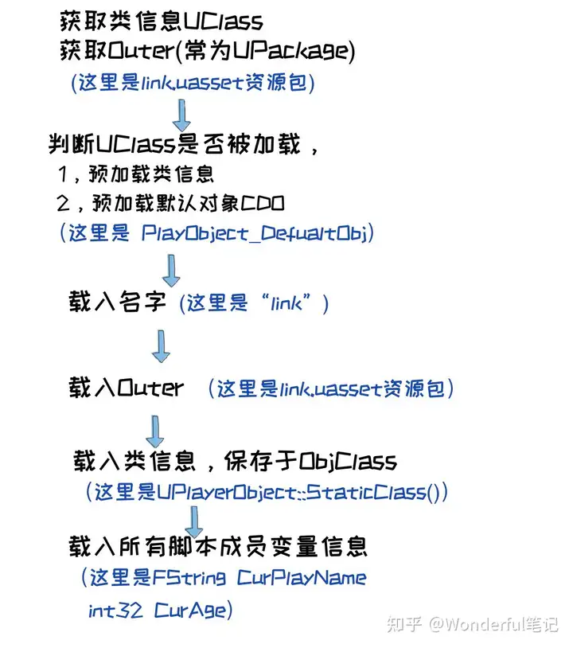
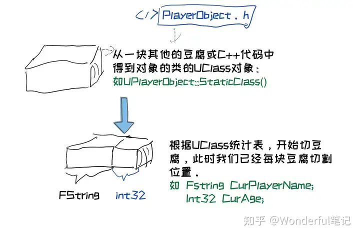
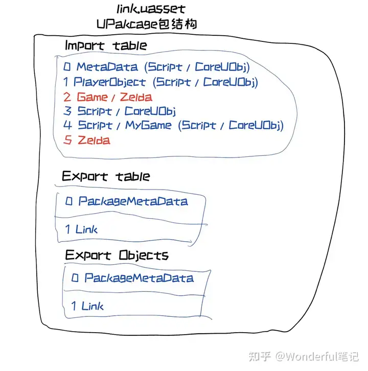
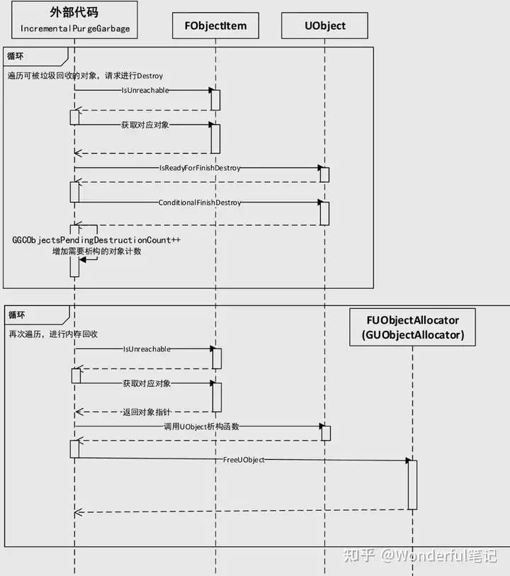

# 大象无形

## 0 目录

```txt
第1章 开发之前——五个最常见基类

第2章 需求到实现

第3章 创建自己的C++类

第4章 对象

第5章 从C++到蓝图

第6章 UE4游戏性框架概述

第7章 引擎系统相关类

第8章 模块机制

第9章 重要核心系统

第10章 对象模型

第11章 渲染

第12章 Slate

第13章 蓝图

第14章 引擎独立程序

第15章 插件

第16章 自定义资源和编辑器
```

## 1 开发之前——五个最常见基类

- UObject
  - Garbage collection垃圾收集

    C++释放资源的解决方案，①继承UObject ②非UObject可以采用智能指针
  - Reference updating引用自动更新
  - Reflectio反射（TODO：第二章即将学习）
  - Serialization序列化：保存资源
  - Automatic updating of default property changes自动检测默认变量的 更改
  - Automatic property initialization自动变量初始化
  - Automatic editor integration和虚幻引擎编辑器的自动交互
  - Type information available at runtime运行时类型识别

    UE4有自己的类型转换方案，`Cast<TargetType>(OriginType)`
  - Network replication网络复制

- Actor
  它能够被挂载组件，但不是组件。组件都以U开头而不是A
- Pawn
国际象棋中的“棋子”，必须要被Controller所操控，可以是玩家也可以是AI
- Character（继承Pawn）

  有特殊的Movement组件，提供了一个基于胶囊体的角色移动，包括了移动和跳跃功能

- Controller

  控制Pawn和Character

  AIController：使用UE4的行为树/EQS环境查询系统

  PlyaerController：绑定输入，转化为对Pawn/Character的函数调用

- 总结
  
  M（Pawn）V（Pawn带的动态网格组件）C（Controller）

## 3 创建自己的C++类

继承UObject的类，类名上方需要加入UCLASS宏

虚幻引擎类命名规则

F：纯C++类
U：继承UObject
A：继承
S：Slate空间相关类
H：HitResult相关类

## 4 对象

类对象的获取

```cpp
for(TActorIterator <ClassType> Iterator(GetWorld());Iterator;++Iterator)
 { 
    ...//do something 
}
```

*Iterator访问对象，或者`Iterator->function()`

## 6 UE4游戏性框架概述

### 6.1 行为树

同样的AI模式，用状态机会涉及大量的跳转，但是用行为树就相对来说更加简化。
同时由于行为树的“退行”特点，也就是“逐个尝试，不行就换”的思路

### 6.2 虚幻引擎网络架构

客户端是对服务端的拙劣模仿，不再时刻去"同步"，而是去"预测"，“模仿”

这就是说，我们承认“延迟”客观存在，只要我们的客户端模仿得别太差劲，那么玩家是可以接受这样的效果的。客户端可以根据同步数据发送时的当前对象的位置与速度，加上数据发送
的时间，猜测出当前对象在服务端的可能位置。并且通过修正当前世界（比如调整当前对象的速度方向，指向新的位置），去模仿服务端位置。如果服务端的位置和客户端差距太大，就强行闪现修正。

## 7 引擎系统相关类

### 7.1 在虚幻引擎4中使用正则表达式

需要包含头文件#include "Regex.h"，通过FRegexPattern 来创建一个待查找或匹配的模式，然后通过FRegexMatcher来查找与匹配字符串中符合模式的部分，如下代码：

```cpp
#include "Regex.h"
FString TextStr("ABCDEFGHIJKLMN");
FRegexPattern TestPattern(TEXT("C.+H"));
FRegexMatcher TestMacher(TestPattern, TestStr);

if (TestMacher.FindNext())
{
  UE_LOG(MyLog, Warning, TEXT("找到匹配内容 %d ~ %d"), 
                TestMacher.GetMatchBeginning(),
                TestMacher.GetMatchEnding());
}
```

### 7.2 FPaths类的使用

在Core模块中，虚幻引擎提供了一个用于路径相关处理的类：FPaths。主要提供了3类“工具”性质API：

1，具体路径类： FPaths::GameDir() 获取游戏根目录

2，工具类：FPaths::FileExists()判断一个文件是否存在。

3，路径转换类：FPaths::ConvertRelativePathToFull()将相对路径转换为绝对路径。

### 7.3 XML与JSON

这里涉及到XML，JSON与INI等三种文件：

XML：可以使用FastXML与FXmlFile进行解析与处理。

Json：可以使用FJsonSerializer与FJsonValue等来进行解析与处理。

ini：使用GConfig类进行读写与解析。

### 7.4 文件读写与访问

使用FPlatformFileManager::Get()->GetPlatformFile()进行文件的读写相关。常用函数如下：

CopyDirctorTree 拷贝目录树

CopyFile 拷贝当前文件

CreateDirectory 创建目录

DeleteDirectory 删除目录

DeleteFile 删除指定文件

FileExists 检查文件是否存在

OpenRead 打开一个文件进行读取

OpenWrite 打开一个文件进行写入

等等。

### 7.5 读写配置GConfig文件（就是Unity中的.Asset）

### 7.6 UE_LOG

### 7.7 字符串处理

### 7.8 编译器相关技巧

## 8 模块机制

### 8.1 模块基础

UE5最小的代码组织单位是模块。每一个模块会有一个*.Build.cs 文件来描述模块主要结构，源码部分会有Public和Private两个文件夹

Runtime主要负责一些游戏的Gameplay等基础模块，在打出的游戏包体与编辑器都会用到这些模块。

Developer主要是一些跨平台相关代码以及一些与游戏无关的底层代码，同样，游戏包和编辑器都会用到。

Editor主要是一些编辑器相关代码，只有编辑器用到，打出给玩家的游戏包体是不会包含这些代码的。

Plugin主要是一些插件相关，给引擎提供了一些额外的扩展功能，并不是编辑器所必须包含的。

### 8.2 模块初始化

总体上说，模块的加载遵循这样的顺序：

1. 首先加载的是Platform File Module，因为虚幻引擎要读取文件。
2. 接下来加载的是核心模块：
(FEngineLoop::PreInit→LoadCoreModules)。
3. 加载CoreUObject。
4. 然后在初始化引擎之前加载模块：
FEngineLoop::LoadPreInitModules。
5. 加载Engine。
6. 加载Renderer。
7. 加载AnimGraphRuntime。

### 8.3 模块总结

我们可以看到UnrealEngine的Visual Studio解决方案里，主要有 引擎主体的工程UE5，其中UE5里面有一个Plugins目录，即为引擎插件，插件其实是一起编译在引擎里面的，然后还有一个Programs目录，会编译很多个独立程序出来，这些独立程序可以脱离引擎独立运行，主要是执行一些类似Pak打包，引擎后台服务，编译Shader等独立exe程序

我们会通过UnrealEngine生成一个自己的游戏项目，比如名字为MyGame，然后我们通过MyGame.uproject可以生成一个MyGame.sln的visual studio解决方案，这里的结构更为简单:
Engine(引擎引用)、Game、Plugins、Config

#### 8.3.1 `*.Target.cs`文件概述
这个*.Target.cs是用来描述如何生成一个可执行exe的，包括这个exe的类型，它的链接方式，以及各种编译选项，编译宏定义等

Type参数分为  Program，Editor，Game，server，client

前三种 Program，Editor，Game用得比较多，我们来重点介绍一下：

首先，Program是独立程序，就是类似 UnrealPak.exe等，可以脱离UnrealEngine环境也能独立运行的exe，主要是作为处理单一功能的可执行文件。比如UnrealPak主要为了把 指定列表的所有*.uasset资源，打包成一个*.pak包。

Editor是附带UE5编辑器的程序，我们日常开发游戏MyGame时，需要在UE5编辑器里面查看各种美术资源，修改关卡和角色蓝图等，然后可以点击运行按钮，来查看游戏内效果，用的资源就是美术提交的散装的原始资源uasset，有时候进入场景有点卡顿，因为需要运行时编译shader，压缩贴图等，为了方便我们在开发时修改资源等。所以我们有一个MyGameEditor.Target.cs来生成这个附带UE5编辑器的MyGame项目。

最后，Game是发布给玩家的游戏包体的程序，比如我们的MyGame开发好了，我们会打一个MyGame的游戏包体给玩家玩，这个游戏里面没有编辑器，用的资源也是cook好并打好pak包的二进制资源，因此进入场景会非常流畅，较大得改善了玩家的游戏体验。所以我们有一个MyGame.Target.cs来生成这个不带UE5编辑器的MyGame

LinkType主要是：Modular 和 Monolithic 两个值。如果不定义这个参数，默认为Modular：每个模块一个dll，例如UnrealPak。Monolithic：所有文件编进一个exe，如BlankProgram。


#### 8.3.2 `*.Target.cs`文件 vs `*.Build.cs` 文件

它们同样作为给UBT处理的描述文件，也是有不同的地方的，首先*.Target.cs文件是每个要编译成一个比较独立的程序的目标需要一个，而*.Build.cs更广泛，每个模块都有一个。另外，*.Target.cs 主要描述链接信息，编译选项，一些预定义宏等。而*.Build.cs文件 主要描述它需要包含哪些头文件目录，需要依赖哪些模块等。

### 8.4 UBT UHT 

*UBT*全称为 UnrealBuildTool ，意思是虚幻引擎的构建工具，它主要负责分析build.cs和Target.cs等配置文件，并把虚幻的*.h和*.cpp文件编译并链接为二进制可执行文件exe/dll。

*UHT*全称为 UnrealHeaderTool，意思是虚幻引擎的头文件工具，主要负责解析各个头文件，并分析其中的有UCLASS()，USTRUCT()等前缀的类，以及UFUNCTION()等前缀的函数，并且把这些类与函数等信息通过生成(*.generate.h)等代码反射给蓝图使用

完整编译流程:

UBT收集目录中的*.cs文件，解析各种编译配置；然后UBT调用UHT分析需要分析的*.h文件，根据文件是否有UCLASS()，UFUNCTION（）等宏，来反射信息，并生成*.generated.h和*.gen.cpp文件；最后UBT调用MSBuild，将相关*.h/ *.cpp代码，以及生成的*.generated.h和*.gen.cpp一起编译。

## 9 重要核心系统简介

### 9.1 引擎初始化过程

游戏初始化是由PreInit()预初始化，Init()两个步骤组成，然后是主循环的Tick()函数。最后是结束退出的Exit()函数。


预初始化PreInit()：

1. 设置路径：当前程序路径，当前工作目录路径，游戏的工程路径。
2. 设置标准输出：设置GLog系统输出的设备，是输出到命令行还是何处。

3. 并且也初始化了一部分系统

  - 初始化游戏主线程GameThread，其实只是把当前线程设置为主线程
  - 初始化随机数系统（随机数种子）
  - 初始化TaskGraph任务系统，并按照当前平台的核心数量来设置TaskGraph的工作线程数量。同时也会启动一个专门的线程池，生成一堆线程，用于在需要的时候使用。也就是说虚幻引擎的线程数量是远多于核心数量的。

4. 在完成这些之后，会调用LoadCoreModules。目前所谓的CoreModules指的就是CoreUObject。
5. 随后，所有的PreInitModules会被启动起来。这些强大的模块是：引擎模块、渲染模块、动画蓝图、Slate渲染模块、Slate核心模块、贴图压缩模块和地形模块。
6. 当这些模块加载完毕后，AppInit函数会被调用，进入引擎正式的初始化阶段

初始化Init():

在进入初始化流程时，所有被加载到内存的模块，如果有PostEngineInit函数的，都会调用从而初始化。这一过程借助IProjectManager完成的。

主循环:
循环引擎的主循环代码大致如下：
```cpp
while (!GIsRequestingExit)
{
  EngineTick();
}
```

### 9.2 并行与并发

TaskGraph系统

虚幻引擎有一个更为现代的多线程框架，基于Task思想，对线程进行复用的系统，就是TaskGraph系统。因为频繁创建与销毁线程的代码略大，而且很多时候我们创建线程又是临时的，我们可以把需要执行的“指令”和数据封成一个包，然后交给TaskGraph系统。TaskGraph系统会选择合适的空闲线程对这个任务进行执行。

https://zhuanlan.zhihu.com/p/574216210

首先TaskGraph是UE中基于任务的并发机制。可以创建任务在指定类型的线程中执行，同时提供了等待机制，其强大之处在于可以调度一系列有依赖关系的任务，这些任务组成了一个有向无环的任务网络（DAG），并且任务的执行可以分布在不同的线程中。

https://zhuanlan.zhihu.com/p/578687893

## 10 对象模型

### 10.1 序列化/反序列化

打印一下sizeof(UObjectBase)， 以及 sizeof(UObject)， 发现两者都是48个字节

UObject的序列化和反序列化都对应同一个函数Serialize。正向写入和反向读取需要按同样的方式进行。

需要注意的是，序列化/反序列化的过程是一个“步骤”，而不是一个完整的对象初始化过程。反序列化的主要步骤是：先实例化对象，然后再反序列化对象的属性。



入所有脚本成员变量信息，这里的代码主要在 UObject::Serialize(...)函数中，它主要有如下几个步骤：

1，调用FArchive::MarkScriptSerializationStart函数，标记脚本数据序列化开始。

2，调用ObjClass对象的SerializeTaggedProperties函数，进而调用类的每个Tag的Tag.SerializeTaggedProperty()函数，载入脚本定义的成员变量，比如我们的UPlayerObject里面自定义的CurPlayerName 和 CurAge两个成员变量

3，调用MarkScriptSerializationEnd标记脚本数据序列化结束。





## 10.2 垃圾回收

UObject垃圾回收：分为两个遍历阶段，前阶段为通知各UClass父类进行析构阶段，后阶段为C++析构和内存回收阶段。

销毁过程

UObject对象无法手动释放，只能手动请求“ConditionalBeginDestroy”来申请销毁。具体是否销毁，何时销毁，取决于虚幻引擎的垃圾回收系统。实际上ConditionalBeginDestroy函数只是设置了UObject的RF_BeginDestroyed为真，并通过SetLinker函数将当前对象从Linker导出表中清除。

待垃圾回收确认销毁该UObject时，由FinishDestroy函数完成UObject销毁操作。首先使用函数DestroyNoNativeProperties销毁非C++的成员变量。其核心是一个for循环，获取当前UClass类的析构函数链表，调用每个析构函数的DestroyValue_InContainer函数，以完成自身的销毁。

```cpp
for (UProperty *p = GetClass()->DestructorLink; p; p=p->DestructorLinkNext)
{
    p->DestroyValue_InContainer(this);
}
```

触发销毁

销毁主要由虚幻引擎的垃圾回收器来触发。

垃圾回收器实际上执行两个步骤：析构和回收。前者负责调用析构函数，通知对象进行析构操作。后者则负责回收当前UObject占用的内存。相关代码在baseCollection.cpp的IncrementalPurgeGarbage中



垃圾回收

垃圾回收的算法比较复杂，这里就不深入探讨源码实现，而是只是对垃圾回收过程进行简单的介绍。

垃圾回收算法简介

垃圾回收算法简单来说是解决这样一个问题：在一个合租房内公共区域里面的物品，每个人原则上会去收拾自己的垃圾（父对象负责回收子对象的释放）。但在丢东西时，不知道别人有没有在用，贸然丢弃就会引起问题。比如我认为这个属于我的电磁炉已经不需要了，于是随手丢进了垃圾堆。过了一会儿舍友从房间出来，准备煮面，发现电磁炉没了（在别的对象持有当前对象引用情况下释放对象，导致野指针）。于是大家只好采取一个保守的策略，大家都不丢垃圾，屋子里堆满了垃圾，需要一个垃圾回收系统来确定哪些垃圾可以丢。比较典型的垃圾回收算法有两种：引用计数 和 标记-清扫两种。

### 10.2.1 引用计数算法

给每个东西都挂一个数字牌，我要用时，就把数字加1，不需要时候就把数字减1。一旦最后一个人不用这个东西时，发现减1时为0，于是把这个东西丢进垃圾桶。

优势：垃圾回收操作是实时进行，不需要暂停其他人的工作。

劣势：1，指针操作开销，每次操作都要调整数字牌的数字。2，环形引用，比如锅盖引用锅，锅引用锅盖，导致两者一直未能释放。

### 10.2.2 标记-清扫算法

标记-清扫算法时追踪式GC的一种。会寻找整个对象引用网络，来寻找不需要垃圾回收的对象。这与引用计数的“只关心单个对象”思路相反。先假定所有东西都是垃圾，然后让每个舍友（在算法中称为根）开搜寻，让每个舍友指认哪些东西时他/她需要的，最终剩下没有指认的东西，就是垃圾，可以直接回收。

优势：无环形引用。当没有人需要用锅时，由于锅和锅盖没有任何舍友（根）引用，所以都会被回收掉。

劣势：需暂停。算法开始执行时，需要暂停舍友们的正常工作，等算法结束后，大家才能继续做手头的事情。

### 10.2.3 UObject的标记清扫算法

虚幻引擎的垃圾回收算法的特点如下：

1，虚幻引擎的UObject的反射系统已经提供每个对象的互相引用的信息，从而能够实现对象引用网络。故采用追踪式GC。

2，UClass包含了类的成员信息，类的成员变量也包含了“是否是指向对象的指针”的信息，因此具备精确式GC的客观条件。也就是利用反射系统，完成对每一个被引用对象的定位，所以选择精确式GC。

3，虚幻引擎回收过程中没有搬迁对象，因为搬迁时修正指针地址的庞大成本。

4，虚幻引擎选择了一个非实时但是渐进式的垃圾回收算法。将垃圾回收的过程分布，并行化，以削弱选择追踪式GC带来的停等消耗。

## 11 渲染系统

“游戏线程（逻辑线程）”与“渲染线程”的说法。而笔者认为，对渲染线程的理解可以从这一句话入手：“渲染线程是游戏线程的奴隶” 。对应的含义是以下两点：

外包团队 渲染线程是一个外包团队，其实质上并不知道自己真正执行了什么。游戏线程不停地向渲染线程对应的任务池派送任
务，渲染线程只是埋头去执行。

追本溯源 对渲染线程执行逻辑的分析离不开对游戏线程渲染相关代码的分析。游戏线程是木偶师，渲染线程是木偶，只看木偶不
能窥得全貌，必须要看木偶师的想法，才能理解整个系统。

对于渲染线程的设计，两种方案是：

1. 渲染线程具有独立的逻辑系统。

2. 渲染线程只是简单地作为工作线程不断执行游戏线程赋予的工作。


延迟渲染，英文名为Deferred Rendering。虚幻引擎对于场景中所有不透明物体的渲染方式，就是延迟渲染。而对于透明物体的渲染方式，则是前向渲染（Forward Rendering）。

所谓延迟渲染，是为了解决场景中由于物体、光照数量带来的计算复杂度问题。假如场景中有5个物体和5个光源，每个物体都单独计算光照，那么计算量将是5×5=25次光照计算。随着光源数量的提升，光照计算的计算量会呈几何级数上升。这样的代价是非常高昂的。而延迟渲染则是将“光照渲染”延迟进行。每次渲染，将会把物体的BaseColor（基础颜色）、粗糙度、表面法线、像素深度等分别渲染成图片，然后根据这几张图，再逐个计算光照。带来的好处是，无论场景中有多少个物体，经过光照准备阶段之后，都只是变成了几张贴图，计算光照的时候，根据每个像素的深度，能够计算出像素在世界空间位置，然后根据表面法线、粗糙度等参数，带入公式进行计算。于是之前5×5的光照渲染计算量，被直线降低为5+5的计算量。5+5的来历是：

5个物体→多张贴图：需要5次渲染。

5个光源→逐光源计算光照结果：需要5次渲染。

随着光源数量的增多，延迟渲染节省的计算量会越来越多

https://zhuanlan.zhihu.com/p/599255569

https://zhuanlan.zhihu.com/p/614966986

## 12 Slate界面系统

作为核心界面系统，Slate是一个跨平台的、硬件加速的图形界面框架，采用了C++的泛型编程来允许直接使用C++语言撰写界面。

Slate是一个分辨率自适应的相对界面布局系统，为了能够完成这样的目的，Slate实质上采用了一个“两次”排布的思路。

1. 首先，递归计算每个控件的大小，父控件会根据子控件来计算自己的大小。

2. 然后，根据控件大小，具体计算出每个控件的绘制位置。

由于有部分控件是“大小可改变”的，因此必须先计算出“固定大小”，才可能实际排布这些控件。

## 13 蓝图

小型蓝图的编译速度远远快过C++的编译速度。并且最新版本的虚幻引擎能够在发布的时候将蓝图编译为C++，从而提升蓝图在最终发布版本的执行效率，进而弥补蓝图在性能上的固有缺陷。因此分析，选择C++的理由可能只剩下C++本身更大范围的API，以及蓝图系统在内容较多时候不如C++直观的原因。

蓝图系统依然是一套依托于虚幻引擎现有UClass、UProperty、UFunction框架，根植于虚幻引擎UnrealScript字节码编译器系统的一套可视化编程系统。这就意味着：

1. 蓝图最终编译结果依然会转化为UClass、UProperty、UFunction信息。其中指令代码将会存储于UFunction的信息中。

2. 蓝图本身可以看作是一种可视化版的UnrealScript，是经过转化和经过语法解析生成的字节码。

总而言之，这是一个涉及颇多方面的系统。从非常适合编辑的UEdGraph结构开始，逐步归并整理，以产生UClass结构。然后对逻辑相关的部分进行处理之后，不断向适合顺序执行的字节码结构靠拢，最终被Backend发射成为最终的字节码。其实从实用主义的角度而言，知道如何向蓝图暴露函数、蓝图如何调用C++层的函数就已经能够使用蓝图完成大部分的开发工作了。进一步，如果有需要，希望用C++调用蓝图函数的知识也并不复杂。那么为何非要了解蓝图的编译和工作方式呢？那是因为笔者希望读者能拥有扩展虚幻引擎本身的能力，针对项目的需求，扩展蓝图自身的节点，甚至创造自己的蓝图系统以应对特殊的需求（比如剧情分支树等）。另外，笔者也希望读者拥有对虚幻引擎自身工作机制的好奇心，以及对虚幻引擎本身进行研究的勇气。

## 14 引擎独立应用程序

是虚幻引擎提供了几个案例性的程序，如BlankProgram和SlateViewer。我们可以从这几个应用程序着手进行分析
和学习。

简而言之，开发这样的程序需要遵循以下步骤：

1. 建立文件结构。
2. 配置.Target.cs和.build.cs。
3. 撰写代码。
4. 剥离应用程序。

## 15 插件开发


## 16 自定义资源和编辑器

自定义资源类型

虚幻引擎提供了自定义资源非常便捷的接口。你只需要执行两步：

1. 创建一个继承自UObject的类，该类将会作为你自定义资源的数据
模型类。你可以定义自己的字段来存储你希望存储的信息。

2. 创建一个工厂类，该类将会被虚幻引擎识别，然后作为在内容管理
器中创建资源的工厂，可以在这里设置你的自定义资源的数据模型
的初始值等。

切分两个模块

虚幻引擎的模块分为Runtime、Development和Editor，只有Runtime
模块是在运行时包含的，剩余两个模块都不会在发布版本中包含。而在
自定义资源中，只有你的数据模型类是需要包含在运行时的，对数据模
型进行编辑的类并不需要包含在运行时的构建版本中。所以我们需要分
为两个模块。
