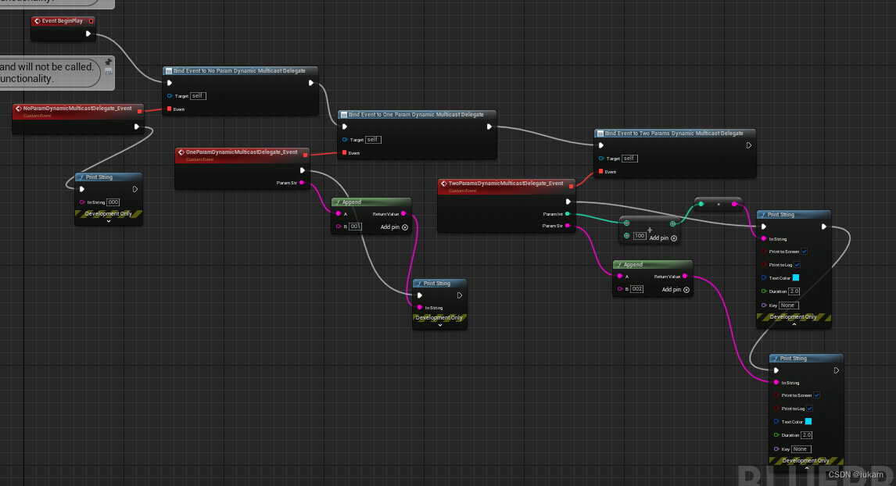

https://benui.ca/unreal/delegates-advanced/#non-dynamic-single-delegate

https://blog.csdn.net/qq_52179126/article/details/129868844?spm=1001.2014.3001.5502

## 单播委托

单播委托 只能绑定一个函数

创建一个C++类 MyDelegateActor

MyDelegateActor.h

```cpp

#pragma once

#include "CoreMinimal.h"
#include "GameFramework/Actor.h"
#include "MyDelegateActor.generated.h"

DECLARE_DELEGATE(NoParamDelegate);//声明一个无参委托
DECLARE_DELEGATE_OneParam(OneParamDelegate, int32);//声明一个有一个int32参数的委托
DECLARE_DELEGATE_TwoParams(TwoParamsDelegate, int32, FString);//声明一个有一个int32参数和一个FString参数的委托
DECLARE_DELEGATE_RetVal(int32, RetValDelegate);//声明一个有返回值的委托

UCLASS()
class DEMO_API AMyDelegateActor : public AActor
{
	GENERATED_BODY()
	
public:	
	// Sets default values for this actor's properties
	AMyDelegateActor();

protected:
	// Called when the game starts or when spawned
	virtual void BeginPlay() override;

public:	
	// Called every frame
	virtual void Tick(float DeltaTime) override;

	NoParamDelegate NoParamDelegate;//声明一个无参委托
	OneParamDelegate OneParamDelegate;//声明一个有一个int32参数的委托
	TwoParamsDelegate TwoParamsDelegate;//声明一个有一个int32参数和一个FString参数的委托
	RetValDelegate RetValDelegate;//声明一个有返回值的委托

	void NoParamDelegateFunc();//无参委托函数
	void OneParamDelegateFunc(int32 Param);//有一个int32参数的委托函数
	void TwoParamsDelegateFunc(int32 Param1, FString Param2);//有一个int32参数和一个FString参数的委托函数
	int32 RetValDelegateFunc();//有返回值的委托函数

};
```

```cpp

#include "MyDelegateActor.h"

// Sets default values
AMyDelegateActor::AMyDelegateActor()
{
	// Set this actor to call Tick() every frame.  You can turn this off to improve performance if you don't need it.
	PrimaryActorTick.bCanEverTick = true;
	NoParamDelegate.BindUObject(this, &AMyDelegateActor::NoParamDelegateFunc);	   // 绑定无参委托函数
	OneParamDelegate.BindUObject(this, &AMyDelegateActor::OneParamDelegateFunc);   // 绑定有一个int32参数的委托函数
	TwoParamsDelegate.BindUObject(this, &AMyDelegateActor::TwoParamsDelegateFunc); // 绑定有一个int32参数和一个FString参数的委托函数
	RetValDelegate.BindUObject(this, &AMyDelegateActor::RetValDelegateFunc);	   // 绑定有返回值的委托函数
}

// Called when the game starts or when spawned
void AMyDelegateActor::BeginPlay()
{
	Super::BeginPlay();
	NoParamDelegate.Execute(); // 执行无参委托函数
	OneParamDelegate.Execute(1); // 执行有一个int32参数的委托函数
	TwoParamsDelegate.Execute(1, TEXT("TwoParamsDelegate")); // 执行有一个int32参数和一个FString参数的委托函数
	int32 RetVal = RetValDelegate.Execute(); // 执行有返回值的委托函数
	UE_LOG(LogTemp, Warning, TEXT("RetVal:%d"), RetVal);
	
}

// Called every frame
void AMyDelegateActor::Tick(float DeltaTime)
{
	Super::Tick(DeltaTime);
}
void AMyDelegateActor::NoParamDelegateFunc()
{
	UE_LOG(LogTemp, Warning, TEXT("NoParamDelegateFunc"));
}
void AMyDelegateActor::OneParamDelegateFunc(int32 Param)
{
	UE_LOG(LogTemp, Warning, TEXT("OneParamDelegateFunc Param:%d"), Param);
}
void AMyDelegateActor::TwoParamsDelegateFunc(int32 Param1, FString Param2)
{
	UE_LOG(LogTemp, Warning, TEXT("TwoParamsDelegateFunc Param1:%d Param2:%s"), Param1, *Param2);
}
int32 AMyDelegateActor::RetValDelegateFunc()
{
	UE_LOG(LogTemp, Warning, TEXT("RetValDelegateFunc"));
	return 1;
}

```

## 多播委托

多播委托（代理） 可以绑定绑定多个函数

创建一个C++类 MyDelegateActor

MyDelegateActor.h

```cpp
// Fill out your copyright notice in the Description page of Project Settings.

#pragma once

#include "CoreMinimal.h"
#include "GameFramework/Actor.h"
#include "MyDelegateActor.generated.h"

// 多播委托代理
DECLARE_MULTICAST_DELEGATE(NoParamMulticastDelegate);							  // 声明一个无参多播委托
DECLARE_MULTICAST_DELEGATE_OneParam(OneParamMulticastDelegate, int32);			  // 声明一个有一个int32参数的多播委托
DECLARE_MULTICAST_DELEGATE_TwoParams(TwoParamsMulticastDelegate, int32, FString); // 声明一个有一个int32参数和一个FString参数的多播委托

UCLASS()
class DEMO_API AMyDelegateActor : public AActor
{
	GENERATED_BODY()

public:
	// Sets default values for this actor's properties
	AMyDelegateActor();

protected:
	// Called when the game starts or when spawned
	virtual void BeginPlay() override;

public:
	// Called every frame
	virtual void Tick(float DeltaTime) override;

	/*****     多播委托代理         ******/
	NoParamMulticastDelegate NoParamMulticastDelegate;	 // 声明一个无参多播委托
	OneParamMulticastDelegate OneParamMulticastDelegate;	 // 声明一个有一个int32参数的多播委托
	TwoParamsMulticastDelegate TwoParamsMulticastDelegate; // 声明一个有一个int32参数和一个FString参数的多播委托
	void NoParamMulticastDelegateFunc();					 // 无参多播委托函数
	void NoParamMulticastDelegateFunc2();
	void OneParamMulticastDelegateFunc(int32 Param);		 // 有一个int32参数的多播委托函数
	void OneParamMulticastDelegateFunc2(int32 Param);
	void TwoParamsMulticastDelegateFunc(int32 Param1, FString Param2); // 有一个int32参数和一个FString参数的多播委托函数
	void TwoParamsMulticastDelegateFunc2(int32 Param1, FString Param2); 
	
};

```

MyDelegateActor.cpp

```cpp
// Fill out your copyright notice in the Description page of Project Settings.

#include "MyDelegateActor.h"

// Sets default values
AMyDelegateActor::AMyDelegateActor()
{
	// Set this actor to call Tick() every frame.  You can turn this off to improve performance if you don't need it.
	PrimaryActorTick.bCanEverTick = true;

	/*****     多播委托代理         ******/
	NoParamMulticastDelegate.AddUObject(this, &AMyDelegateActor::NoParamMulticastDelegateFunc); // 绑定无参多播委托函数
	NoParamMulticastDelegate.AddUObject(this, &AMyDelegateActor::NoParamMulticastDelegateFunc2);
	OneParamMulticastDelegate.AddUObject(this, &AMyDelegateActor::OneParamMulticastDelegateFunc); // 绑定有一个int32参数的多播委托函数
	OneParamMulticastDelegate.AddUObject(this, &AMyDelegateActor::OneParamMulticastDelegateFunc2);
	TwoParamsMulticastDelegate.AddUObject(this, &AMyDelegateActor::TwoParamsMulticastDelegateFunc); // 绑定有一个int32参数和一个FString参数的多播委托函数
	TwoParamsMulticastDelegate.AddUObject(this, &AMyDelegateActor::TwoParamsMulticastDelegateFunc2);
}

// Called when the game starts or when spawned
void AMyDelegateActor::BeginPlay()
{
	Super::BeginPlay();

	/*****     多播委托代理         ******/
	NoParamMulticastDelegate.Broadcast();								// 执行无参多播委托函数
	OneParamMulticastDelegate.Broadcast(1);								// 执行有一个int32参数的多播委托函数
	TwoParamsMulticastDelegate.Broadcast(1, TEXT("TwoParamsDelegate")); // 执行有一个int32参数和一个FString参数的多播委托函数
}

// Called every frame
void AMyDelegateActor::Tick(float DeltaTime)
{
	Super::Tick(DeltaTime);
}

/*****     多播委托代理         ******/
void AMyDelegateActor::NoParamMulticastDelegateFunc()
{
	UE_LOG(LogTemp, Warning, TEXT("NoParamMulticastDelegateFunc"));
}
void AMyDelegateActor::NoParamMulticastDelegateFunc2()
{
	UE_LOG(LogTemp, Warning, TEXT("NoParamMulticastDelegateFunc2"));
}
void AMyDelegateActor::OneParamMulticastDelegateFunc(int32 Param)
{
	UE_LOG(LogTemp, Warning, TEXT("OneParamMulticastDelegateFunc Param:%d"), Param);
}
void AMyDelegateActor::OneParamMulticastDelegateFunc2(int32 Param)
{
	UE_LOG(LogTemp, Warning, TEXT("OneParamMulticastDelegateFunc2 Param:%d"), Param);
}
void AMyDelegateActor::TwoParamsMulticastDelegateFunc(int32 Param1, FString Param2)
{
	UE_LOG(LogTemp, Warning, TEXT("TwoParamsMulticastDelegateFunc Param1:%d Param2:%s"), Param1, *Param2);
}
void AMyDelegateActor::TwoParamsMulticastDelegateFunc2(int32 Param1, FString Param2)
{
	UE_LOG(LogTemp, Warning, TEXT("TwoParamsMulticastDelegateFunc2 Param1:%d Param2:%s"), Param1, *Param2);
}


```

## 动态单播 Dynamic Single DelegatePermalinkPermalink

```cpp
DECLARE_DYNAMIC_DELEGATE_OneParam(FOnScoreChangedSignature, int32, NewScore);

// If we have a UFUNCTION()-marked function `OnScoreChanged(int32 NewScore)
// we can subscribe using BindDynamic and the ThisClass macros
OnScoreChangedDelegate.BindDynamic(this, &ThisClass::OnScoreChanged);
```

## 动态多播代理

动态多播委托代理 区别在于可以暴露给蓝图，在蓝图中进行事件绑定, 一定要是F开头。还有就是参数和参数名一定要配合使用

创建一个C++类 MyDelegateActor

MyDelegateActor.h
```cpp
// Fill out your copyright notice in the Description page of Project Settings.

#pragma once

#include "CoreMinimal.h"
#include "GameFramework/Actor.h"
#include "MyDelegateActor.generated.h"

// 动态多播委托代理 区别在于可以暴露给蓝图，在蓝图中进行事件绑定, 一定要是F开头
DECLARE_DYNAMIC_MULTICAST_DELEGATE(FNoParamDynamicMulticastDelegate);												  // 声明一个无参多播委托
DECLARE_DYNAMIC_MULTICAST_DELEGATE_OneParam(FOneParamDynamicMulticastDelegate, FString, ParamStr);					  // 声明一个有一个int32参数的多播委托
DECLARE_DYNAMIC_MULTICAST_DELEGATE_TwoParams(FTwoParamsDynamicMulticastDelegate, int32, ParamInt, FString, ParamStr); // 声明一个有一个int32参数和一个FString参数的多播委托

UCLASS()
class DEMO_API AMyDelegateActor : public AActor
{
	GENERATED_BODY()

public:
	// Sets default values for this actor's properties
	AMyDelegateActor();

protected:
	// Called when the game starts or when spawned
	virtual void BeginPlay() override;

public:
	// Called every frame
	virtual void Tick(float DeltaTime) override;
	/*****     动态多播委托代理         ******/
	UPROPERTY(BlueprintAssignable, Category = "MyDelegate")
	FNoParamDynamicMulticastDelegate NoParamDynamicMulticastDelegate; // 声明一个无参多播委托
	UPROPERTY(BlueprintAssignable, Category = "MyDelegate")
	FOneParamDynamicMulticastDelegate OneParamDynamicMulticastDelegate; // 声明一个有一个int32参数的多播委托
	UPROPERTY(BlueprintAssignable, Category = "MyDelegate")
	FTwoParamsDynamicMulticastDelegate TwoParamsDynamicMulticastDelegate; // 声明一个有一个int32参数和一个FString参数的多播委托
};
```

MyDelegateActor.cpp
```cpp
// Fill out your copyright notice in the Description page of Project Settings.

#include "MyDelegateActor.h"

// Sets default values
AMyDelegateActor::AMyDelegateActor()
{
	// Set this actor to call Tick() every frame.  You can turn this off to improve performance if you don't need it.
	PrimaryActorTick.bCanEverTick = true;
}

// Called when the game starts or when spawned
void AMyDelegateActor::BeginPlay()
{
	Super::BeginPlay();

	/*****     执行动态多播委托代理         ******/
	NoParamDynamicMulticastDelegate.Broadcast();
	OneParamDynamicMulticastDelegate.Broadcast(TEXT("OneParamsDelegate"));
	TwoParamsDynamicMulticastDelegate.Broadcast(1, TEXT("TwoParamsDelegate"));
}

// Called every frame
void AMyDelegateActor::Tick(float DeltaTime)
{
	Super::Tick(DeltaTime);
}
```

蓝图实现


打印
