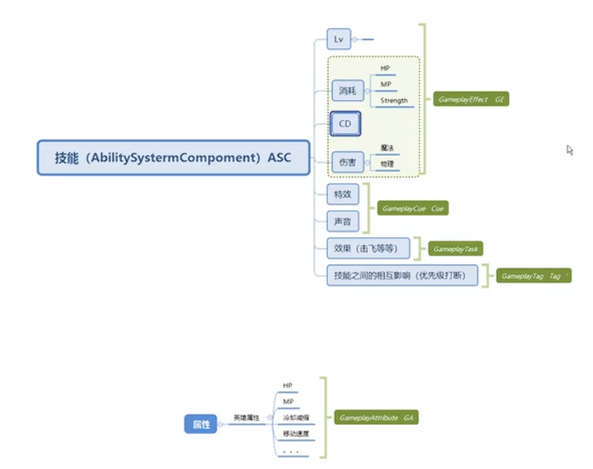
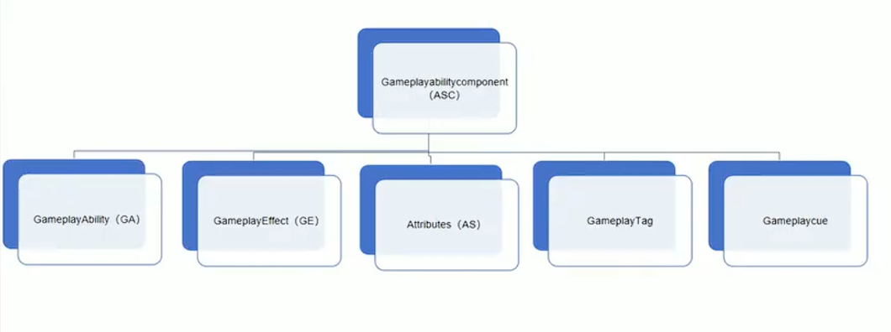

# Game Abitlity System

## 什么是GAS

GAS（全称 Gameplay Ability System） 是虚幻引擎内置的一个插件框架，专门用于构建复杂的角色能力系统，如技能、属性、Buff/Debuff、冷却等。它最初是为《堡垒之夜》、《Paragon》等大型多人项目设计的，经过了实战验证。

## GAS结构

## GA

Gameplay Ability（GA）是GAS的核心概念之一，代表（定义）角色可以执行的具体技能或动作。例如攻击，跳跃，施法，道具使用。每个GA都包含了技能的逻辑、动画、特效等信息。

## GE

Gameplay Effect（GE）是GAS中的另一个重要概念，代表对角色属性的影响，例如伤害、治疗、增益、减益等。GE可以应用于角色，改变其属性值，可以是实时的（如伤害），持续的（如中毒），或者无限期的（如永久增益）。GE通过修改器（Modifier）和执行器（Executor）来定义对属性的影响。修改器用于直接修改属性值，而执行器用于执行更复杂的逻辑，如根据当前属性值计算伤害。

## Attributes

Gameplay Attribute（属性）是GAS中用于定义角色状态的变量，例如生命值、魔法值、攻击力、防御力等。属性可以被GE修改，并且可以通过GA进行查询和使用。属性通常在Attribute Set中，Attribute Set负责存储属性值，并处理属性的修改和复制。

## Gameplay Tag

Gameplay Tag（游戏标签）是GAS中用于标识和分类各种游戏对象或事件的标签系统。它们可以用于标记GA、GE、AttributeSet等，以便在逻辑中进行条件判断和过滤。例如，可以使用标签来区分不同类型的技能（如攻击技能、防御技能），或者标记角色状态（如眩晕、沉默）。标签系统提供了灵活的方式来管理和组织游戏元素，使得开发者可以更方便地实现复杂的游戏逻辑。

## Gameplay Cue

Gameplay Cue（游戏提示）是GAS中用于触发视觉和音效反馈的系统。当GA或GE被激活时，可以通过Gameplay Cue来播放特定的动画、粒子效果、声音等，以增强玩家的游戏体验。Gameplay Cue通常与标签系统结合使用，可以根据不同的标签来触发不同的反馈效果。e.g., GameplayCue.FireballExplosion。GameplayCue通过GameplayCueNotify类来实现，可以在蓝图或C++中定义。Gameplay Cue使得游戏中的技能和效果更加生动和具有表现力。

## ASC

可以放到Character（如果单机）或者player state