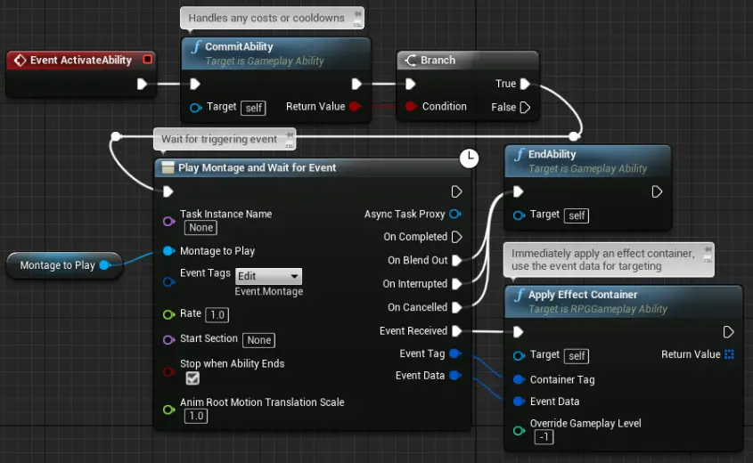
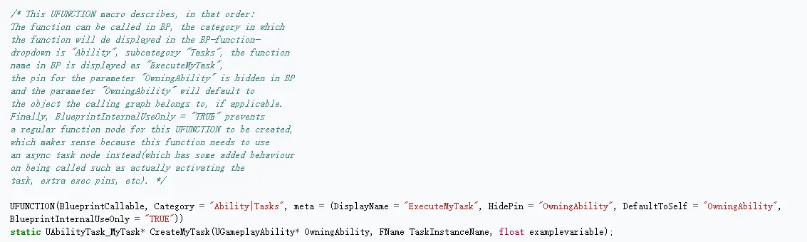
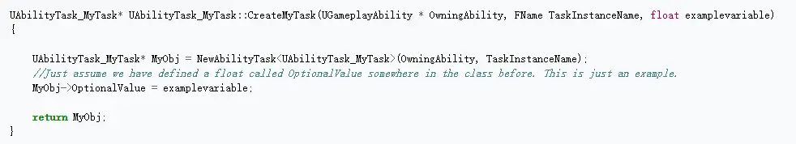
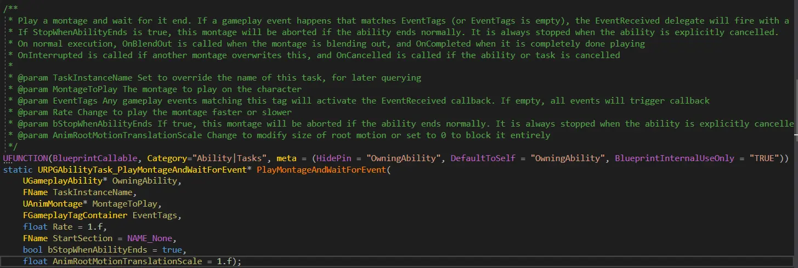
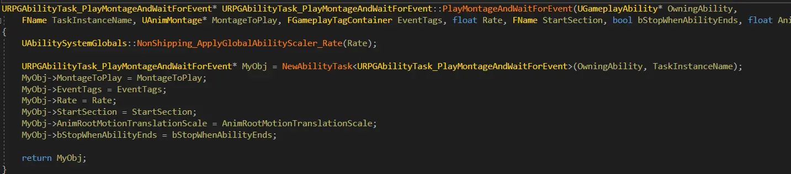
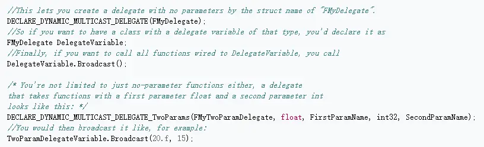
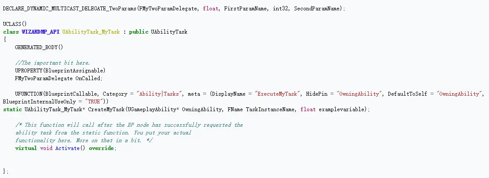
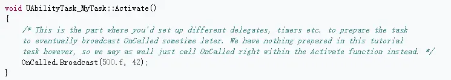

## Ability Task

Ability Task是Gameplay Task的子类，只能被GameplayAbilities使用。Gameplay Task更通用，不仅仅用在Game Ability System中，也可用来给AI发送命令，或是实现Delay的效果。它的一个重要特性：类似Unity中的协程，是异步的，不会阻塞Update。
既然我们是在研究GAS，这里主要讨论Ability Task。Unreal Engine中已经提供了不少Ability Task类。

e.g., ApplyRootMotion, MoveToLocation, WaitDelay

Ability Task在Gameplay Ability的执行过程中调用，通过Delegate（C++)和其他Exec Pin(Blueprint)来影响Ability的执行。一个典型的应用是等待外部给予输入（注意到API图中一堆的Wait）。Task可以随时调用EndTask来终止，当Ability调用EndAbility时，也会终止相应的所有Tasks。ActionRPG中使用Ability Task的例子：

其中PlayMontageAndWaitForEvent就是一个自定义的Ability Task。后文将会介绍如何自定义Ability Task。
Ability Task也可以在网络环境中使用，但Ability Task本身不直接参与replication，而是由Gameplay Ability(Replicated)来间接同步。对于Engine提供的Ability Task，可以放心食用，自定义Task时要小心。
(UGameplayTask_WaitDelay是一个不错的example)

## Custom Ability Task

继承自UAbilityTask后，需要声明一个static函数，为这个AbilityTask在蓝图中生成节点。这里参考https://wiki.unrealengine.com/GameplayAbilities_and_You#GameplayTasks
中的说明，如果你的新AbilityTask类为UAbilityTask_MyTask，则相应的static函数为：

注意声明中UFUNCTION中的修饰符，其中BlueprintInternalUseOnly = "True"有点难理解。事实上是所有AbilityTask默认是异步的，你的静态函数并不是对应的蓝图生成task节点，它只是这个蓝图节点的一部分实现，另一部引擎帮你完成了。所以BlueprintInternalUseOnly = "True"来阻止BlueprintCallable自动生成蓝图节点。

Note：当不知道该用怎样的修饰符时就去翻引擎中实现类似功能的代码，复制粘贴！！！

为了添加其他Exec Pin，我们要声明Delegate，关于具体实现为：

注意delegate的类型为DLECALRE_DYNAMIC_MULTICAST(_XXX)，其中的Broadcast需要在Activate函数中调用。delegate的使用例子如下：

