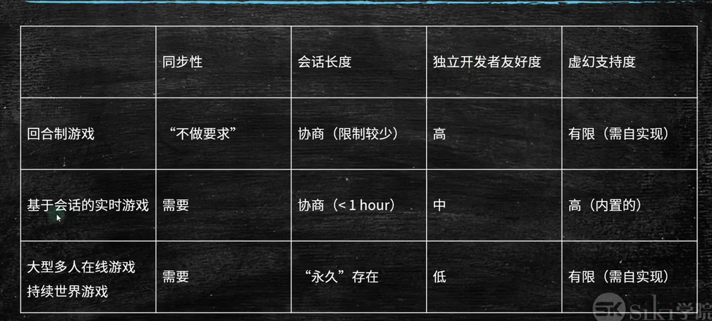
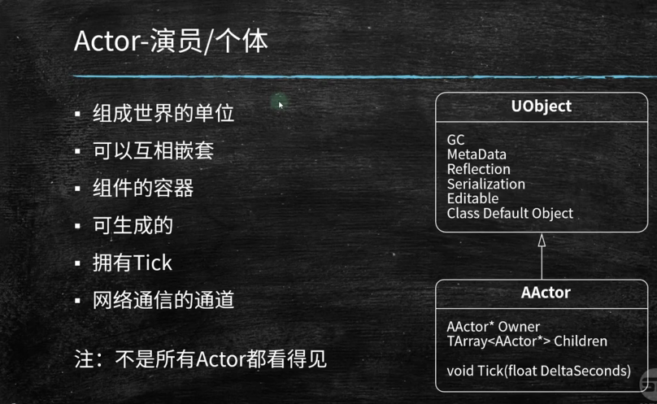
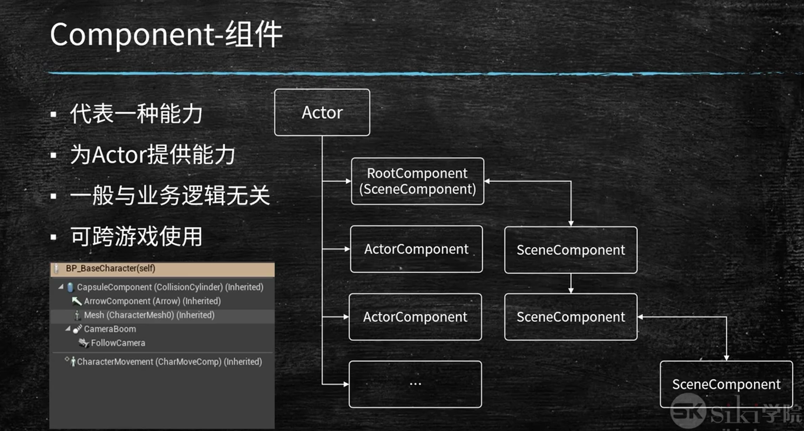
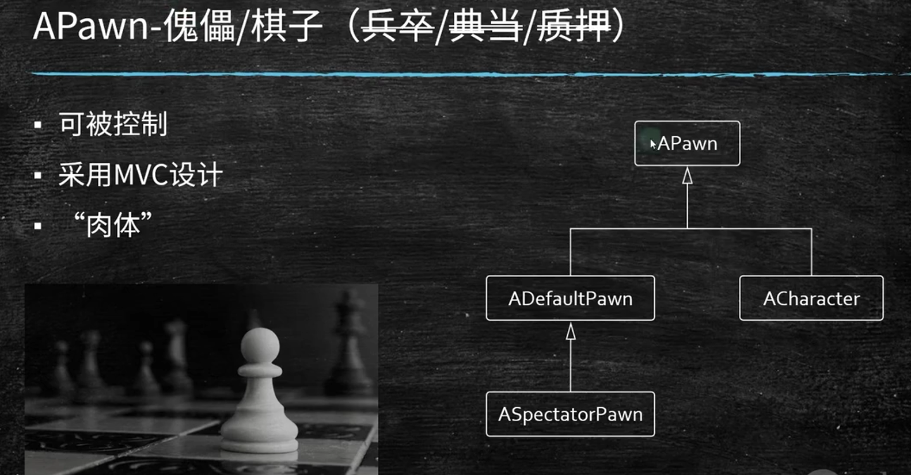
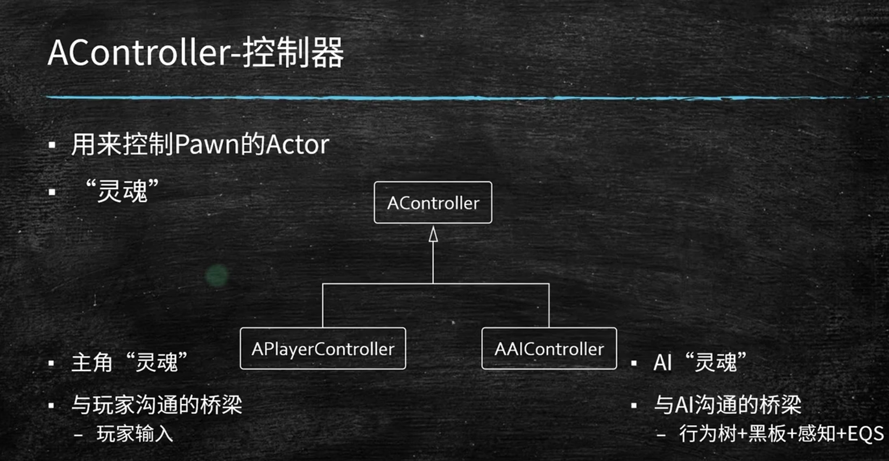
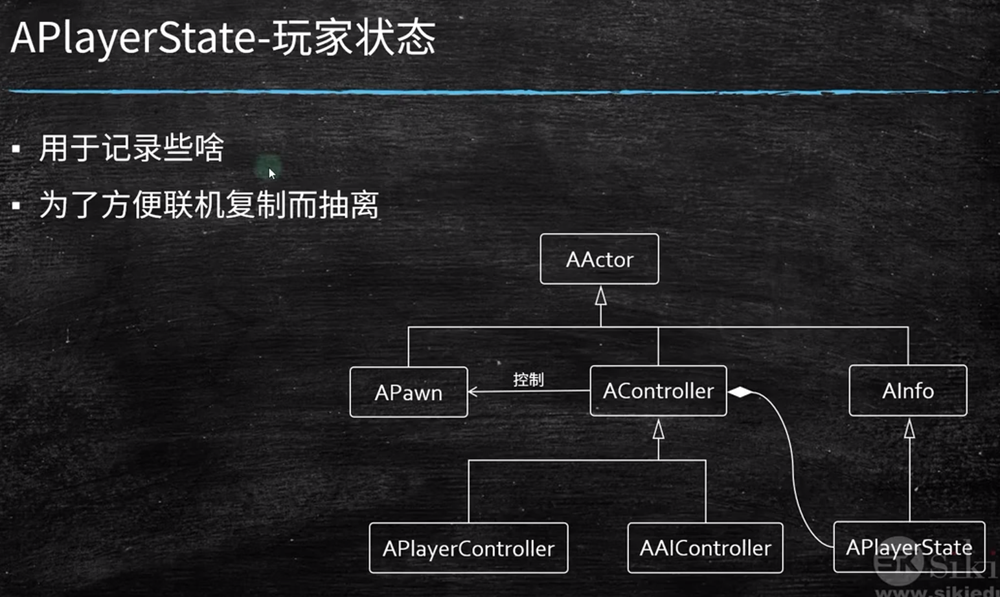

## 多人游戏类型

基于会话的：游戏性尚可，又不会过于复杂

- 查找
- 连接
- 同步

## 输入与状态

输入：玩家被击中了，拾取了一件东西

在某个tick中，输入作用到了状态身上，会产生新的状态

## 点对点模型 P2P

P2P：每个客户端都是服务器，每个客户端都是客户端

- 优点：简单，不需要服务器
- 缺点：扩展性差，不适合大型游戏
        整场游戏速度取决于最慢的线
        易作弊，不公平

## C/S模型

解决了p2p的痛点，除了连接速度

服务区最权威，不能相信客户端

## Gameplay框架

游戏规则、玩家输出与控制、相机和用户界面等核心系统

WorldSettings 和关卡蓝图都是Actor

关卡蓝图ALevelScriptActor
- 特殊默认脚本actor
- 每个关卡一个
- 正经项目中应用场景有限
- 非常适用于原型项目或者展示项目
- 适用于一些关卡本身的特定逻辑

