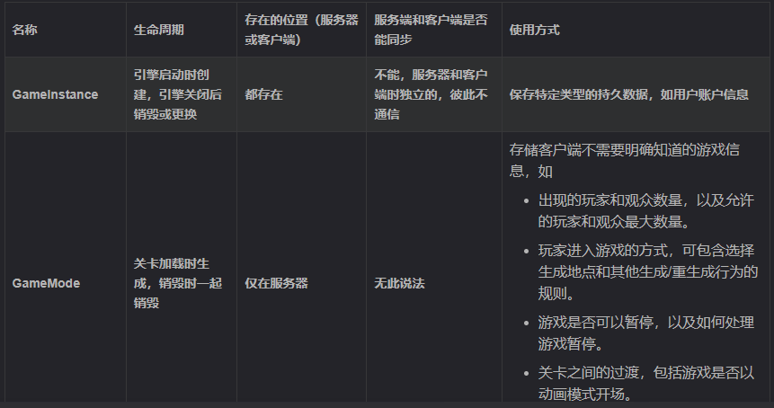
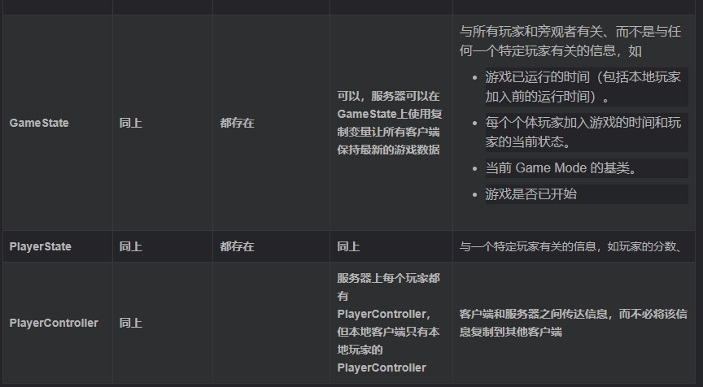
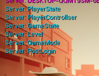
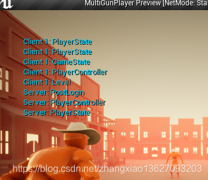

# 联网过程

当一个新客户端第一次连接时，会发生如下事情：

1）首先、客户端会向服务器端发送连接请求；

2）服务器端会处理这个请求，如果服务器端没有拒绝连接，就会向客户端发送一个响应（发送当前应该加载的地图、信息等）；

3）服务器等待客户端加载；

4）加载完成后服务器调用本地的GameMode里的PreLogin事件，在这个事件的后续处理中还有机会拒绝连接；

5）如果服务器还是接受连接则调用GameMode中的Login事件，此事件的作用时创建一个PlayerController，然后将其复制到新连接的客户端，一旦客户端收到就会替换掉客户端临时的PlayerController，在这个过程中PlayerController的Event BeginPlay事件会被调用；

6）上面的一切都顺利后调用服务器端的GameMode的PostLogin事件。

再第二个玩家加入进来时，先在服务器端创建新玩家的Player State如图4所示，此时的Player State比其他类都早，此时的数据并没有同步过来，也即Player State是一个默认的对象，等到客户端生成两个Player State之后服务器端的Player State数据会保持和这生成的两个中应该对应的那个数据一致.