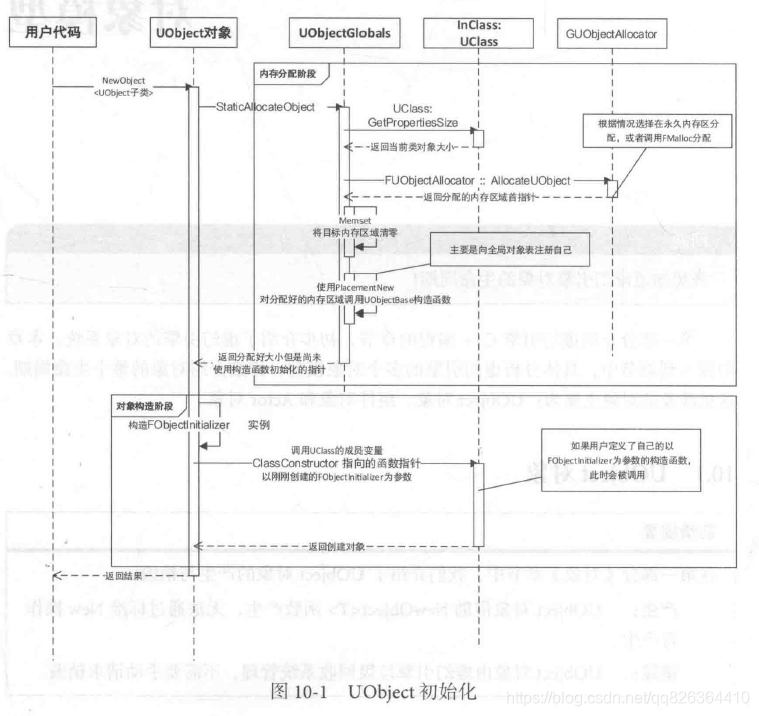

# UObject

https://zhuanlan.zhihu.com/p/24319968

(1) 内存分配阶段：
获取当前UObject对象对应的UClass类的信息，根据类成员变量的总大小，加上内存对齐，然后在内存中分配一块合适的区域存放。

(2) 对象构造阶段：
获取FObjectInitializer对象持有的、指向刚刚构造出来的UObject指针，调用以FObjectInitializer为参数的构造函数（ClassConstructor），完成对象构造。

## 功能

一，垃圾收集 (Garbage collection + Reference updating)

继承自UObject类的类对象，都会加入到UE4的垃圾收集系统，在没有其他地方引用时候，定期清理，释放内存。

二，反射

运行时能获取一个类，动态创建类的对象，并且能动态获取到类有哪些函数和成员变量等，UE4的蓝图中大量使用了反射技术。

三，序列化

能把一个类的对象保存到磁盘，并且在下次运行时无损加载它。

四，与编辑器的交互

UE4编辑器能操作类的变量，设置属性等。

五，运行时类型识别

继承自UObject，能使用Cast<>来进行运行时类型识别

六，网络复制

UE4包括一套服务器/客户端架构，能自动完成UObject的属性网络复制的功能。
