# Week1 UE4入门
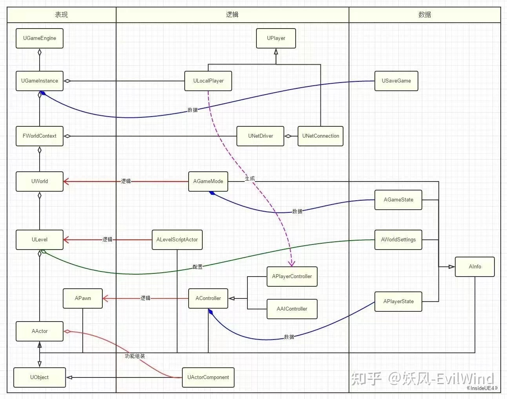
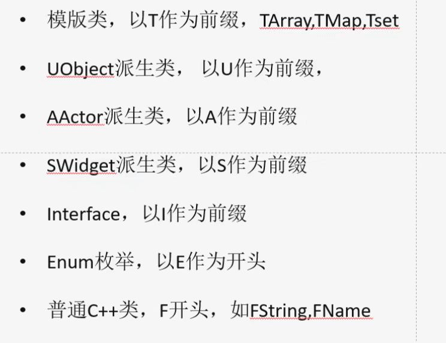
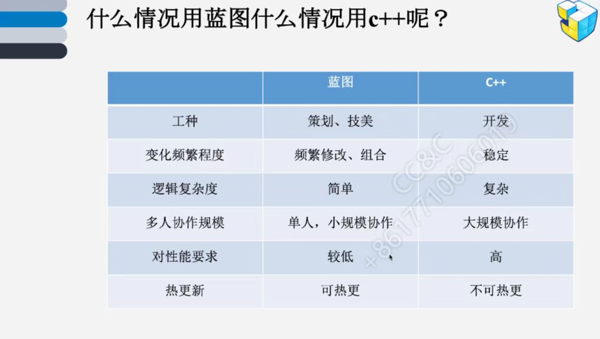
最后稍微介绍一下 gameplay framework 方面的对比，unity 采用 gameobject 和 component 的架构，ue4 也采取了类似的架构，但是更加 hybrid 一点，无论是历史遗留原因还是其他原因，ue4 有很冗长的继承结构，actor 也能有 component，但是很多例子也有直接使用 actor 自身的，不完全依赖 component。unity 采用的是 prefab，ue4 相应的功能有 blueprint，这个结合我自身的经验，ue4 的 robust 程度和方便程度远远大于 unity，他的每一个模块的自定义 editor 真的比 unity 的方便太多，特别是 setup 方面的。从引擎内定的 editor 来比较 ue4的迭代效率比 unity 高很多，特别是中大型项目的迭代速度。另外个人感觉如果比较熟悉的话小团队制作一些游戏 prototype 速度也不会比 unity 慢。

#### Class Hierarchy
- Object // Base class for all Unreal objects
- Actor // Objects that can be placed or spawned in the world 
- Pawn // Actors that can be 'controlled' by players or AI
- Character // pawn that implements walking movement

#### Prefixes
- U - Classes deriving from UObject
- A - deriving from Actor
- F - Structs
- E - Enums
- I - Interfaces

#### Player Controller
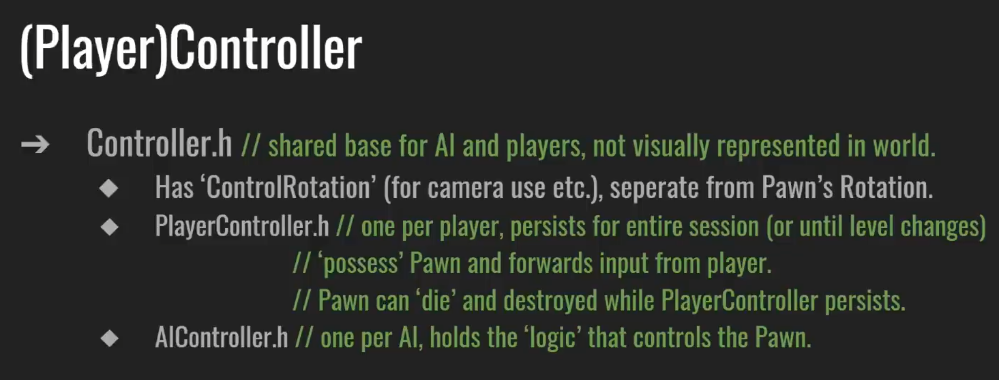

# Week2 游戏模式
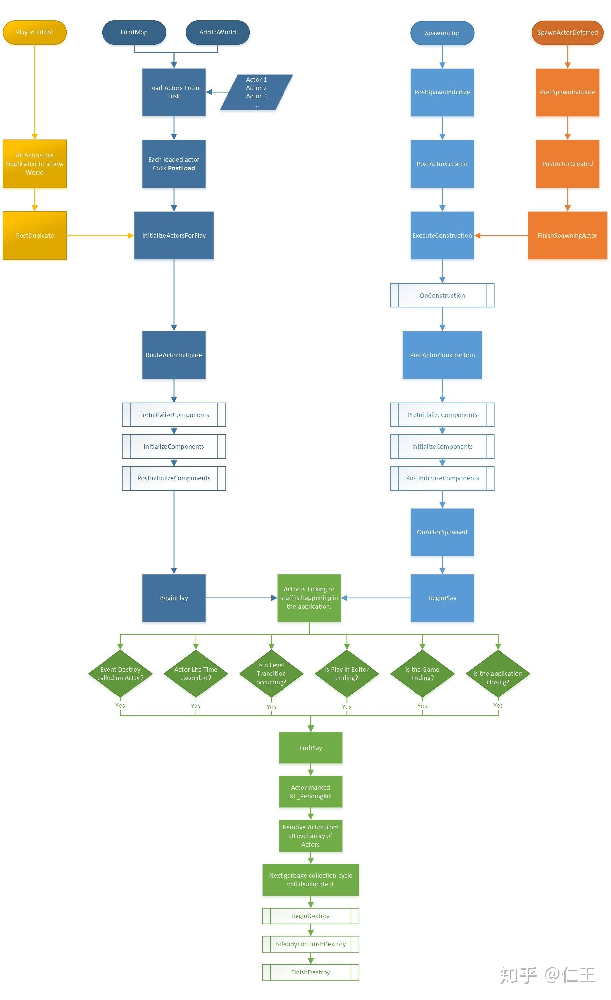
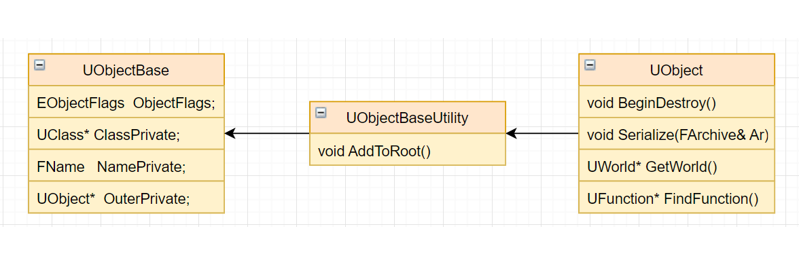
UE提供C++支持GC的功能，UObject是所有GC的基石

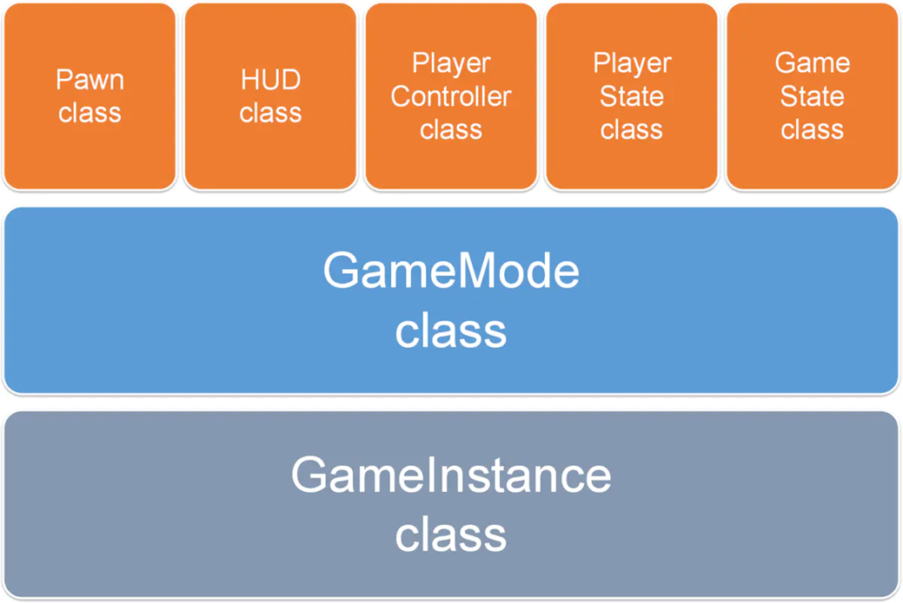

- Pawn是马甲，Controller是驱动马甲的大脑

- Controller可以管理多个Player，可以让哪个Player拥有控制权

- GameMode是定义了游戏的规则. 不用的游戏有不同的GameMode，可以在Project Setting里配置

- GameState是包含了游戏的状态,如:当前游戏中的玩家列表、得分情况、玩家的任务清单完成情况等

- PlayerState包含玩家的状态,如:名字、得分、等级等

# Week3 C++代码规范

核心常用概念
- UGameInstance：
	保存当前的WorldContext和其他信息，理解为游戏的实例
- WorldContext：
	一个World管理多个Level，并负责这些Level的加载和释放
- World：
	World里保存了一个主Level和很多其他SubLevel
- Level：
	Level保存了本Level的所有Actor
- Actor：  
Actor是没有位置信息的，SceneComponent组件提供位置  
Actor的AttachtoActor是把SceneComponent相接  
Actor挂载多个SceneComponent，同时SceneComponent又可以递归挂载下去  

UE4中核心基础类Actor
- UActorComponent：
    继承UObject,所有Component的基类  
- USceneComponent：
      显示3D世界中的组件  
- UPrimitiveComponent：
      包含或能生成某种类型的几何体
- UMeshComponent：
    是USkinnedMeshComponent
    与UStaticMeshComponent的父类 

在UE4游戏场景中看到的所有对象皆是Actor，而Actor复杂的功能是由许多不同的Component共同实现的。UActorComponent提供最一般的功能，USceneComponent提供三维的空间变换以及嵌套功能，UPrimitiveComponent提供了可视化的功能。因此可以根据需要继承不同的组件类来实现自定义的组件类。
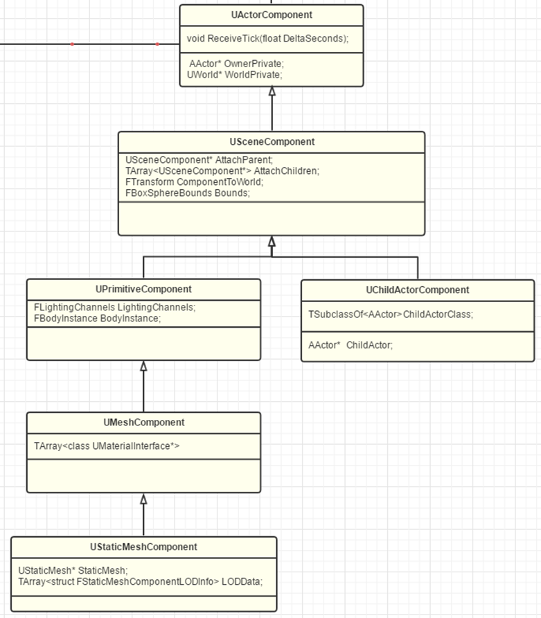
# Week4 UMG
虚幻动态图形UI设计器
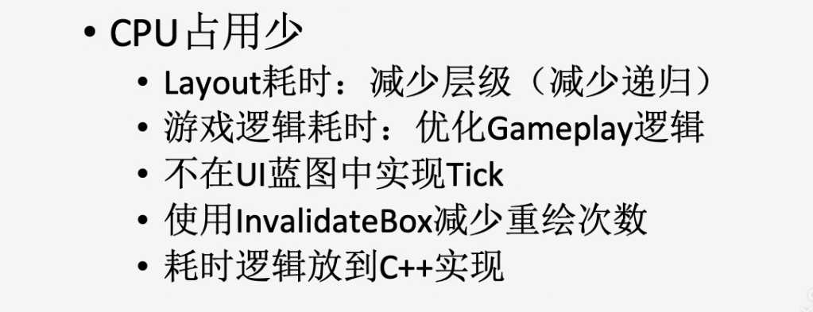
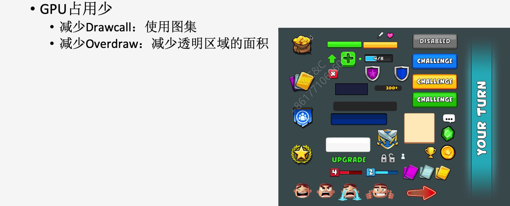
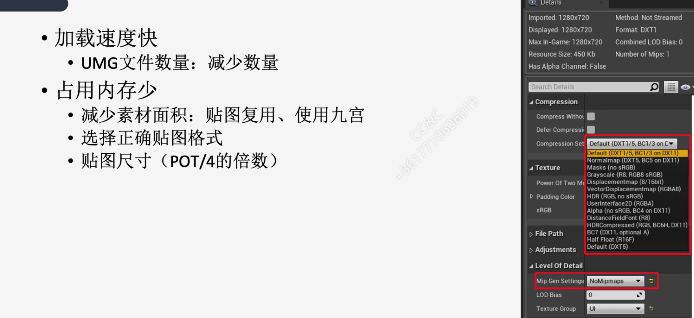

# Week5 骨骼动画

# Week6 物理引擎

- 物理引擎是游戏引擎的一个子系统，检测并处理物体的碰撞，并按照力学规律模拟计算物体的运动，让游戏中的物体运动真实、可信

- 既可以和游戏逻辑相关，也可以是纯表现

- 目的是实现操作和视觉上的真实感，并不是追求正确和严格

#### 碰撞检测
圆 -> r1 + r2 ≥ d
矩形 -> 分离轴
凸包 -> GJK  
简化 -> 包围盒  （AABB轴对齐包围盒 OBB有向包围盒）

# Week7 渲染原理

MVP变换之后

# Week8 游戏网络

## 网络基础

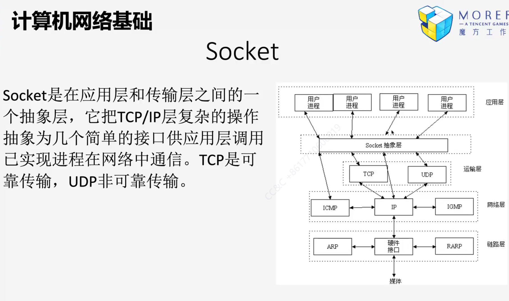

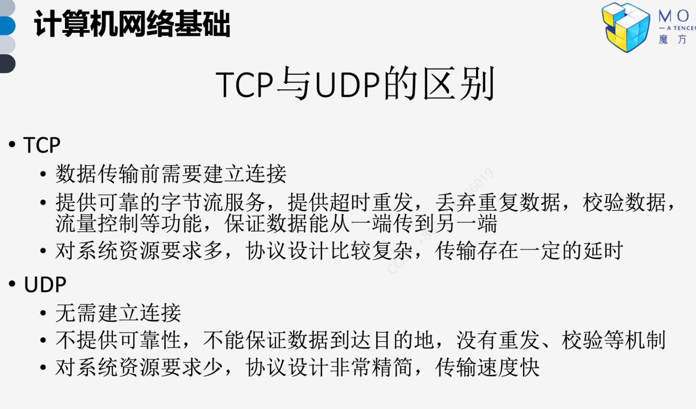

## 网络架构
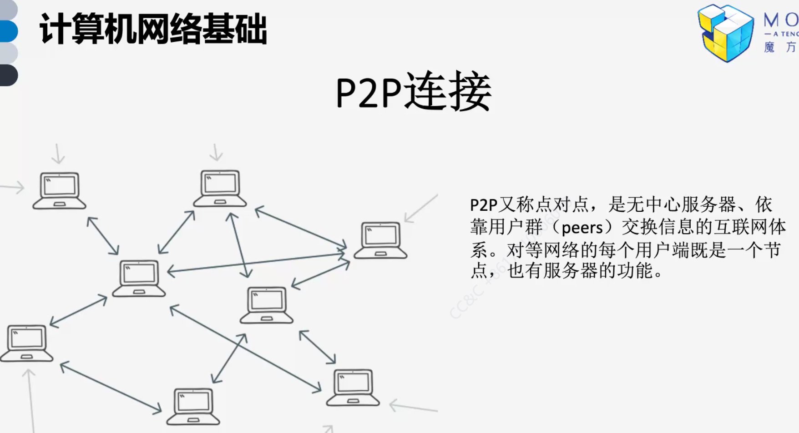
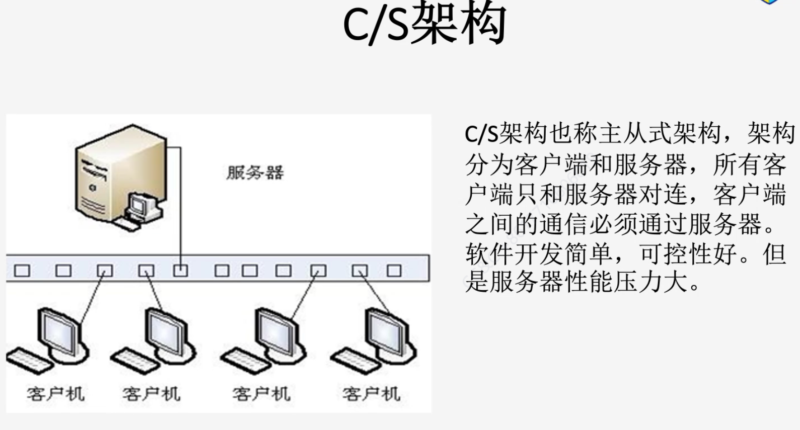

## 网络同步

## 白话帧同步

### 变与不变
输入是动力，改变游戏生态

精度（状态一致性）问题（状态同步），响应时间不一致（网络更好）（数据压缩），画面一致性（客户端预演和回滚）

生态一致？
精度方案————定点数
意外事件————随机数一致
时间————步长一致

### 如何验证

- 验证数据一致性
    - 数据段md5计算
    - 数值日志

- 客户端画面平滑
    - 预测（表现和逻辑分离）
    - 快照（取决于数据量）
    - 回滚（解决预测问题）
    - 追帧

- 防作弊
    - 实时验证
    - 离线验证+惩罚

- 断线重连
    -
# Ref

https://gameinstitute.qq.com/community/detail/118913

