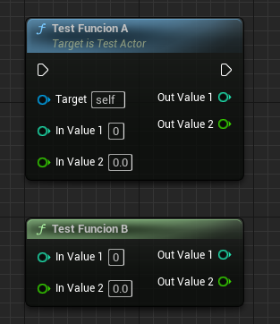
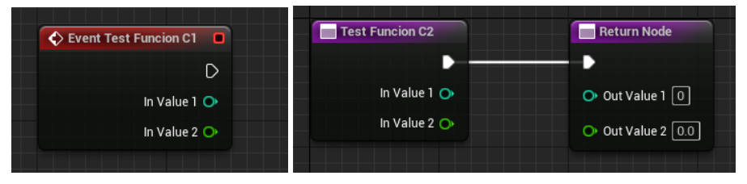
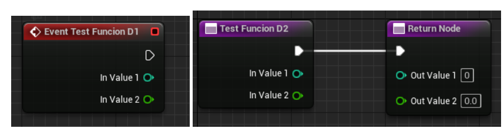
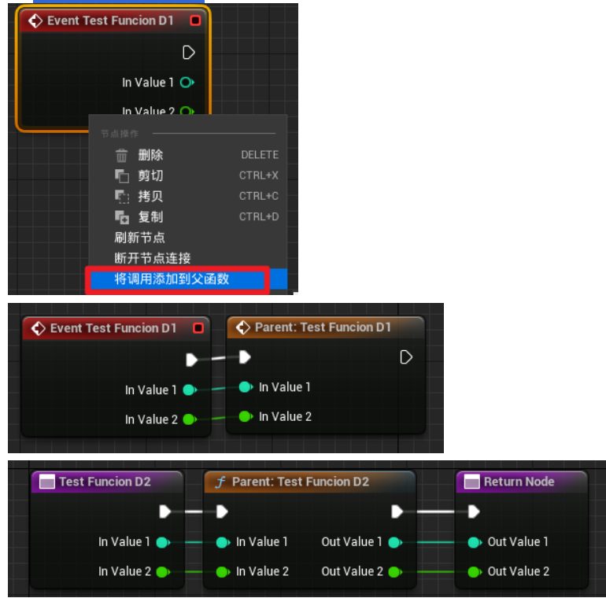
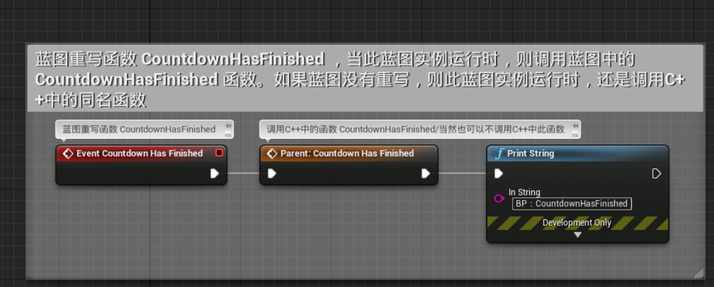

https://blog.csdn.net/qq_40120946/article/details/135000715?utm_medium=distribute.pc_relevant.none-task-blog-2~default~baidujs_baidulandingword~default-0-135000715-blog-136680814.235^v43^pc_blog_bottom_relevance_base6&spm=1001.2101.3001.4242.1&utm_relevant_index=1

## 函数UFUNCTION常用符

蓝图调C++函数：BlueprintCallable，BlueprintPure

C++调蓝图函数：BlueprintImplementableEvent，BlueprintNativeEvent

## BlueprintCallable，BlueprintPure

实现：C++
调用：蓝图

.h
```cpp
// 普通函数
UFUNCTION(BlueprintCallable)
void TestFuncionA(int InValue1, float InValue2, int& OutValue1, float& OutValue2);
// 纯函数
UFUNCTION(BlueprintPure)
void TestFuncionB(int InValue1, float InValue2, int& OutValue1, float& OutValue2);
```

.cpp
```cpp
void ATestActor::TestFuncionA(int InValue1, float InValue2, int& OutValue1, float& OutValue2)
{
}
void ATestActor::TestFuncionB(int InValue1, float InValue2, int& OutValue1, float& OutValue2)
{	
}
```



BlueprintCallable 函数以C++编写，可从 蓝图图表 中调用，但只能通过编辑C++代码进行修改或重写。以此类方式标记的函数通常具备供非程序员使用而编写的功能，但是不应对其进行修改，否则修改将毫无意义。数学函数便是此类函数的经典范例。

## BlueprintImplementableEvent

实现：C++

调用：蓝图

.h
```cpp
//无返回值
UFUNCTION(BlueprintImplementableEvent)
void TestFuncionC1(int InValue1,float InValue2);
//有返回值
UFUNCTION(BlueprintImplementableEvent)
void TestFuncionC2(int InValue1,float InValue2, int& OutValue1, float& OutValue2);
```



在C++ header (.h)文件中设置 BlueprintImplementableEvent 函数，但是函数的主体则在蓝图图表中完成编写，而非C++中。创建此类通常是为了使非程序员能够对无预期默认动作或标准行为的特殊情况创建自定义反应。

## BlueprintNativeEvent

实现：蓝图C++都可，优先调用蓝图override重写函数，没有重写则调用默认C++函数

调用：蓝图

.h
```cpp
//无返回值
UFUNCTION(BlueprintNativeEvent)
void TestFuncionD1(int InValue1, float InValue2);
void TestFuncionD1_Implementation(int InValue1, float InValue2);
//有返回值
UFUNCTION(BlueprintNativeEvent)
void TestFuncionD2(int InValue1, float InValue2, int& OutValue1, float& OutValue2);
void TestFuncionD2_Implementation(int InValue1, float InValue2, int& OutValue1, float& OutValue2);
```

.cpp
```cpp
void ATestActor::TestFuncionD1_Implementation(int InValue1, float InValue2)
{
}
void ATestActor::TestFuncionD2_Implementation(int InValue1, float InValue2, int& OutValue1, float& OutValue2)
{
}
```



P.S.
若想蓝图C++函数都调用



lueprintNativeEvent 函数与 BlueprintCallable 和 BlueprintImplementableEvent 函数的组合类似。其具备用C++中编程的默认行为，但此类行为可通过在蓝图图表中覆盖进行补充或替换。对此类代码编程时，C++代码固定使用命名末尾添加了_Implementation的虚拟函数，如下所示。此为最为灵活的选项，因此本教程将采用这种方法。

### C++ Blueprint Native Event 例子

首先创建C++ 类 Countdown，继承 Actor 类

为了让非程序员调用C++函数，并用 蓝图 对其进行覆盖，需对 ACountdown.h 头文件中对函数进行以下修改。

```cpp
// BlueprintNativeEvent:在C++中实现CountdownHasFinished_Implementation()函数，
// 蓝图可以重载CountdownHasFinished 函数
UFUNCTION(BlueprintNativeEvent)
void CountdownHasFinished();
virtual void CountdownHasFinished_Implementation();
```

后，在 ACountdown.cpp 中，需对以下行进行修改：

```cpp
//void ACountdown::CountdownHasFinished()
//{
//}
 
//改为
// C++ 对CountdownHasFinished的实现，要添加_Implementation
void ACountdown::CountdownHasFinished_Implementation()
{
 
}
```

```cpp
void ACountDown::Settest_IntVal_T(int32 val)
{
	// 如果蓝图复写了 CountdownHasFinished 函数，那么这里就掉用到 蓝图 的 复写函数 CountdownHasFinished 。
	// 当然 蓝图的函数还可以调用其父类 的 CountdownHasFinished 函数,也就是C++中 CountdownHasFinished_Implementation 函数
	CountdownHasFinished();
	// 注意：不要如下这样调用，如果CountdownHasFinished 函数被 蓝图 复写，这里就无法执行蓝图的函数了。
	//CountdownHasFinished_Implementation();
 
	UE_LOG(LogTemp, Log, TEXT("调用了 C++ Settest_IntVal_T 函数"));
	test_IntVal = val;
}
```

### 蓝图中用法

首先 创建蓝图类 BP_Countdown 继承C++ Countdown类，然后在蓝图图中对CountdownHasFinished 函数覆盖进行补充或替换。这里复写时蓝图调用了父类的同名函数，即C++中定义的 CountdownHasFinished_Implementation 函数

