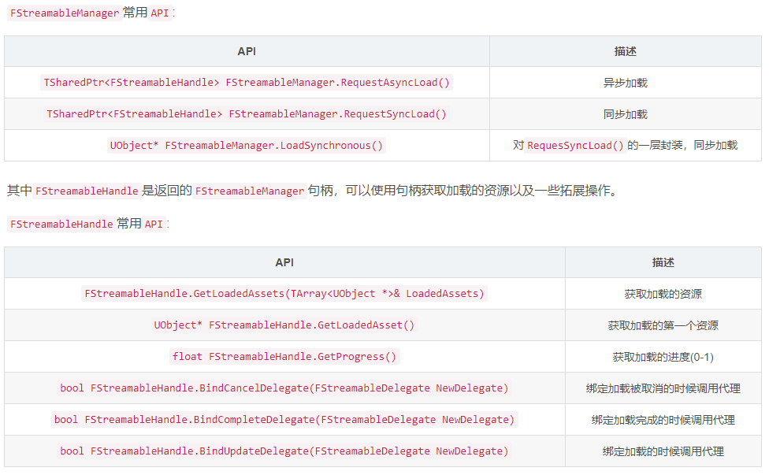

# UE4 同异步加载

## 1 资源引用

资源引用分为资源软引用和资源硬引用。软引用通常是仅储存资源对象的资源路径没有与资源产生耦合关系的引用(软引用加载到内存中，引用对象不会被加载到内存中，只有在需要的时候才会被加载进内存中)。硬引用则是拥有资源对象实际成员变量，直接与资源对象产生耦合(硬引用被加载到内存中，则被引用的对象资源也会被加载到内存中)。

在蓝图中软引用和硬引用的表现：

```cpp
// 硬引用：已经被加载到内存
UPROPERTY(EditAnywhere,BlueprintReadWrite,Category="Frame")
AActor* ActorObject;

UPROPERTY(EditAnywhere,BlueprintReadWrite,Category="Frame")
TSubclassOf<AActor> ActorClass;
```

​ 比较常用的软引用类型分为:

- TSoftObjectPtr
- TSoftClassPtr
- FSoftObjectPath
- FSoftClassPath

​ TSoftObjectPtr和TSoftClassPtr是一种智能指针。TSoftObjectPtr和TSoftClassPtr是对FSoftObjectPtr的一种封装。

```cpp
//TSoftObjectPtr源码
template<class T=UObject>
struct TSoftObjectPtr
{
public:
	...
	FORCEINLINE T* Get() const //获取真正的资源对象指针
	{
		return dynamic_cast<T*>(SoftObjectPtr.Get());
	}
    ...
	FORCEINLINE const FSoftObjectPath& ToSoftObjectPath() const //获取FSfotObejctPath
	{
		return SoftObjectPtr.GetUniqueID();
	}
private:
	FSoftObjectPtr SoftObjectPtr;//包装的FSoftObjectPtr
```

通过Get()获取真正的资源引用指针，ToSoftObjectPath()获取FSoftObjectPath类型的资源路劲。

TSoftClassPtr同样封装了FSoftObjectPtr，同时它能像TSubclassOf一样有包含子类的效果,同时也具有Get()以及ToSoftObjectPath()函数。

```cpp
UPROPERTY(EditAnywhere,BlueprintReadWrite,Category="Frame")
TSoftObjectPtr<AActor> softActorobj;

UPROPERTY(EditAnywhere,BlueprintReadWrite,Category="Frame")
TSoftClassPtr<AActor> softActorClass;
```

​FSoftObjectPath和FSoftClassPath是资源软引用路劲。FSoftObjectPath主要是用于保存继承于UObject非蓝图资源的软引用类型:例如(UStaticMesh、UMaterial、UTexture...)。FSoftClassPath是FSoftObjectPath的派生类，用于储存一个类型的软引用(例如蓝图类资源)

```cpp
UPROPERTY(EditAnywhere,BlueprintReadWrite,Category="AssetRef",meta=(AllowedClasses="StaticMesh"))
FSoftObjectPath AsetObjectPath;

UPROPERTY(EditAnywhere,BlueprintReadWrite,Category="AssetRef")
FSoftClassPath AsetClassPath;
```

除了上述常用的引用类型，其实还有以下两种：

- FStringAssetReference
- TAssetPtr<Type>

FStringAssetReference其实就是FSoftObjectPath的别名，两者为同一类型:
```cpp
typedef FSoftObjectPath FStringAssetReference;
```

TAssetPtr<Type>是TSoftObjectPtr的别名：
```cpp
template<class T=UObject>
using TAssetPtr = TSoftObjectPtr<T>;
```
我们用的时候最好只用上面四种提到过的引用类型，这两者舍弃掉就行。

硬引用和软引用的区别：

- 硬引用过多会导致程序启动时间长因为加载大量资源导致而导致的进程阻塞。
- 软引用因为加载资源少，且资源都是用到的时候才进行加载，所以程序的常驻内存少。

## 2 资源加载

### 2.1 静态加载

​ 静态加载指的是只能在构造函数进行的加载方式。使用ConstructorHelpers::FClassFinder() \ ConstructorHelpers::FObjectFinder()进行加载，前者用于蓝图类资源的加载，后者用于非蓝图类资源的加载。头文件#include "Object/ConstructorHelpers.h"

```cpp
#include "UObject/ConstructorHelpers.h"   
AResourceActor::AResourceActor()
{
   PrimaryActorTick.bCanEverTick = true;
   ConstructorHelpers::FObjectFinder<UStaticMesh> meshAsset(TEXT("/Game/Meshes/1M_Cube.1M_Cube"));
   if(meshAsset.Succeeded())
   {
      UE_LOG(LogTemp,Warning,TEXT("Mesh Name%s"),*(meshAsset.Object->GetName()));
   }

   ConstructorHelpers::FClassFinder<AActor> blueprintAsset(TEXT("/Game/CPP/BlueprintTest.BlueprintTest_C"));
   if(blueprintAsset.Succeeded())
   {
      UE_LOG(LogTemp,Warning,TEXT("Blueprint Name%s"),*blueprintAsset.Class->GetName());
   }
}

```

​ 注意在加载蓝图类时，路劲最后需要加上_C。例如:蓝图路径是：Blueprint’/Game/Blueprints/Test’，
加后缀以后，则是：Blueprint’/Game/Blueprints/Test_C’。

### 2.2 动态加载

​ 静态加载的局限性就是在于资源的路劲必须写死，这就导致一旦资源路劲发生更改就必须修改代码，同时只能在构造函数里进行调用。静态加载的这种方式非常不方便我们对资源加载的操作，所以引出了动态加载。

​ 在了解同步加载之前，我们首先需要知道，UE4中的资源对象的存在方式是怎样的。资源对象存在的方式在UE4中有两种，一种是已经被加载到了内存中(使用FindObject()进行资源的加载)，第二种资源是处于硬盘中(这种就需要使用LoadClass()\LoadObject()方法进行加载)。随后进行序列化和反序列化的时候还需要处理对象资产的引用问题：例如A对象引用了B对象，实例化A对象的时候B对象的加载方式需要看B对象的引用是硬引用(指针引用)还是软引用(路劲引用)。

​ 接下来对动态加载中的同步、异步加载进行介绍：

#### 2.2.1 动态同步加载

```cpp
// 直接从内存加载
- FindObject();

// 从硬盘加载
- LoadObject();
- LoadClass();
- StaticLoadObject();
- StaticLoadClass();

```

​ 当我们需要的资源已经被加载到了内存中，我们可以直接使用FindObject(是对StaticFindObject的一层封装)进行资源的加载(比如引擎的内置资源:StartContent…):这里我们加载一个FirstPerson包自带的StaticMesh，随后Ctrl+C复制资源路劲。

```cpp
UStaticMesh* MeshPtr = FindObject<UStaticMesh>(ANY_PACKAGE,TEXT("StaticMesh'/Game/Meshes/1M_Cube.1M_Cube'"));
if(IsValid(MeshPtr))
{
UE_LOG(LogTemp,Warning,TEXT("Get Mesh %s"),*MeshPtr->GetName());
}

```

​ LoadObject()和LoadClass()分别是对StaticLoadObject()和StaticLoadClass()的一层封装：

```cpp
template< class T > 
inline T* LoadObject( UObject* Outer, const TCHAR* Name, const TCHAR* Filename=nullptr, uint32 LoadFlags=LOAD_None, UPackageMap* Sandbox=nullptr )
{
	return (T*)StaticLoadObject( T::StaticClass(), Outer, Name, Filename, LoadFlags, Sandbox );
}
```

LoadObject用于加载非蓝图类资源，一般与FindObject连用，当该资源没有加载到内存，才进行从硬盘的加载

```cpp
// 直接从内存加载
UStaticMesh* meshPtr = FindObject<UStaticMesh>(nullptr,TEXT("StaticMesh'/Game/HorrorEngine/Meshes/Book.Book'"));
if(!meshPtr)
{
	GEngine->AddOnScreenDebugMessage(1,50.0f,FColor(255,0,0),TEXT("Not Found Mesh In Memeory"));
     // 从硬盘加载
	meshPtr = LoadObject<UStaticMesh>(nullptr,TEXT("StaticMesh'/Game/HorrorEngine/Meshes/Book.Book'"));
	if(meshPtr)
	{
		GEngine->AddOnScreenDebugMessage(2,50.0f,FColor(255,0,0),TEXT("Load Mesh From Hard Disk"));
	}
}
else
{
	GEngine->AddOnScreenDebugMessage(1,50.0f,FColor(255,0,0),TEXT("Found Mesh In Memeory"));
}
```

LoadClass用于加载继承于AActor的蓝图类对象:

```cpp
UClass* actorClass = LoadClass<AActor>(nullptr,TEXT("/Game/CPP/MySpawnActor.MySpawnActor_C"));
if(actorClass)
{
    // 生成Actor
    //GetWorld()->SpawnActor<AActor>(actorClass,FVector::ZeroVector,FRotator::ZeroRotator);
    UE_LOG(LogTemp,Warning,TEXT("Get Blueprint Actor %s"),*actorClass->GetName());
}
```

如果要加载多个资源对象到内存，一直LoadClass会很不方便，我们可以使用UE4为我们提供了创建资源注册表(DataAsset)的方式，在蓝图中，设置资源的路劲在C++中进行资源的加载。

*UDataAsset*
```cpp
USTRUCT()
struct FResourceData
{
	GENERATED_BODY()
	UPROPERTY(EditAnywhere,Category="Resource")
	FString ResourceName;

	UPROPERTY(EditAnywhere,Category="Resource")
	FSoftObjectPath ResourcePath;
};


UCLASS()
class REFLECTIONFRAME_API UResourceAssetData:public UDataAsset
{
	GENERATED_BODY()
public:
	UPROPERTY(EditAnywhere)
	TArray<FResourceData> DataArray;

	UPROPERTY(EditAnywhere)
	TArray<UTexture2D*> TextureArray;
};
```
首先我们需要创建一个继承于UDataAsset的派生类，用于存放我们资源的注册表。随后我们在蓝图中进行设置。

​ 在蓝图中创建DataAsset并继承我们刚刚创建的C++类。随后我们就可以在该类中设置我们的资源软引用。

```cpp
UPROPERTY(EditAnywhere,Category="DataAsset")
UResourceAssetData* Data;

void AResourceActor::UpdateMesh()
{
	if(Data&&Data->DataArray.Num()>0)
	{
		MeshIndex = ++MeshIndex>=Data->DataArray.Num()?0:MeshIndex;
		UStaticMesh* meshPtr = LoadObject<UStaticMesh>(nullptr,*Data->DataArray[MeshIndex].ResourcePath.ToString());
		Mesh->SetStaticMesh(meshPtr);
	}
}
```

随后我们可以写一个测试函数，循环切换我们DataAsset中的StaticMesh，通过获取到资源路劲(ResourcePath中的ToString()),进行StaticMesh资源的加载。

*UObjectLibrary*

​ 我们也可以使用UObjectLibrary将某一路劲下所有同类型的资源，保存到UObjectLibrary中，随后在将资源Load进内存中。

例如：需要导入的资源为Content/HorrorEngine/Textures下所有的Texture。

```cpp
#include "Engine/ObjectLibrary.h"
class UObjectLibrary* Library;

if(!Library)
{
	Library = UObjectLibrary::CreateLibrary(UObject::StaticClass(),false,false);
	Library->AddToRoot();	//防止被GC
}
Library->LoadAssetDataFromPath(TEXT("/Game/HorrorEngine/Textures"));
// 加载蓝图Class的话 需要换成LoadBlueprintAssetDataFromPath 同时需要将bInHasBlueprintClasses设置为true

TArray<FAssetData> AssetDatas;
Library->GetAssetDataList(AssetDatas);
if(AssetDatas.Num()>0)
{
	for(auto const& Asset:AssetDatas)
	{
		UE_LOG(LogTemp,Warning,TEXT("Asset Name %s"),*Asset.GetAsset()->GetName());
		// Asset.ToSoftObjectPath(); Get SoftObjectPath
	}	
}
```
其中CreateLibrary()创建一个Library,BInHasBlueprintClasses含义是这个类是否是蓝图类，如果你需要传入蓝图类的话就需要设置为True，bInUseWeak是否启用弱指针

```cpp
UObjectLibrary* UObjectLibrary::CreateLibrary(UClass* InBaseClass, bool bInHasBlueprintClasses, bool bInUseWeak)
```
加载少量轻量级的资源我们可以使用同步加载，但资源如果越来越多，继续同步加载就会导致游戏进程的阻塞，这个时候我们就需要使用异步加载。

#### 2.2.2 动态异步加载

异步加载我们需要使用FStreamableManager这个类，首先需要创建这个类，建议是把它设置为全局单例。我们在创建它的时候有两种方式，一种是我们自己进行创建声明，第二种是使用UE4已经为我们创建好的一个全局单例FStreamableManager。

```cpp
#include "Engine/StreamableManager.h"
FStreamableManager Manager; //我们自己创建
UAssetManager::Get().GetStreamableManager(); //使用UAssetManager中的FStreamableManager

```



我们将UObjectLibrary与FStreamableManager连用可以写下如下代码，同样的你也可以使用UAssetData:

```cpp
TArray<FSoftObjectPath> AssetPaths; //资源StringReference
TSharedPtr<FStreamableHandle> ManagerHandle; //FStreamable返回的句柄


void AResourceActor::AsyncLoadObjectReview()
{
	if(!Library)
	{
		Library = UObjectLibrary::CreateLibrary(UObject::StaticClass(),false,false);
		Library->AddToRoot();
	}
	Library->LoadAssetDataFromPath(TEXT("/Game/Meshes"));
	TArray<FAssetData> Assets;
	Library->GetAssetDataList(Assets);
	if(Assets.Num()>0)
	{
		for(auto Asset:Assets)
		{
			AssetPaths.AddUnique(Asset.ToSoftObjectPath());
		}	
	}
	ManagerHandle = UAssetManager::Get().GetStreamableManager().RequestAsyncLoad(AssetPaths);
	FStreamableDelegate DelegateFinished = FStreamableDelegate::CreateUObject(this,&AResourceActor::AsyncLoadObjectReviewFinished);
	FStreamableUpdateDelegate DelegateUpdate = FStreamableUpdateDelegate::CreateUObject(this,&AResourceActor::AsyncLoadObjectReviewUpdate);
	ManagerHandle->BindCompleteDelegate(DelegateFinished);
	ManagerHandle->BindUpdateDelegate(DelegateUpdate);
}


void AResourceActor::AsyncLoadObjectReviewFinished()
{
	TArray<UObject*> objectArray;
	ManagerHandle->GetLoadedAssets(objectArray);
	if(objectArray.Num()>0)
	{
		for(auto const& object:objectArray)
		{
			UE_LOG(LogTemp,Warning,TEXT("Load Object %s"),*object->GetName());
		}
	}else
	{
		UE_LOG(LogTemp,Warning,TEXT("Can't Load Object"));
	}
	
}

void AResourceActor::AsyncLoadObjectReviewUpdate(TSharedRef<struct FStreamableHandle> Handle)
{
	UE_LOG(LogTemp,Warning,TEXT("current progress %f"),Handle->GetProgress());
}

```

## 3 Ref

https://www.cnblogs.com/sin998/p/15610027.html

https://blog.csdn.net/weixin_45389639/article/details/121591697
