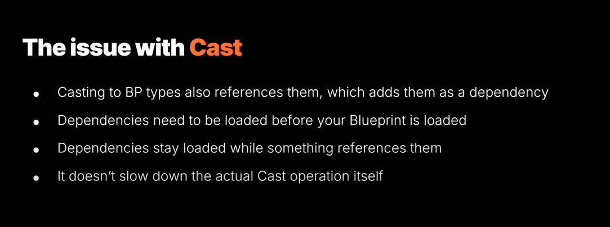
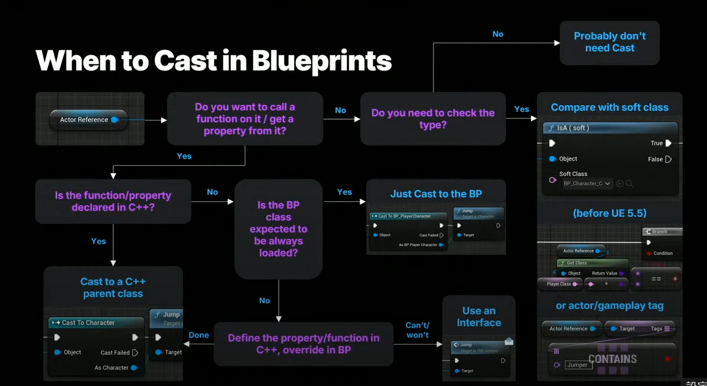

# Cast

https://peterleontev.com/blog/unreal_cast/

http://www.bimant.com/blog/unreal-engine-cpp-cast/


## 简介

Cast is a node that converts a pointer type of some data to another type, with type checking.

## Issue

Casting to a Blueprint type will also reference it, which adds it as a dependency. And dependencies need to be loaded before your own Blueprint is loaded.

Dependencies also stay loaded while something references them. So if you have a BP_PlayerCharacter that, for example, references the final boss of your game in a cast node because you need to do some special functionality for when the boss grabs you, well then that boss asset needs to be loaded before we can finish loading BP_PlayerCharacter, and the boss asset will stay loaded in memory for as long as BP_PlayerCharacter is loaded, which is all the time! 😱

But! This doesn't slow down the actual Cast operation itself.

If we are just mindful of that, then we can use the Cast node where it makes sense and other methods in other cases. And I've made this flow graph to help you know when to use Cast!



## Solution

Cast函数不应过于频繁地调用，这一点很重要。 理想情况下，游戏代码根本不应该调用 Cast 函数！



## Cast和CastChecked

- `Cast<ToType>(Object)`: 这是一种安全的类型转换方法，如果转换成功，它返回一个非空的指针或引用，否则返回 nullptr。这种类型的转换主要用于处理基类和派生类之间的关系。

    ```cpp
    AActor* MyActor = ...; 
    AMyCharacter* MyCharacter = Cast<AMyCharacter>(MyActor); 
    if (MyCharacter) { 
        // 转换成功，可以使用 MyCharacter 对象 
    } 
    else {
        // 转换失败，MyActor 不是 AMyCharacter 类型的对象 
    }
    ```

- `CastChecked<ToType>(Object)`: 这是一种类似的类型转换方法，但它在转换失败时会引发断言（Assertion），因此更适合在开发和调试阶段使用。在运行时，如果转换失败，它会触发断言并在编辑器中停止程序执行

    ```cpp
    AActor* MyActor = ...;
    AMyCharacter* MyCharacter = CastChecked<AMyCharacter>(MyActor); 
    // 如果转换失败，这里会引发断言并停止程序执行
    ```

## 总结

Cast 运行时成本为：

- Linear,   O(Depth(InheritanceTree)), in the editor environment (UE_EDITOR = 1).
- Constant, O(1),in the non-editor environment (UE_EDITOR = 0).

Sum:

- Cast<T> has to be used for *UObjects* due to type safety; it will return *nullptr* in case of a failure in comparison with *static_cast*.
- Cast<T> runtime cost is *O(1) or constant* in non-editor environment and *O(Depth(InheritanceTree))* in editor environment.
- Cast<T> does not use *dynamic_cast*.